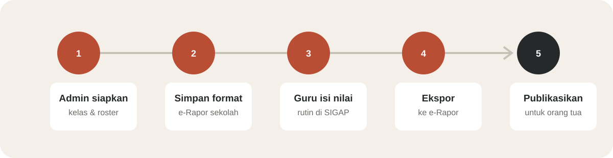
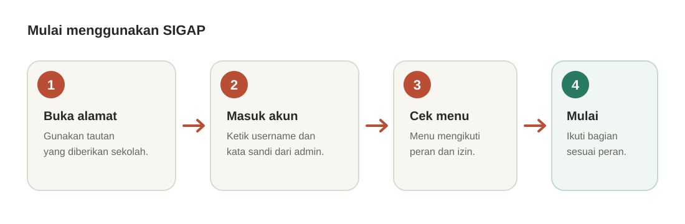
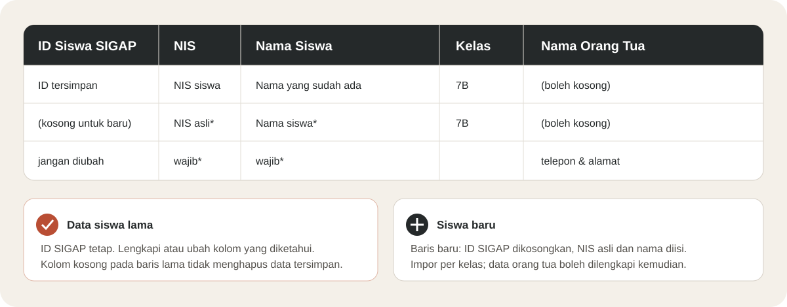
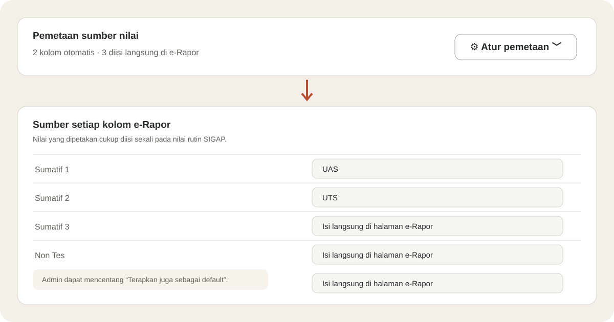
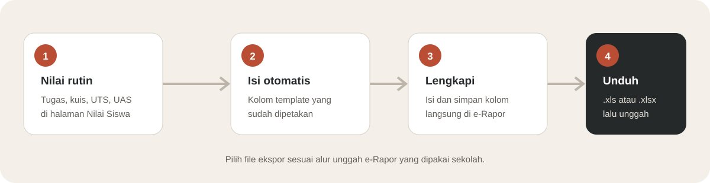
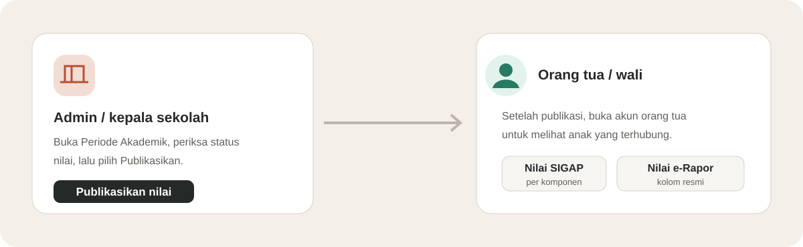

# Panduan Memulai SIGAP
### Panduan praktis pengguna baru

**Edisi Oktober 2026** · Administrator · Guru · Kepala Sekolah · Orang Tua/Wali

> Panduan 15 halaman ini menjelaskan alur penggunaan SIGAP dari persiapan akun sampai informasi nilai diterima orang tua. Baca bagian sesuai peran; menu yang tampil mengikuti hak akses akun.

## 1. Masuk ke SIGAP

1. Buka alamat SIGAP yang diberikan sekolah.
2. Masukkan **Username** dan **Kata sandi**, lalu klik **Masuk**.
3. Jika belum memiliki akun atau lupa kata sandi, hubungi administrator sekolah.
4. Setelah masuk, buka **Profil Saya**. Periksa nama dan username serta ganti kata sandi awal jika diminta.

Jangan menggunakan akun pengguna lain. Jika halaman masuk menolak username atau kata sandi, periksa ejaan, huruf besar/kecil, dan pastikan akun masih aktif.

## 2. Kenali peran dan menu

| Peran | Menu awal | Kegiatan utama |
|---|---|---|
| Administrator | Dashboard | Menyiapkan data sekolah, akun, penugasan, dan fitur SIGAP. |
| Guru | Dashboard / Jadwal Mengajar | Mengisi jurnal, presensi siswa, dan nilai pada kelas yang diampu. |
| Kepala sekolah | Dashboard / Pengawasan Sekolah | Memantau kegiatan sekolah dan meninjau publikasi nilai sesuai izin. |
| Orang tua/wali | Dashboard | Melihat informasi siswa yang tertaut setelah sekolah memublikasikan nilai. |

Menu umum administrator meliputi **Profil Sekolah**, **Periode Akademik**, **Mata Pelajaran**, **Kelas & Siswa**, **Data Guru**, **Kontrak Mengajar**, **Jadwal Pelajaran**, **Pengguna**, dan **Peran & Hak Akses**. Guru biasanya melihat **Jurnal Mengajar**, **Absensi Siswa**, **Nilai Siswa**, dan **Konfirmasi Kehadiran** bila fitur tersebut aktif.

Jika menu tidak tampak, jangan menganggap datanya hilang. Minta administrator memeriksa peran dan izin akun.

## 3. Administrator: siapkan profil dan tahun ajaran

### Profil sekolah

1. Buka **Profil Sekolah**.
2. Lengkapi identitas sekolah, alamat, dan informasi yang dipakai sekolah.
3. Pastikan NPSN tepat jika akan mencocokkan file e-Rapor.
4. Jika sekolah memakai pembatasan lokasi untuk konfirmasi kehadiran, lengkapi lokasi dan radius sesuai konfigurasi sekolah.

### Tahun ajaran

1. Buka **Periode Akademik** dan pilih **Tambah Tahun**.
2. Isi nama tahun ajaran, tanggal mulai, dan tanggal selesai.
3. Simpan, lalu pilih **Aktifkan** pada tahun ajaran yang digunakan. Hanya tahun ajaran yang aktif menjadi konteks kerja saat ini.
4. Gunakan tombol **Bobot** untuk menyesuaikan komponen dan bobot nilai menurut aturan sekolah. Total bobot harus 100.

Jangan memublikasikan nilai pada tahap persiapan. Publikasi dilakukan setelah data diperiksa dan siap dibagikan.

## 4. Administrator: siapkan kelas dan mata pelajaran

1. Buka **Mata Pelajaran**. Pastikan mapel yang diajarkan sudah terdaftar dengan nama/kode yang benar.
2. Buka **Kelas & Siswa**. Pastikan kelas tersedia di tahun ajaran aktif.
3. Buka kelas untuk melihat roster, mencari siswa, menambah data siswa, atau membuka proses impor.
4. Sebelum guru mulai mengisi nilai, periksa bahwa kelas dan mapel sudah dapat dipilih pada halaman penilaian.

Data kelas menjadi penghubung antara roster siswa, penugasan guru, jadwal, presensi, dan nilai. Gunakan ejaan nama kelas dan mata pelajaran secara konsisten agar guru memilih data yang tepat.

## 5. Administrator: impor dan perbarui roster siswa

### Memilih template

- Untuk memperbarui satu kelas, buka kelas tersebut dan unduh **data kelas (.xlsx)**. File membawa **ID Siswa SIGAP** untuk mengenali siswa lama.
- Untuk menambahkan daftar siswa baru, unduh template **Excel (.xlsx)**. Template **CSV** juga didukung; Excel lebih mudah diedit karena kolom dan tabelnya sudah tertata.

### Mengisi file

1. Isi satu siswa per baris. Siswa baru wajib memiliki **NIS** dan **Nama Siswa**.
2. Untuk file data kelas, jangan ubah/hapus **ID Siswa SIGAP** milik siswa lama.
3. Untuk siswa baru di file data kelas, biarkan **ID Siswa SIGAP** kosong, lalu isi NIS asli dan nama siswa.
4. Pada template umum, isi nama kelas sesuai nama kelas yang sudah terdaftar di SIGAP.
5. Kolom telepon dan alamat bersifat opsional. Ikuti petunjuk layar bila mengisi nama orang tua dan membuat akun orang tua.
6. Simpan file, buka **Impor daftar siswa**, pilih file, dan periksa hasil serta pesan untuk baris yang gagal.

Pada file kelas, kolom lama yang dibiarkan kosong tidak menghapus data yang tersimpan. Semua siswa yang diimpor melalui halaman kelas akan masuk ke kelas yang sedang dibuka.

### Tiga identitas yang tidak boleh tertukar

- **NIS**: nomor resmi siswa dari sekolah.
- **ID Siswa SIGAP**: ID internal agar SIGAP dapat memperbarui catatan siswa yang sama.
- **ID anggota rombel**: ID siswa dari e-Rapor yang dipakai untuk mencocokkan siswa pada template.

## 6. Administrator: tambahkan guru, akun, dan jadwal

1. Buka **Data Guru** dan tambahkan data guru sesuai identitas sekolah.
2. Buka **Kontrak Mengajar** untuk menetapkan kelas yang menjadi tanggung jawab guru dan penugasan yang diperlukan.
3. Buka **Jadwal Pelajaran** → **Tambah Jadwal**. Pilih tahun ajaran, hari, jam, kelas, mapel, dan guru.
4. Buka **Pengguna** untuk memastikan guru dan petugas terkait memiliki akun aktif.
5. Buka **Peran & Hak Akses** untuk mengatur izin peran. Berikan izin minimum yang dibutuhkan pengguna.
6. Minta guru masuk dan memeriksa apakah Dashboard/Jadwal Mengajar dan kelasnya sudah muncul.

**Data Guru**, **Kontrak Mengajar**, **Jadwal Pelajaran**, dan **Pengguna** memiliki fungsi berbeda: data identitas guru, penugasan kelas, slot waktu pelajaran, dan akun untuk masuk. Jika jadwal kosong, periksa semua bagian tersebut dan tahun ajaran aktif.

## 7. Administrator dan guru: kehadiran guru dengan QR

### Menyiapkan fitur (administrator)

1. Buka **Pengaturan Kehadiran**.
2. Aktifkan metode QR bila sekolah memakainya. Sakelar pengaturan tersimpan otomatis.
3. Atur **Interval Refresh** bila diperlukan, lalu klik **Simpan Interval**.
4. Buka **Layar QR Absen** dan tampilkan kode di layar sekolah. QR berganti sesuai interval.

Kehadiran QR bersifat pilihan sekolah. Menonaktifkannya menyembunyikan alur konfirmasi QR; jurnal, presensi siswa, dan nilai tetap berjalan.

### Melakukan konfirmasi (guru)

1. Buka **Konfirmasi Kehadiran**.
2. Pindai QR yang sedang tampil di sekolah sebelum mengisi jurnal atau nilai bila fitur mewajibkan konfirmasi.
3. Jika lokasi diminta, izinkan akses lokasi dan pastikan berada dalam radius sekolah yang dikonfigurasi.

Jika tombol atau kamera tidak bekerja, periksa izin kamera/lokasi pada browser. Minta admin mengecek metode QR, koneksi layar, lokasi sekolah, dan radius.

## 8. Guru: isi jurnal dan presensi siswa

1. Buka **Jurnal Mengajar**.
2. Klik **Tambah Jurnal**, lalu pilih sesi jadwal yang sudah berlangsung dan belum dijurnal.
3. Isi **Materi** dengan ringkasan kegiatan belajar.
4. Periksa roster. Setiap siswa dapat ditandai **Hadir**, **Sakit**, **Izin**, atau **Alpa**.
5. Simpan jurnal. Untuk memperbaiki materi atau presensi, buka jurnal lalu pilih ubah.

Jika pilihan sesi tidak tersedia, periksa jadwal dan tanggal sesi. Jurnal susulan hanya bisa diisi bila syarat kehadiran pada hari itu terpenuhi. Menu **Absensi Siswa** digunakan untuk melihat atau mengelola catatan kehadiran sesuai izin.

Periksa nama siswa dan status sebelum menyimpan. Kesalahan presensi bisa memengaruhi informasi yang dipantau sekolah dan orang tua.

## 9. Guru: masukkan nilai rutin SIGAP

1. Buka **Nilai Siswa**.
2. Pilih **Kelas**, **Mapel**, dan **Jenis Penilaian** seperti tugas, kuis, UTS, atau UAS.
3. Klik **Lihat Rekap** untuk memuat daftar siswa.
4. Klik sel nilai yang akan diisi. Masukkan angka 0–100; tekan **Enter** untuk menerapkan perubahan pada sel.
5. Klik **Simpan Semua Perubahan**. Tunggu pesan berhasil sebelum berpindah halaman.

Nilai rutin menyimpan perkembangan seperti tugas harian dan ulangan. Komponen/bobot ditetapkan sesuai aturan sekolah. Mengosongkan sel dan menyimpan dapat menghapus nilai tersebut, jadi periksa sebelum menyimpan.

Nilai rutin SIGAP dan nilai resmi e-Rapor merupakan tampilan/alur yang berbeda. Pemetaan dapat membuat kolom e-Rapor mengikuti nilai rutin, tetapi hanya untuk kolom yang dihubungkan.

## 10. Administrator: simpan template e-Rapor

Template disimpan untuk kombinasi **kelas + mapel + semester**. Guru memerlukan template untuk menampilkan tabel dan mengunduh ekspor.

1. Buka **Penilaian → Pengaturan e-Rapor**.
2. Pilih kelas, mapel, dan semester yang sama dengan file dari e-Rapor.
3. Pilih file `.xls` asli dari e-Rapor SMP 2025.2 atau `.xlsx` yang disimpan ulang melalui Excel sebagai **Excel Workbook**.
4. Klik **Periksa dan unggah**. Ukuran file maksimal 2 MB sesuai petunjuk halaman.
5. Periksa ringkasan/pratinjau sebelum melanjutkan.
6. Jika ada siswa pada file yang belum terdaftar, masukkan NIS asli siswa saat diminta. Periksa juga siswa di roster SIGAP yang tidak ada pada file.
7. Setelah roster cocok, lanjutkan **Buat siswa dan simpan** atau proses simpan yang ditampilkan.

File kosong boleh dipakai untuk mendaftarkan struktur template. Nilai yang sudah ada pada file yang diunggah juga dapat diimpor ke SIGAP. Mengganti nama ekstensi `.xls` menjadi `.xlsx` tidak mengubah formatnya; gunakan **Save As → Excel Workbook (.xlsx)**.

Jangan mengubah header, ID mapel, ID anggota rombel, atau struktur yang dibutuhkan e-Rapor. Jika NPSN sekolah diisi pada profil, pastikan file berasal dari sekolah yang sama.

## 11. Administrator atau guru berizin: petakan kolom nilai

1. Pada halaman **Pengaturan e-Rapor**, pilih kombinasi kelas, mapel, dan semester.
2. Buka bagian **Pemetaan sumber nilai** dengan klik **Atur pemetaan**.
3. Pada setiap kolom template, pilih jenis nilai SIGAP (misalnya UAS) atau **Isi langsung di halaman e-Rapor**.
4. Klik **Simpan pemetaan** untuk menyimpan pilihan pada template yang sedang dipilih.

Jika admin ingin memakai aturan pada template lain, centang **Terapkan juga sebagai default**, pilih cakupan, lalu simpan sekali: **semua mapel pada tahun ajaran/semester itu** atau **mapel ini di semua kelas pada semester itu**. Default tidak berarti semua pemetaan khusus harus sama; template tertentu tetap dapat mempunyai pengecualian.

Jika administrator mengaktifkan akses pemetaan guru, guru dapat mengatur pemetaan khusus untuk kelas/mapel yang diampu. Guru tidak mengubah default sekolah maupun sakelar akses.

Mengganti sumber nilai tidak memindahkan nilai lama. Setelah perubahan, periksa nilai yang sudah terisi pada sumber sebelumnya dan kolom e-Rapor terkait.

## 12. Guru: simpan nilai dan unduh ekspor e-Rapor

1. Buka **Nilai Siswa → Impor / Ekspor e-Rapor**.
2. Pilih kelas, mapel, dan semester yang template-nya sudah disimpan. Klik **Tampilkan nilai**.
3. Pastikan nama/daftar siswa sesuai template.
4. Nilai dari sumber terpetakan terisi otomatis. Kolom **Isi langsung di halaman e-Rapor** dapat diketik jika Anda mempunyai izin edit.
5. Klik **Simpan nilai** setelah mengisi atau mengubah kolom langsung.
6. Klik **Unduh .xls (format sekolah)** atau **Unduh .xlsx** sesuai alur sekolah.
7. Buka hasil unduhan sebentar, lalu unggah ke e-Rapor melalui prosedur sekolah.

Pilih **.xls (format sekolah)** untuk keluaran berdasarkan format sekolah yang tersimpan, atau **.xlsx** bila alur sekolah meminta workbook Excel modern. Keduanya menggunakan pilihan kelas, mapel, dan semester di halaman.

Jika ekspor tidak muncul, biasanya template belum tersimpan untuk kombinasi yang dipilih, roster belum cocok, atau akun tidak memiliki izin. Jangan unggah file dengan jumlah/nama siswa yang keliru; minta admin memeriksa roster dan unggah template yang benar.

## 13. Publikasikan nilai dan akses orang tua

### Kepala sekolah

1. Buka **Dashboard** atau **Pengawasan Sekolah** untuk melihat ringkasan kegiatan.
2. Pastikan guru menyelesaikan pengisian dan sekolah sudah meninjau data yang akan dibagikan.
3. Buka **Periode Akademik** dan pilih tahun ajaran yang benar.
4. Pengguna dengan izin yang sesuai memilih **Publikasikan** dan mengonfirmasi tindakan.
5. Jika nilai perlu disembunyikan kembali untuk pemeriksaan, gunakan **Tarik Publikasi**.

Saat dipublikasikan, orang tua akan menerima notifikasi. Publikasi dilakukan sesuai prosedur pemeriksaan internal sekolah.

### Orang tua/wali

1. Masuk memakai akun yang diberikan atau ditautkan sekolah.
2. Pada **Dashboard**, pilih anak yang terhubung ke akun Anda.
3. Pilih **Nilai** atau **Kehadiran** untuk membuka informasi anak.
4. Halaman Nilai membedakan nilai rutin SIGAP dan **Nilai Resmi e-Rapor**.

Nilai tampil setelah dipublikasikan dan hanya untuk siswa yang tertaut ke akun. Jika anak belum muncul, hubungi administrator; jangan mencoba menautkan siswa sendiri.

## 14. Pemecahan masalah dan daftar periksa

| Kendala | Langkah yang dilakukan |
|---|---|
| Tidak bisa masuk/menu hilang | Periksa username; minta admin mengecek akun, peran, izin, dan status aktif. |
| Kelas atau jadwal kosong | Admin memeriksa tahun ajaran aktif, kelas, Kontrak Mengajar, dan Jadwal Pelajaran. |
| Tidak bisa mengisi jurnal/nilai | Guru memeriksa konfirmasi kehadiran jika diwajibkan; admin memeriksa izin dan penugasan. |
| File e-Rapor ditolak | Cocokkan kelas, mapel, semester, NPSN jika dipakai, ukuran, ekstensi sebenarnya, dan struktur file. |
| Nama/jumlah siswa berbeda | Samakan roster SIGAP dengan template; gunakan NIS asli dan jangan menyamakan ID SIGAP dengan ID rombel. |
| Nilai e-Rapor kosong | Periksa pemetaan, nilai sumber, dan apakah kolom memang harus diisi langsung. |
| Orang tua belum melihat nilai | Pastikan akun tertaut ke siswa yang benar dan tahun ajaran sudah dipublikasikan. |

### Daftar periksa singkat

- **Admin sebelum tahun ajaran dimulai:** aktifkan periode, siapkan mapel/kelas/roster, tambahkan guru, atur penugasan dan jadwal, lalu buat akun serta izin.
- **Guru setiap hari:** cek jadwal, konfirmasi hadir bila diwajibkan, isi jurnal dan presensi, lalu masukkan nilai saat diperlukan.
- **Admin/guru sebelum ekspor:** pastikan template dan roster cocok, nilai tersimpan, kolom langsung lengkap, dan kelas/mapel/semester tepat.
- **Kepala sekolah sebelum publikasi:** tinjau kelengkapan dan pastikan sekolah memang siap membagikan nilai.

Untuk panduan seluruh menu, buka [Manual Book SIGAP](manual-book.md). Untuk urutan paling singkat mengelola e-Rapor, buka [Panduan Cepat](panduan-cepat.md).
