# MANUAL BOOK SIGAP
### Sistem Informasi Guru, Absensi, dan Prestasi

Panduan penggunaan untuk administrator, guru, kepala sekolah, dan orang tua/wali siswa.

---

## Daftar Isi

- **Bagian 1 — Mengenal SIGAP**
  - 1.1 Masalah yang dijawab SIGAP
  - 1.2 Empat peran pengguna
  - 1.3 Yang perlu disiapkan
- **Bagian 2 — Mulai Memakai**
  - 2.1 Masuk ke sistem
  - 2.2 Mengenal layar kerja
  - 2.3 Profil dan kata sandi
  - 2.4 Keluar
- **Bagian 3 — Administrator**
  - 3.1 Profil sekolah dan batas lokasi (geofence)
  - 3.2 Periode akademik dan publikasi nilai
  - 3.3 Mata pelajaran dan KKM
  - 3.4 Kelas dan siswa
  - 3.5 Import siswa massal sekaligus akun orang tua
  - 3.6 Data guru dan kontrak mengajar
  - 3.7 Jadwal pelajaran
  - 3.8 Pengaturan QR absen dan layar QR
  - 3.9 Pengguna, peran, dan hak akses
  - 3.10 Pengumuman
- **Bagian 4 — Guru**
  - 4.1 Dashboard jadwal hari ini
  - 4.2 Konfirmasi kehadiran dengan QR
  - 4.3 Jurnal mengajar dan presensi siswa
  - 4.4 Nilai siswa
  - 4.5 Rekap absensi siswa
  - 4.6 Rapor siswa
- **Bagian 5 — Kepala Sekolah**
  - 5.1 Delapan kartu ringkasan
  - 5.2 Pintasan pengawasan
  - 5.3 Rata-rata Nilai per Kelas
  - 5.4 Kehadiran Guru (30 Hari)
  - 5.5 Guru Tanpa Konfirmasi (7 Hari)
  - 5.6 Monitoring Konfirmasi
  - 5.7 Laporan Kehadiran Guru
  - 5.8 Audit Nilai
- **Bagian 6 — Orang Tua/Wali**
- **Bagian 7 — Alur Harian Ringkas**
- **Bagian 8 — Tips dan Pemecahan Masalah**
- **Lampiran A — Menu yang tampak per peran**
- **Lampiran B — Glosarium**
- **Lampiran C — Akun demo lingkungan percobaan**

---

# Bagian 1 — Mengenal SIGAP

## 1.1 Masalah yang dijawab SIGAP

SIGAP menyatukan tiga kebutuhan sekolah yang biasanya terpisah:

| Kebutuhan | Sebelum | Dengan SIGAP |
|---|---|---|
| Data guru, siswa, kelas, mapel | Buku induk dan berkas terpisah | Satu basis data, terhubung sejak awal |
| Absensi guru | Catatan manual, rawan titip absen | Scan QR di sekolah dengan posisi GPS dan jarak ke sekolah |
| Jurnal mengajar | Buku jurnal kertas | Terisi per jadwal, sekaligus jadi presensi siswa |
| Nilai dan rapor | Rekap spreadsheet | Nilai per komponen, rapor tercetak, orang tua memantau sendiri |
| Informasi ke orang tua | Surat atau grup chat | Notifikasi dan pengumuman di akun orang tua |

Yang membuat SIGAP berbeda: **data siswa langsung terhubung ke akun orang tuanya**. Satu akun orang tua hanya bisa melihat nilai dan absensi anaknya sendiri — bukan kelas, bukan sekolah.

## 1.2 Empat peran pengguna

| Peran | Singkat yang bisa dilakukan |
|---|---|
| **Administrator** | Mengisi seluruh data master (profil sekolah, periode akademik, mapel, kelas, siswa, guru, orang tua), mengatur pengguna dan hak akses, mengatur QR absen, membuat pengumuman |
| **Guru** | Konfirmasi kehadiran harian lewat QR, mengisi jurnal mengajar beserta presensi siswa, memasukkan dan mengubah nilai kelas yang diampunya, melihat jadwal mengajarnya |
| **Kepala Sekolah** | Mengawasi kehadiran guru, melihat rekap nilai per kelas, memeriksa riwayat perubahan nilai (audit), membaca laporan konfirmasi di luar radius sekolah |
| **Orang Tua/Wali** | Melihat daftar anaknya, nilai dan rapor tiap anak, rekap absensi anak, serta pengumuman dan notifikasi dari sekolah |

Satu akun hanya punya satu peran. Hak akses menentukan menu apa yang muncul di sidebar — jadi tidak ada tombol "hilang", memang tidak ditampilkan untuk peran tersebut.

## 1.3 Yang perlu disiapkan

- **Perangkat**: komputer atau laptop dengan peramban modern (Chrome, Edge, Firefox, Safari versi terbaru). Untuk scan QR, guru memakai HP atau laptop berkamera.
- **Alamat aplikasi**: diberikan sekolah, misalnya `http://localhost:5555` pada lingkungan percobaan atau alamat server sekolah.
- **Akun**: username dan kata sandi dibuatkan administrator.
- **Izin kamera dan lokasi**: diminta sekali saat pertama kali memakai fitur absensi.
- **Kamera**: dibutuhkan untuk scan QR dan foto bukti kehadiran.

> Catatan: SIGAP dirancang agar satu orang di sekolah (administrator atau petugas tata usaha) cukup mengelola seluruh data master. Guru, kepala sekolah, dan orang tua tidak perlu memasang apa pun — mereka memakai aplikasi lewat peramban di komputer maupun HP.
>

---

# Bagian 2 — Mulai Memakai

## 2.1 Masuk ke sistem

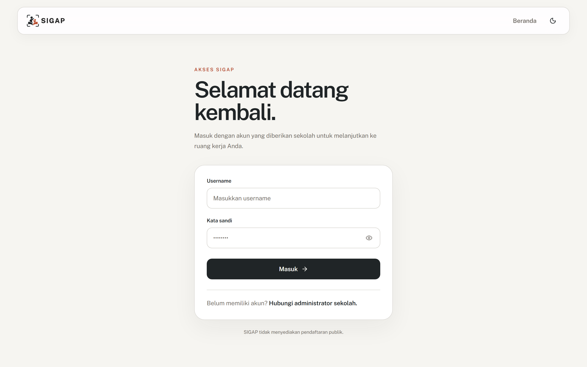

1. Buka alamat SIGAP di peramban.
2. Halaman awal adalah **Beranda**. Klik tombol masuk, atau buka langsung ke halaman **Akses SIGAP**.
3. Isi **Username** dan **Kata sandi**.
4. Klik **Masuk**.
5. Anda dibawa ke layar sesuai peran: administrator ke *Dashboard*, guru ke *Jadwal Mengajar*, kepala sekolah ke *Dashboard Pengawasan*, orang tua ke *Dashboard Anak*.

Lupa kata sandi? Hubungi administrator sekolah — hanya administrator yang dapat menyetel ulang kata sandi melalui menu **Pengguna**.

## 2.2 Mengenal layar kerja

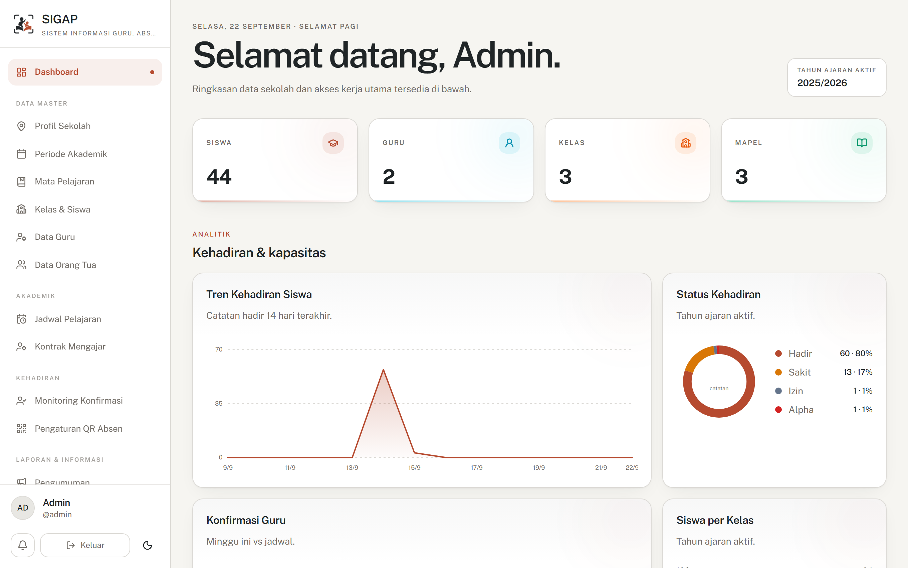

Setelah masuk, layar terbagi menjadi tiga area:

| Area | Isi |
|---|---|
| **Sidebar kiri** | Menu utama, dikelompokkan: Data Master, Akademik, Penilaian, Kehadiran, Laporan & Informasi, Manajemen, Akun. Menu yang aktif ditandai warna dan titik di kanannya |
| **Isi halaman** | Tabel, kartu ringkasan, grafik, dan formulir sesuai menu yang dipilih |
| **Kanan bawah sidebar** | Ikon **notifikasi** (lonceng), tombol **Keluar**, dan tombol **mode gelap/terang** |

Beberapa kebiasaan antarmuka yang berlaku di seluruh aplikasi:

- Tombol di kanan atas halaman (misal **Tambah Siswa**, **Import CSV**) membuka formulir di tengah layar, bukan halaman baru.
- Kolom pencarian di atas tabel menyaring data tanpa memuat ulang halaman.
- Kolom **Aksi** di ujung kanan tabel berisi tombol ubah (pensil) dan hapus (tempat sampah).
- Pesan hijau berarti berhasil, pesan merah berarti ada yang perlu diperbaiki.
- Posisi scroll sidebar dipertahankan saat Anda berpindah menu.

## 2.3 Profil dan kata sandi

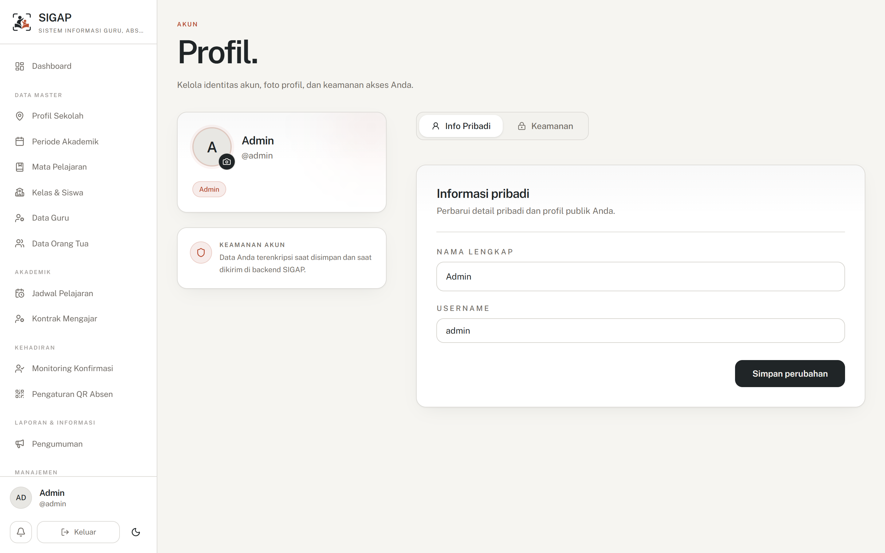

Menu **Akun → Profil Saya** berisi dua tab:

1. **Profil** — mengubah nama, username, telepon, dan foto profil (unggah gambar).
2. **Kata Sandi** — isi **Kata sandi lama**, lalu **Kata sandi baru** beserta konfirmasinya, lalu simpan.

Ganti kata sandi pertama kali setelah akun Anda dibuat administrator.

## 2.4 Keluar

Klik **Keluar** di bagian bawah sidebar. Jangan hanya menutup tab — keluar memastikan sesi Anda benar-benar berakhir, terutama di komputer sekolah yang dipakai bersama.

---

# Bagian 3 — Administrator

Administrator adalah orang pertama yang mengoperasikan SIGAP. Urutan pengerjaan di bawah ini adalah urutan yang disarankan, karena menu berikutnya bergantung pada data sebelumnya.

## 3.1 Profil sekolah dan batas lokasi (geofence)

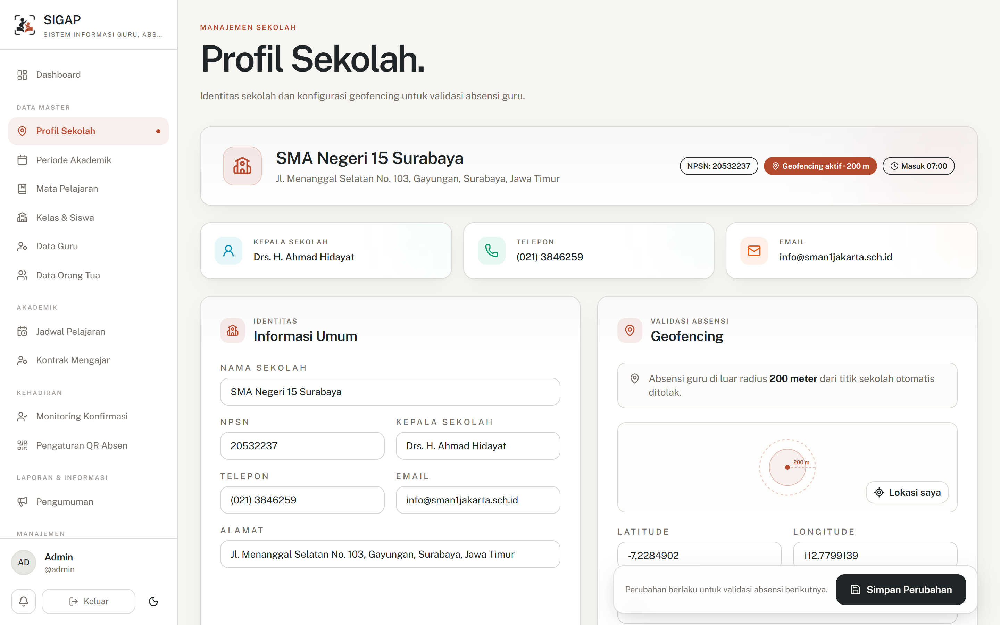

Menu **Data Master → Profil Sekolah**. Isi identitas sekolah: nama, NPSN, nama kepala sekolah, telepon, email, dan alamat.

Tiga kolom berikut menentukan cara kerja absensi guru:

| Kolom | Fungsi |
|---|---|
| **Latitude** dan **Longitude** | Titik pusat sekolah. Diisi koordinat, contoh `-7.2575` dan `112.7525` |
| **Radius (meter)** | Jarak maksimum guru masih dianggap "di dalam sekolah", misalnya `150` |
| **Jam mulai** | Batas waktu kehadiran. Konfirmasi setelah jam ini tercatat **Terlambat** |

> Jika latitude, longitude, dan radius semuanya terisi, sistem mengaktifkan **geofence**: guru yang memindai QR di luar radius akan tetap tercatat, tapi ditandai berada di luar sekolah sehingga bisa ditindaklanjuti kepala sekolah. Kosongkan salah satunya jika sekolah belum ingin memakai pembatasan lokasi.

## 3.2 Periode akademik dan publikasi nilai

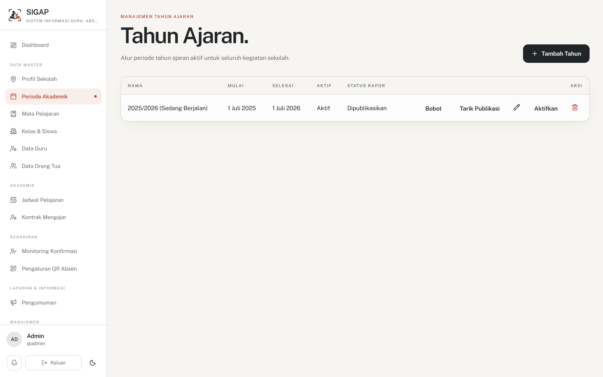

Menu **Data Master → Periode Akademik**.

1. Klik **Tambah** dan isi nama periode (misal `2025/2026`), tanggal mulai, dan tanggal selesai.
2. Tandai satu periode sebagai **Aktif** — semua kelas, jadwal, jurnal, dan nilai mengacu ke periode aktif ini.
3. Pada periode aktif, atur **Publikasi Nilai**:
   - **Publikasi aktif** → orang tua dan siswa dapat melihat nilai dan rapor.
   - **Publikasi mati** → nilai hanya dilihat guru dan kepala sekolah.

Gunakan tombol publikasi ini sebagai "keran" di akhir semester, setelah semua nilai guru selesai diinput.

## 3.3 Mata pelajaran dan KKM

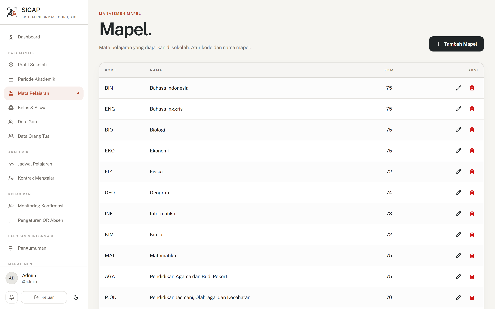

Menu **Data Master → Mata Pelajaran**. Tambahkan mapel beserta **kode** dan **KKM** (kriteria ketuntasan minimum). KKM dipakai sistem untuk menandai nilai tuntas/tidak tuntas dan menghitung predikat pada rapor.

## 3.4 Kelas dan siswa

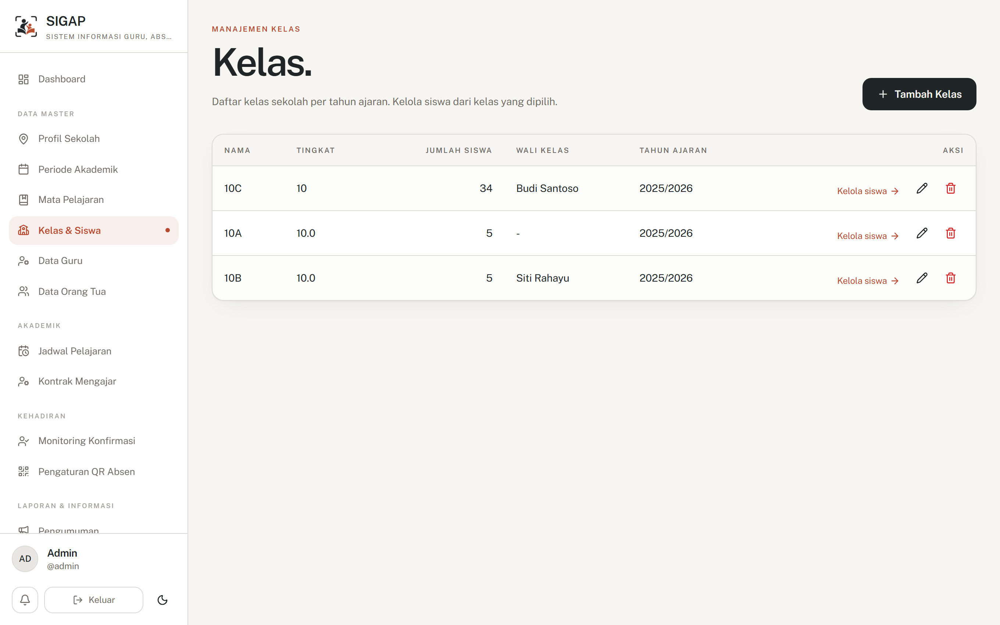

Menu **Data Master → Kelas & Siswa**.

1. **Buat kelas** lebih dulu: nama kelas (misal `10A`), tingkat, dan periode akademik.
2. Klik kelas untuk membuka **daftar siswa** kelas tersebut.
3. Tambah siswa satu per satu dengan tombol **Tambah Siswa**, atau massal lewat **Import CSV** (lihat 3.5).

Isian siswa: **NIS**, **nama**, **kelas**, **telepon**, **alamat**.

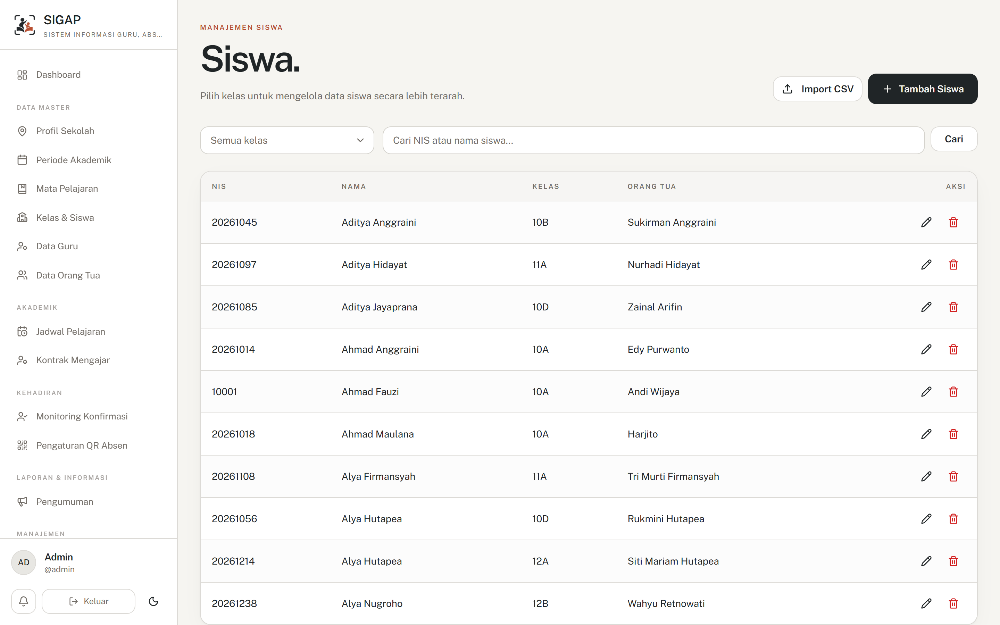

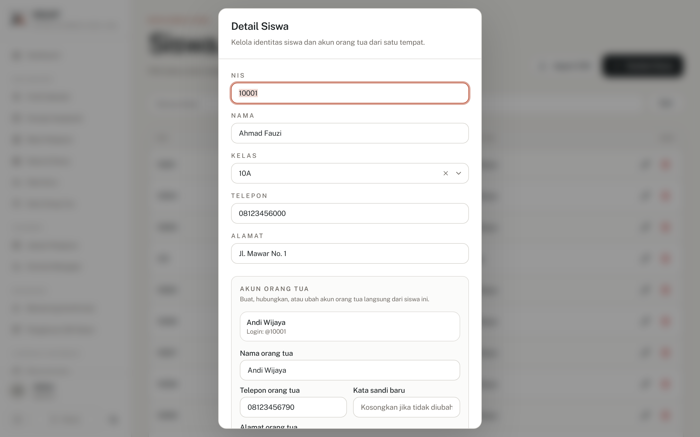

Di dalam formulir siswa ada blok **Akun Orang Tua**. Tiga pilihan:

- **Buat akun baru** — isi nama orang tua dan kata sandi. Username otomatis memakai NIS anak.
- **Pakai akun yang ada** — menautkan akun orang tua yang sudah punya anak lain, sehingga satu akun bisa melihat beberapa anak sekaligus.
- **Lepas akun** — memutus hubungan; jika akun itu tidak lagi menaungi anak mana pun, akunnya ikut terhapus.

## 3.5 Import siswa massal sekaligus akun orang tua

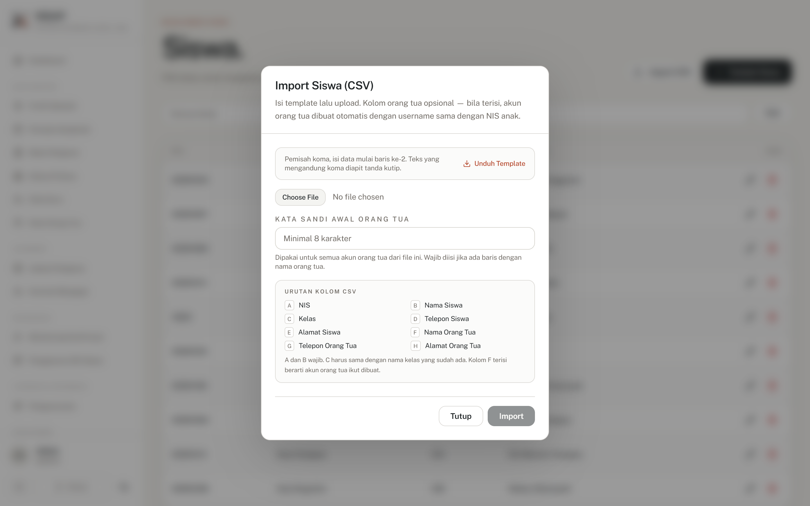

Untuk mengisi puluhan siswa sekaligus, gunakan **Import CSV** di halaman siswa.

**Langkah:**

1. Klik **Import CSV** → jendela formulir terbuka.
2. Klik **Unduh Template** untuk mendapatkan berkas `import-siswa.csv`.
3. Isi data mulai **baris ke-2**. Satu baris = satu siswa.
4. Kembali ke SIGAP, klik **Choose file**, pilih berkas yang sudah diisi.
5. Jika ada baris yang mengisi **Nama Orang Tua**, isi **Kata Sandi Awal Orang Tua** (minimal 8 karakter). Kata sandi ini dipakai untuk semua akun orang tua yang dibuat dari berkas tersebut.
6. Klik **Import**.
7. Baca hasilnya: jumlah siswa yang masuk, jumlah akun orang tua yang dibuat, dan daftar baris yang ditolak beserta alasannya.

**Urutan kolom pada template:**

| Kolom | Isi | Wajib |
|---|---|---|
| A | NIS | ya |
| B | Nama Siswa | ya |
| C | Kelas — harus sama persis dengan nama kelas yang sudah dibuat | ya, kecuali import dari halaman kelas |
| D | Telepon Siswa | tidak |
| E | Alamat Siswa | tidak |
| F | Nama Orang Tua | tidak — tapi kalau terisi, akun orang tua dibuat otomatis |
| G | Telepon Orang Tua | tidak |
| H | Alamat Orang Tua | tidak |

**Yang perlu diketahui:**

- Pemisah antar kolom adalah **koma**. Teks yang mengandung koma harus diapit tanda kutip, contoh: `"Jl. Mawar No. 5, RT 01/RW 02"`. Berkas dengan pemisah titik-koma (`;`) juga diterima.
- Baris pertama boleh header; sistem membacanya sebagai penanda kolom, jadi **urutan kolom boleh diubah** selama nama kolomnya dikenali.
- Membuka berkas CSV di Excel dengan pengaturan regional Indonesia sering membuat semua kolom menumpuk di satu sel. Itu hanya tampilan: selama isinya dipisah koma, sistem tetap membacanya dengan benar. Untuk melihat per kolom, gunakan **Data → From Text/CSV** lalu pilih pemisah *Comma*.
- Baris dengan NIS yang sudah dipakai tidak akan menimpa data lama — baris itu dilewati dan dilaporkan, sehingga Anda bisa memperbaikinya lalu mengimpor ulang bagian yang gagal saja.
- Import dari halaman sebuah kelas mengabaikan kolom Kelas: semua baris masuk ke kelas yang sedang dibuka.

## 3.6 Data guru dan kontrak mengajar

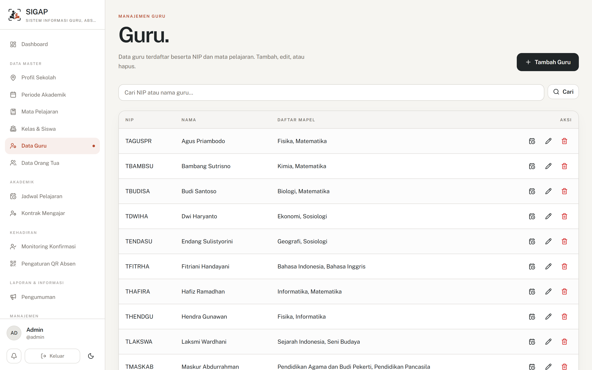

- **Data Master → Data Guru**: tautkan seorang guru ke akun pengguna, isi NIP, telepon, dan mata pelajaran yang diampu.
- **Akademik → Kontrak Mengajar**: menentukan guru mengajar kelas mana saja, dan siapa **wali kelas**-nya. Satu kelas punya satu wali kelas per periode akademik.

Kontrak mengajar inilah yang membuat seorang guru hanya melihat kelas tertentu di layarnya.

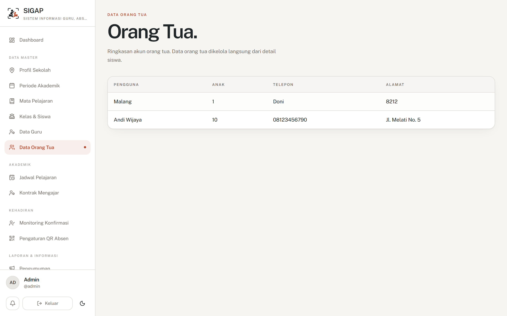

Menu **Data Master → Data Orang Tua** hanya membaca: daftar akun wali beserta jumlah anak yang terhubung. Pembuatan dan perubahan akun orang tua dilakukan dari halaman siswa (3.4) atau lewat import CSV (3.5), supaya relasi akun dan anak tidak terpisah.

## 3.7 Jadwal pelajaran

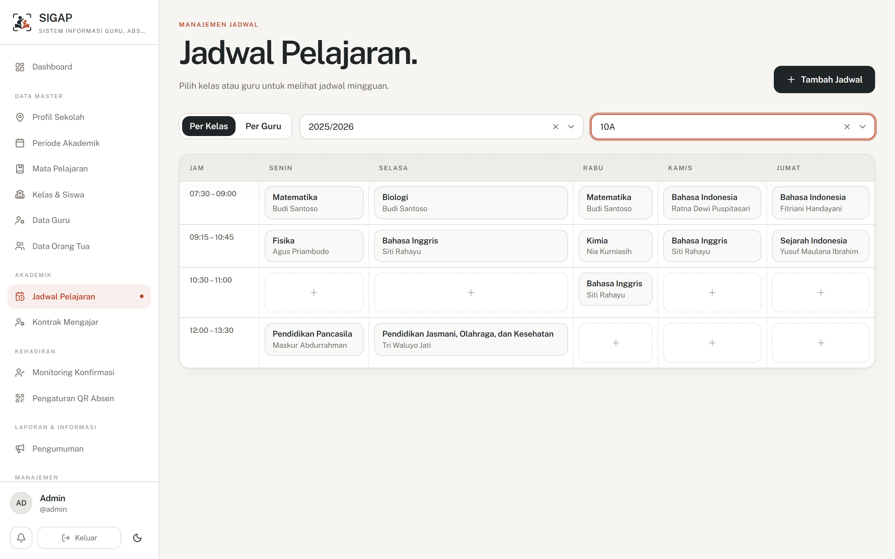

Menu **Akademik → Jadwal Pelajaran**. Pilih periode akademik, lalu saring per kelas atau guru untuk melihat jadwal yang berjalan.

Tombol **Tambah** membuka formulir: kelas, mata pelajaran, guru, hari, jam mulai, dan jam selesai. Jam pada jadwal menentukan daftar "hari ini" yang dilihat guru, sekaligus menjadi dasar perhitungan sesi terlewat bagi kepala sekolah.

## 3.8 Pengaturan QR absen dan layar QR

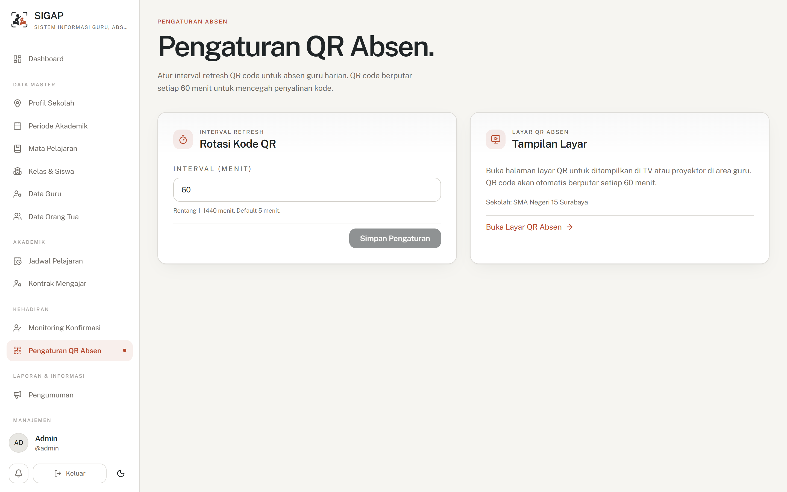

Menu **Kehadiran → Pengaturan QR Absen** mengatur **interval pergantian QR** — berapa detik satu kode QR berlaku sebelum berganti. Nilai kecil (misal 30–60 detik) membuat QR tidak bisa difoto lalu dipakai di rumah.

Setelah disimpan, buka **Layar QR Absen** untuk menampilkan QR berukuran besar di TV atau proyektor di ruang guru.

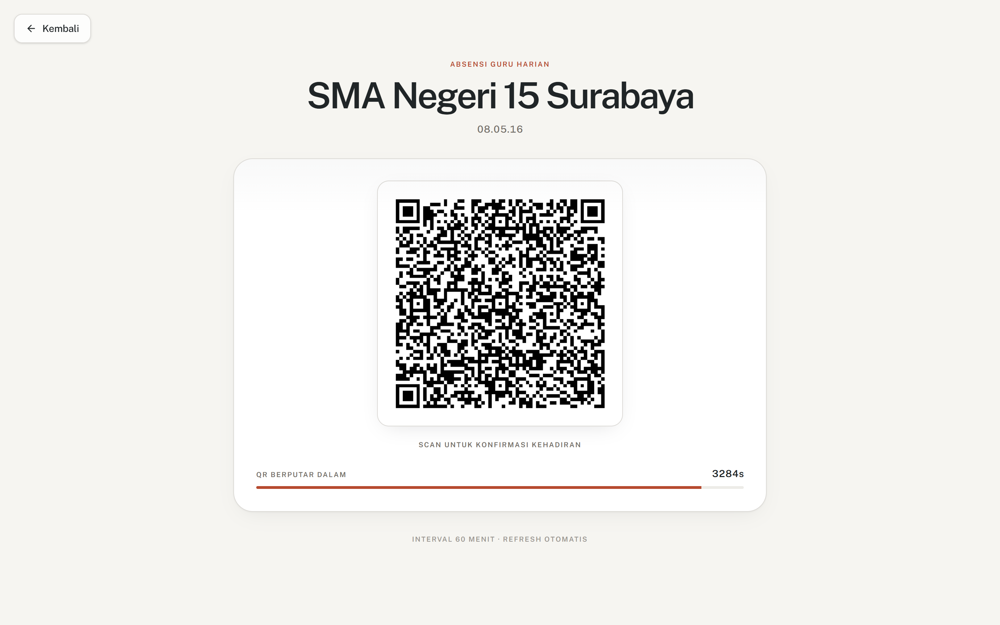

Kode pada layar ini dibuat dari data sekolah dan diperbarui otomatis sesuai interval. Guru memindainya dari akun masing-masing.

## 3.9 Pengguna, peran, dan hak akses

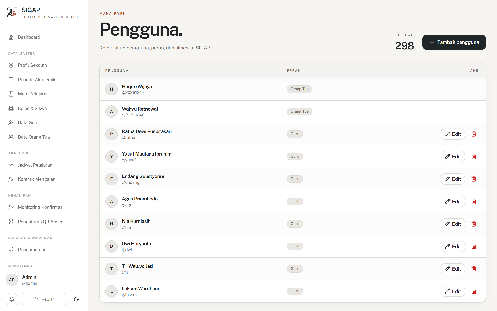

- **Manajemen → Pengguna**: menambah akun, mengatur nama, telepon, peran, dan status aktif. Akun yang dinonaktifkan tidak bisa masuk tetapi datanya tetap tersimpan.
- **Manajemen → Peran & Hak Akses**: setiap peran tersusun dari kumpulan hak akses (misalnya `journals.create`, `grades.edit`, `students.view`). Menambah hak ke sebuah peran langsung mengubah menu yang muncul di sidebar pengguna peran itu.

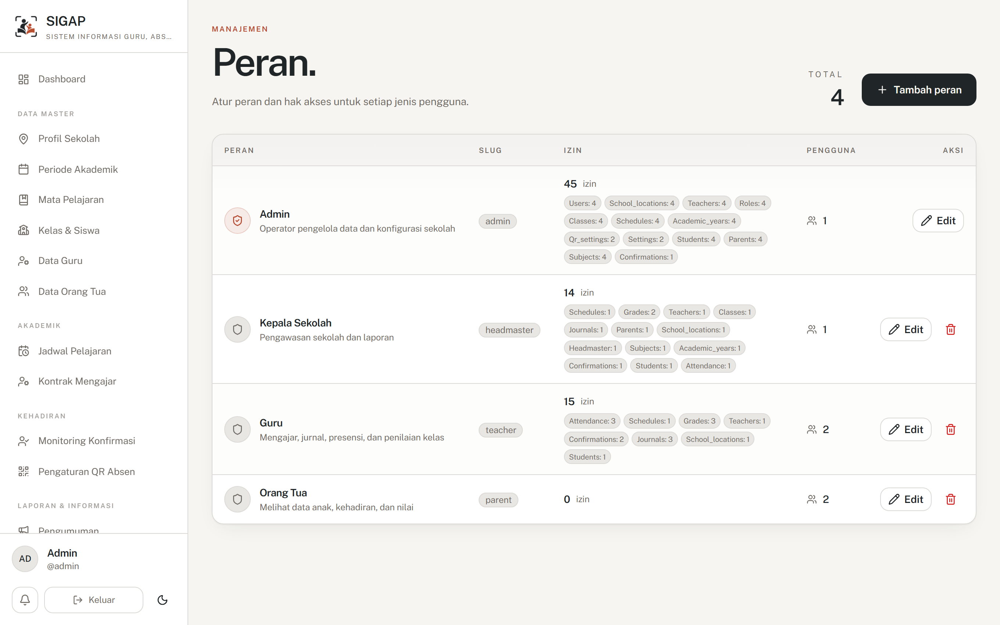

## 3.10 Pengumuman

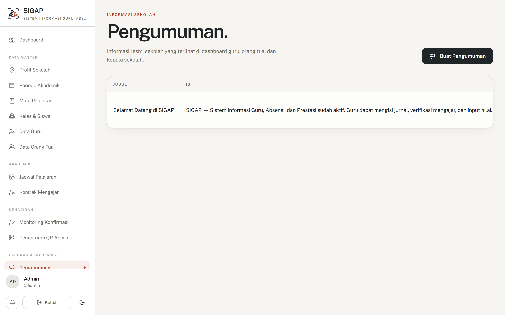

Menu **Laporan & Informasi → Pengumuman**. Judul dan isi pengumuman tersimpan dan muncul di dasbor pengguna yang menjadi sasarannya, termasuk orang tua.

---

# Bagian 4 — Guru

## 4.1 Dashboard jadwal hari ini

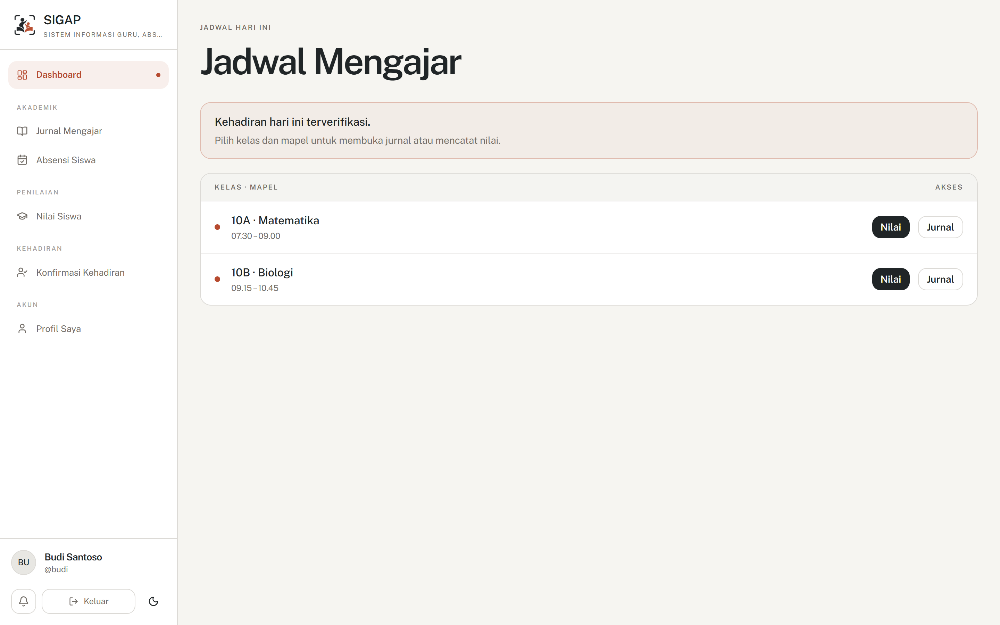

Guru masuk ke halaman **Jadwal Mengajar**. Isinya daftar mengampu hari itu: kelas, mata pelajaran, jam mulai–selesai.

Penting: konfirmasi kehadiran mengikat catatan mengajar pada hari itu. Halaman **Jadwal Mengajar** baru menampilkan daftar sesi setelah guru memindai QR, dan **jurnal serta nilai** menuntut konfirmasi yang sama **pada hari guru itu memang terjadwal mengajar**. Di hari tanpa jam mengajar, daftar nilai tetap terbuka. Aturan ini sengaja dibuat agar catatan kehadiran dan catatan mengajar selalu sepasang, tanpa mengunci guru di hari libur.

## 4.2 Konfirmasi kehadiran dengan QR

Menu **Kehadiran → Konfirmasi Kehadiran**.

1. Klik **Scan QR Absen** dan arahkan kamera ke layar QR di ruang guru.
2. Izinkan akses **kamera** dan **lokasi** saat peramban meminta.
3. Sistem menampilkan **Lokasi Anda** (latitude/bujur dan jarak ke sekolah). Bila posisi belum terbaca, tunggu atau klik **Perbarui lokasi**.
4. Klik **Verifikasi Kehadiran**.
5. Setelah berhasil, muncul status **Sudah terverifikasi** dan **Kehadiran hari ini sudah tercatat.**

| Kondisi | Yang tercatat |
|---|---|
| Di dalam radius sekolah, sebelum jam mulai | Hadir, tepat waktu |
| Di dalam radius, setelah jam mulai | Hadir, ditandai **Terlambat** |
| Di luar radius sekolah | Tetap tersimpan, tapi ditandai **di luar sekolah** dan masuk laporan kepala sekolah |

Satu guru hanya punya satu catatan konfirmasi per hari. Setelah terverifikasi, seluruh menu guru terbuka — klik **Lihat Jadwal Hari Ini** untuk kembali.

## 4.3 Jurnal mengajar dan presensi siswa

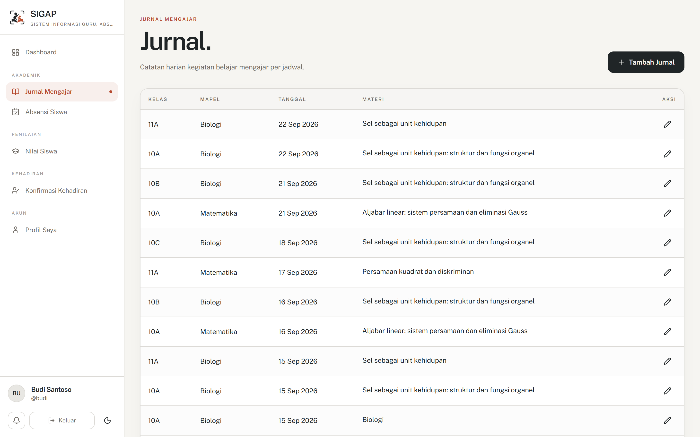

Menu **Akademik → Jurnal Mengajar**. Halaman ini berisi jurnal yang sudah Anda isi, dan tombol **Tambah Jurnal** di kanan atas.

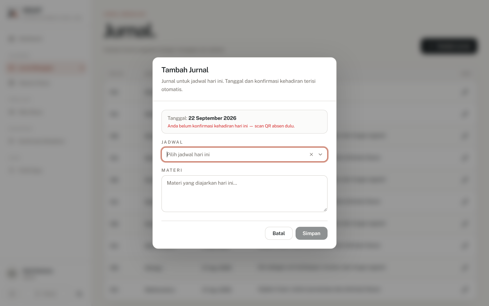

Isi jurnal untuk sesi yang **sudah berlangsung**. Pada hari yang sama, daftar isinya adalah sesi Anda hari ini. Sesi yang terlewat masih bisa ditutup sampai **tiga hari ke belakang** — ditandai keterangan *susulan* — dengan satu syarat: Anda tercatat men-scan QR pada hari sesi itu berlangsung. Tanggal dan bukti konfirmasi kehadiran terisi otomatis — Anda tidak perlu mengetiknya.

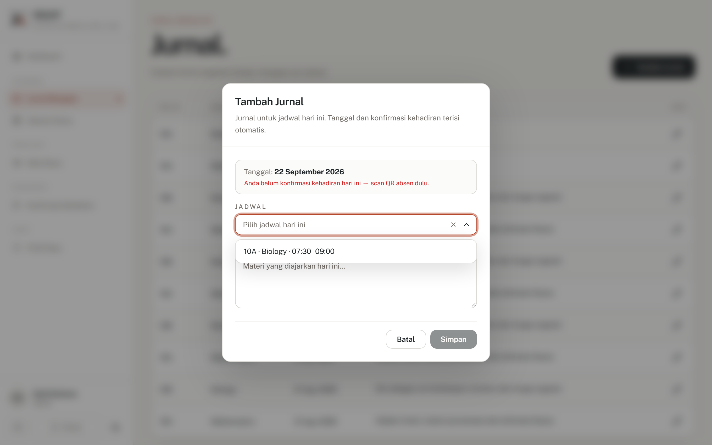

1. Klik kolom **Jadwal**, lalu pilih sesi yang ingin dicatat. Daftar yang muncul hanya sesi Anda yang sudah lewat jam selesainya dalam empat hari terakhir, lengkap dengan tanggal, nama kelas, mata pelajaran, dan jam. Sesi sebelum hari ini diberi keterangan *susulan*.
2. Jika jurnal untuk sesi itu sudah ada, sistem menampilkannya kembali dan materi akan diperbarui, bukan dibuat duplikat.
3. Isi **Materi** — ringkasan yang diajarkan hari itu.
4. Bagian **Presensi Siswa** otomatis memunculkan daftar siswa kelas tersebut. Setiap siswa punya empat tombol: **Hadir**, **Sakit**, **Izin**, **Alpa**. Semua siswa awalnya dianggap Hadir; ubah yang tidak masuk saja. Ringkasan jumlah tiap status terlihat di kanan atas daftar.

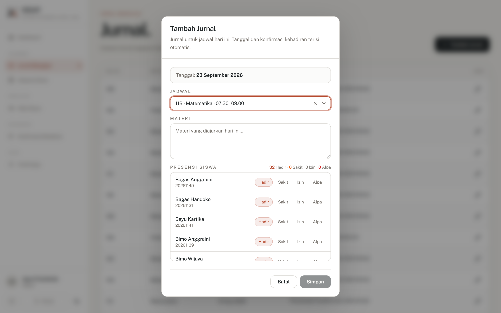

5. Klik **Simpan**. Materi dan presensi tersimpan sekaligus.

> Jika tombol **Tambah Jurnal** tidak dapat diklik atau daftar jadwal kosong, berarti semua sesi tiga hari terakhir sudah terisi jurnal. Bila sesi yang Anda maksud tidak muncul sama sekali, kemungkinan tanggalnya sudah lewat dari tiga hari, Anda tidak tercatat hadir pada hari itu, atau hari tersebut bukan hari efektif menurut kalender sekolah. Untuk kasus terakhir ini, minta administrator memeriksa **Kalender Sekolah**.

## 4.4 Nilai siswa

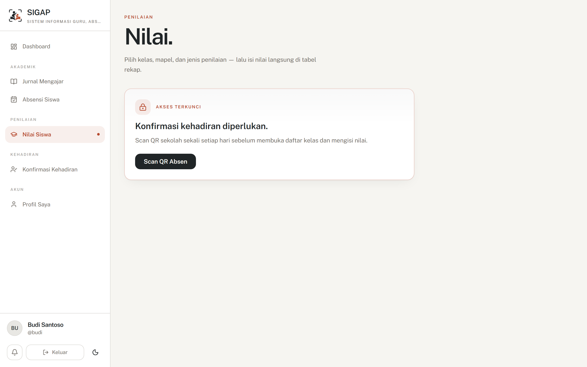

Menu **Penilaian → Nilai Siswa**.

1. Pilih **Kelas** dan **Mapel** pada penyaring di atas.
2. Sistem menampilkan daftar siswa beserta komponen nilai yang berlaku pada periode aktif (misalnya Tugas, UTS, UAS) dan **Nilai Akhir** hasil perhitungan bobot.
3. Klik **Tambah** untuk memasukkan atau mengubah nilai satu siswa, atau isi beberapa nilai lalu klik **Simpan**.
4. **Predikat** dan status tuntas dihitung otomatis memakai KKM mata pelajaran.

Guru hanya dapat menilai kelas dan mapel sesuai kontrak mengajarnya. Soal konfirmasi kehadiran: pada hari Anda **terjadwal mengajar**, nilai baru terbuka setelah memindai QR — sama seperti jurnal. Pada hari yang tidak ada jam mengajar untuk Anda (libur, akhir pekan, atau hari kosong), daftar nilai tetap bisa dibuka dan diisi seperti biasa.

## 4.5 Rekap absensi siswa

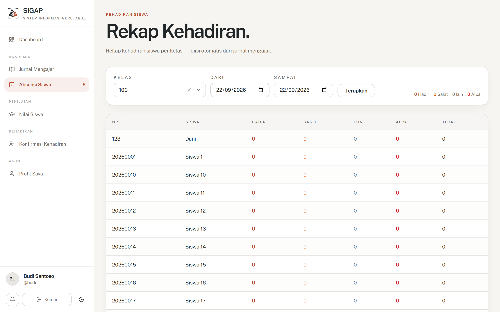

Menu **Akademik → Absensi Siswa** adalah baca ulang presensi yang sudah tercatat lewat jurnal: per kelas, per tanggal, per siswa. Pilih kelas dan rentang tanggal, maka seluruh siswa kelas itu tampil beserta jumlah Hadir, Sakit, Izin, Alpa, dan Total. Karena absensi lahir dari jurnal, halaman ini tidak punya formulir isian — cara menambah catatan absensi adalah dengan mengisi jurnal mengajar.

## 4.6 Rapor siswa

Rapor dibuka dari halaman yang sama: **Akademik → Absensi Siswa** → pilih kelas → klik **Rapor** di kolom Aksi pada baris siswa. Kolom Aksi ini hanya muncul untuk kelas tempat Anda tercatat sebagai **wali kelas**. Guru pengampu biasa tidak melihat tombolnya, dan administrator tidak punya akses ke halaman rapor.

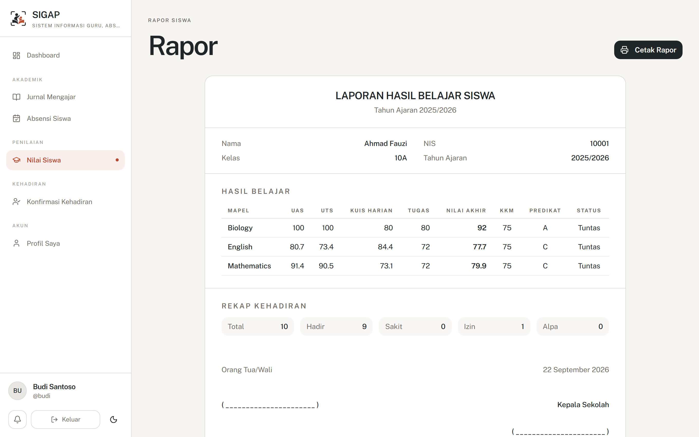

Lembar rapor berisi **Laporan Hasil Belajar Siswa**: identitas dan kelas, nilai per mata pelajaran (UAS, UTS, Kuis Harian, Tugas), Nilai Akhir, KKM, Predikat, status Tuntas, serta rekap kehadiran. Bagian bawah disediakan untuk tanda tangan orang tua/wali dan kepala sekolah. Klik **Cetak Rapor** di kanan atas (atau `Ctrl+P`) untuk mencetak atau menyimpannya sebagai PDF.

> Satu kelas hanya punya satu wali kelas per periode akademik. Jika tombol Rapor tidak muncul pada kelas yang Anda kira, minta administrator memeriksa **Akademik → Kontrak Mengajar** dan mencentang *Wali kelas* untuk kelas tersebut.

---

# Bagian 5 — Kepala Sekolah

Kepala sekolah masuk ke halaman **Pengawasan Sekolah** (kelompok menu *Dasbor Kepala Sekolah*).

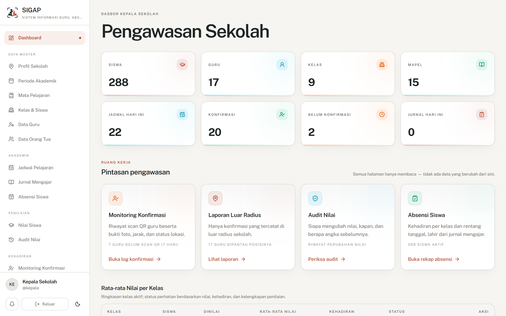

## 5.1 Delapan kartu ringkasan

| Kartu | Artinya |
|---|---|
| Siswa | Jumlah siswa terdaftar |
| Guru | Jumlah akun guru |
| Kelas | Jumlah kelas pada periode aktif |
| Mapel | Jumlah mata pelajaran |
| Jadwal Hari Ini | Sesi yang seharusnya berjalan hari ini |
| Konfirmasi | Sesi hari ini yang gurunya sudah memindai QR |
| Belum Konfirmasi | Sesi hari ini yang gurunya belum memindai QR — angka yang paling perlu diperhatikan setiap pagi |
| Jurnal Hari Ini | Jumlah jurnal yang sudah diisi hari ini |

## 5.2 Pintasan pengawasan

Tepat di bawah kartu ringkasan ada empat kartu pintasan. Semuanya hanya membuka halaman; tidak ada data yang berubah dari sana.

| Pintasan | Membuka |
|---|---|
| Monitoring Konfirmasi | Log pemindaian QR guru beserta jarak dan status lokasi |
| Laporan Luar Radius | Konfirmasi yang tercatat di luar radius sekolah |
| Audit Nilai | Riwayat perubahan nilai |
| Absensi Siswa | Rekap kehadiran per kelas dan rentang tanggal |

Baris kecil di tiap kartu menyebut angka yang sedang berlaku, misalnya `4 guru belum scan QR (7 hari)`, supaya kepala sekolah tahu ke mana harus melihat lebih dulu.

## 5.3 Rata-rata Nilai per Kelas

Tabel ini merangkum tiap kelas aktif: **Kelas, Siswa, Dinilai, Rata-rata Nilai, Kehadiran, Status, Aksi**.

- Kolom **Dinilai** memakai format `32/32` — berapa siswa yang sudah punya nilai dibandingkan jumlah siswanya. Kelas dengan `0/32` berarti belum ada nilai masuk sama sekali.
- Kolom **Status** menandai kelas yang perlu ditindaklanjuti (misal *Perlu perhatian*) bila rata-rata nilainya di bawah 75, kehadiran siswanya di bawah 90%, atau masih ada siswa yang belum dinilai.
- Tautan **Detail nilai** membuka lembar nilai per siswa untuk kelas tersebut — hanya membaca, kepala sekolah tidak mengubah angka di sini.

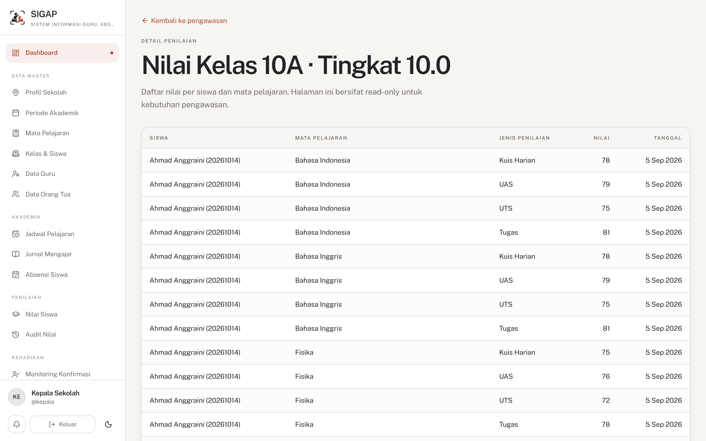

## 5.4 Kehadiran Guru (30 Hari)

Tabel kedua membandingkan konfirmasi QR dengan hari mengajar yang dijadwalkan: **Guru, Hari Hadir, Tingkat Kehadiran, Status, Aksi**. Barisnya berbunyi misalnya `Siti Rahayu · 20/21 · 95,24% · Normal`, dan guru dengan tingkat kehadiran di bawah 90% ditandai *Perlu perhatian*. Tautan **Riwayat** membuka daftar hari guru tersebut.

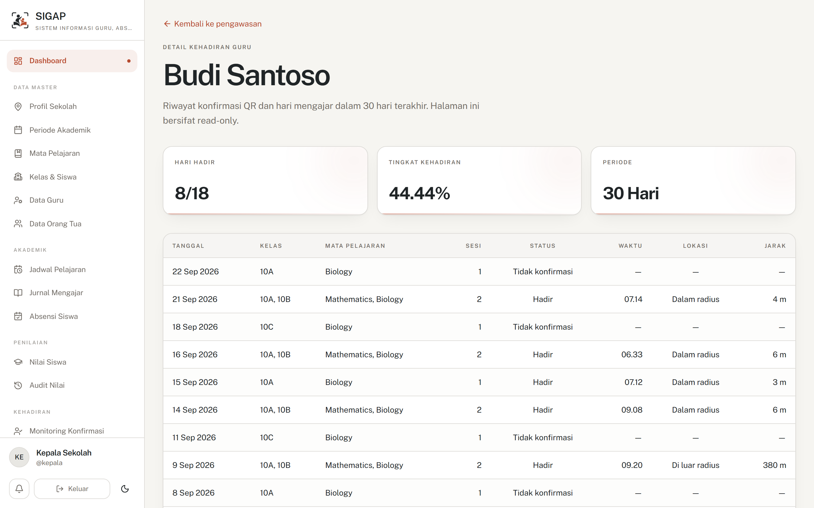

Lembar riwayat menampilkan **Tanggal, Kelas, Mata Pelajaran, Sesi, Status, Waktu, Lokasi, Jarak** — jadi terlihat berapa sesi yang diampu pada hari itu dan apakah konfirmasinya tercatat di dalam sekolah.

## 5.5 Guru Tanpa Konfirmasi (7 Hari)

Satu baris berarti satu guru pada satu hari: ia punya jadwal mengajar, tetapi tidak ada pemindaian QR pada hari itu. Kolomnya **Guru, Tanggal, Sesi Terlewat, Kelas, Mapel, Status**.

Aturannya mengikuti cara guru bekerja: satu pemindaian berlaku untuk satu hari penuh, bukan per jam pelajaran. Karena itu baris di tabel ini muncul meskipun guru tersebut hanya melewatkan scan pagi — jumlah sesinya ikut ditampilkan agar terlihat seberapa besar dampaknya hari itu.

## 5.6 Monitoring Konfirmasi

Menu **Kehadiran → Monitoring Konfirmasi** membuka *Log Kehadiran Guru*. Bagian atas menampilkan ringkasan hari ini, misalnya **15 dari 16 guru sudah konfirmasi hari ini · Batas tepat waktu 07:00**.

Di bawahnya ada penyaring **Dari Tanggal**, **Sampai Tanggal**, dan **Guru** (tombol *Reset* muncul saat penyaring aktif). Gunakan rentang tanggal untuk melihat histori, misalnya satu bulan terakhir.

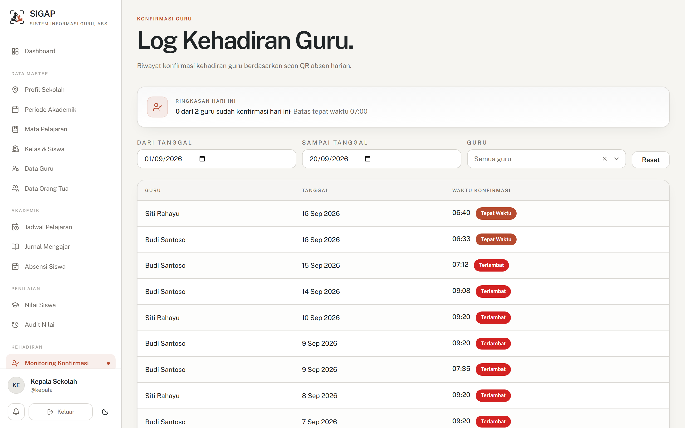

## 5.7 Laporan Kehadiran Guru

Menu **Laporan → Laporan Kehadiran Guru** khusus menampilkan konfirmasi yang tercatat **di luar radius sekolah** — kolomnya **Guru, Kelas, Mapel, Jarak, Konfirmasi, Status**. Laporan inilah yang dipakai menindaklanjuti dugaan absensi tidak di lokasi.

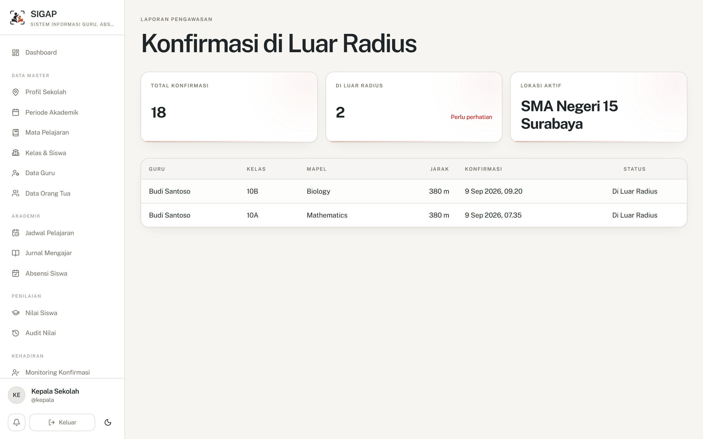

## 5.8 Audit Nilai

Menu **Penilaian → Audit Nilai** berisi riwayat perubahan nilai: **Waktu, Siswa, Mapel, Kelas, Jenis, Aksi, Nilai, Oleh**. Setiap perubahan tercatat otomatis — nilai lama dan nilai baru sama-sama ditampilkan — dan tidak dapat dihapus dari layar. Ini pegangan saat ada keberatan orang tua terhadap sebuah nilai.

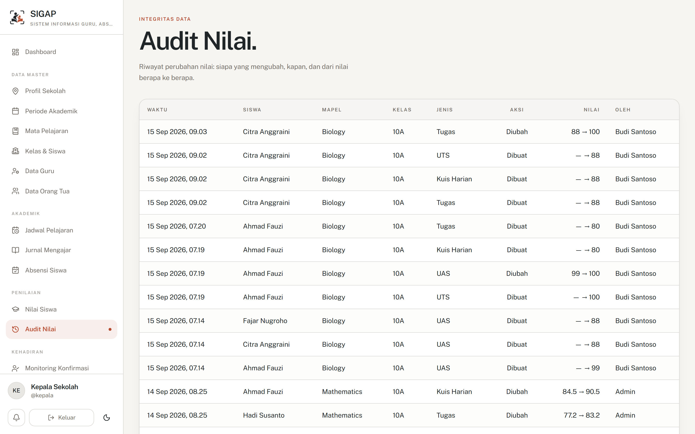

> Kepala sekolah tidak mengubah data master; perannya mengawasi dan menindaklanjuti. Untuk mengubah nilai, kepala sekolah meminta guru pengampu yang memperbaikinya agar jejak audit tetap jelas.

---

# Bagian 6 — Orang Tua/Wali

## 6.1 Masuk dan melihat daftar anak

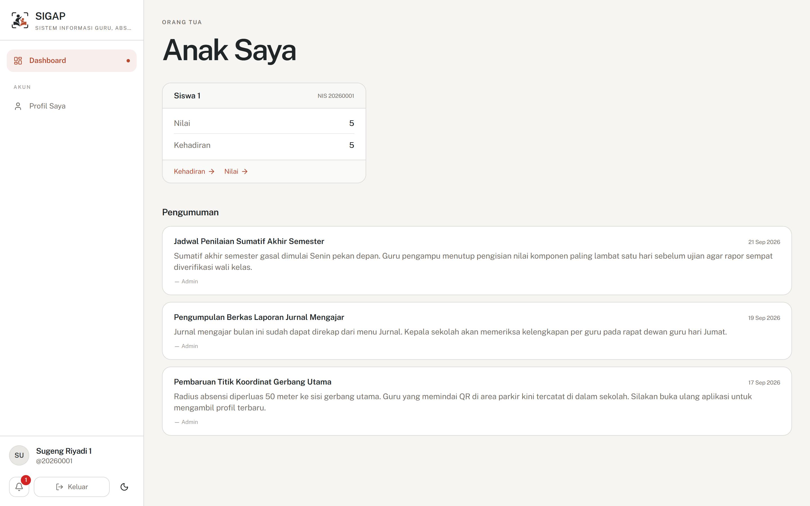

Orang tua masuk memakai **username = NIS anak** dan kata sandi yang diberikan sekolah (bisa dibuatkan lewat import CSV atau oleh administrator di halaman siswa).

Dasbor menampilkan seluruh anak yang tertaut ke akun tersebut, lengkap dengan kelas dan ringkasan kehadirannya. Jika akun menaungi beberapa anak, semua muncul di sini.

## 6.2 Nilai dan rapor anak

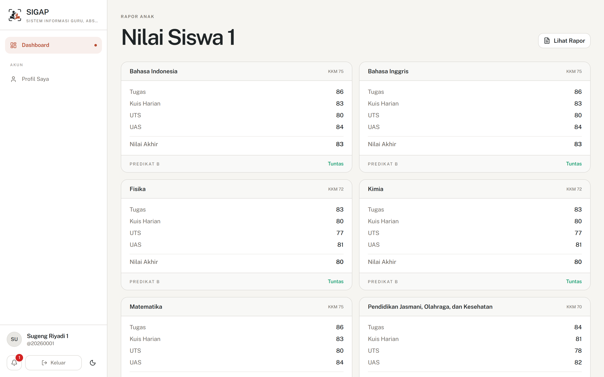

Pilih anak, lalu buka **Nilai**. Yang terlihat: nilai tiap komponen per mata pelajaran, nilai akhir, predikat, dan keterangan tuntas terhadap KKM.

> Nilai baru tampil setelah sekolah **mempublikasikan nilai** pada periode akademik (diatur administrator/kepala sekolah di menu Periode Akademik). Sebelum itu, halaman tetap terbuka tetapi daftar nilai kosong.

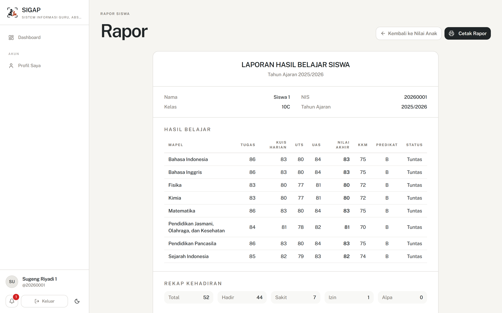

Klik **Lihat Rapor** di kanan atas halaman nilai untuk membuka lembar rekap satu anak — nilai akhir, predikat, dan rekap kehadiran dalam format siap cetak (tombol **Cetak Rapor** atau `Ctrl+P`).

## 6.3 Absensi anak

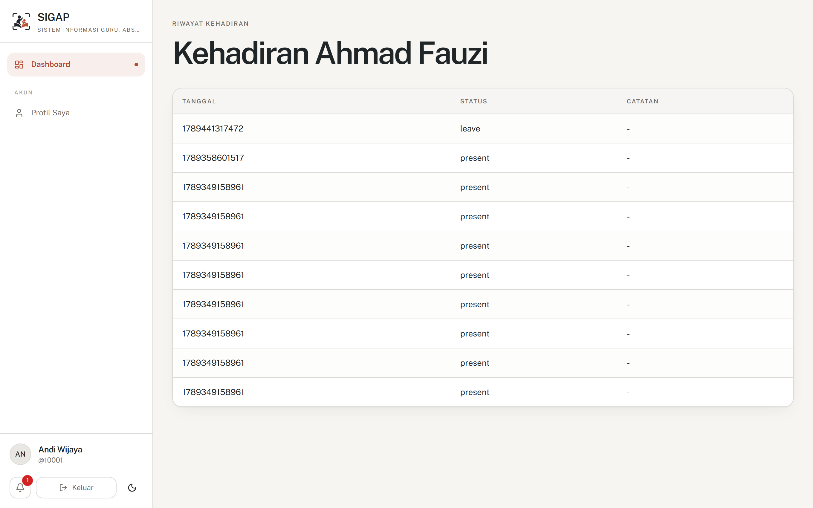

Rekap kehadiran per tanggal beserta total Hadir, Sakit, Izin, dan Alpa. Data ini berasal dari jurnal yang diisi guru pengampu pada hari tersebut.

## 6.4 Notifikasi dan pengumuman

Ikon lonceng di pojok sidebar menampilkan pemberitahuan pribadi (misalnya ada nilai baru). Pengumuman sekolah muncul di halaman utamanya. Orang tua juga dapat mengganti kata sandi sendiri di **Profil Saya**.

---

# Bagian 7 — Alur Harian Ringkas

## 7.1 Satu hari untuk guru

| Waktu | Aksi di SIGAP |
|---|---|
| Tiba di sekolah | **Kehadiran → Konfirmasi Kehadiran** → scan QR di ruang guru → verifikasi |
| Sebelum mengajar | **Akademik → Jurnal Mengajar → Tambah Jurnal** → pilih sesi, tulis materi, tandai siswa yang tidak hadir, simpan |
| Setelah ujian | **Penilaian → Nilai Siswa** → pilih kelas & mapel → input nilai → simpan |
| Sepanjang hari | Ulangi jurnal untuk setiap sesi yang diampu |

## 7.2 Menyiapkan awal semester (administrator)

1. Profil sekolah — identitas, koordinat, radius, jam mulai.
2. Periode akademik baru → tandai **Aktif**.
3. Mata pelajaran beserta KKM.
4. Kelas untuk periode itu.
5. Import CSV siswa (isi kolom orang tua bila ingin akun wali dibuat sekaligus).
6. Data guru + kontrak mengajar + wali kelas.
7. Jadwal pelajaran per kelas.
8. Pengaturan QR absen → cek layar QR tampil dengan benar.
9. Buat akun pengguna dan tentukan perannya.

## 7.3 Akhir semester (administrator & kepala sekolah)

1. Kepala sekolah memeriksa **Audit Nilai** dan **Sesi terlewat**.
2. Guru memastikan seluruh jurnal dan nilai lengkap.
3. Administrator mengaktifkan **Publikasi Nilai** pada periode aktif.
4. Orang tua dapat melihat nilai dan rapor anaknya; cetak rapor bila diperlukan.
5. Nonaktifkan publikasi bila nilai perlu diperbaiki lagi.

---

# Bagian 8 — Tips dan Pemecahan Masalah

| Gejala | Penyebab umum | Yang dilakukan |
|---|---|---|
| Menu yang dicari tidak muncul | Hak akses peran Anda memang tidak mencakup menu itu | Cek Bagian 3.9 atau minta administrator |
| Tombol jurnal/nilai bertuliskan *Akses terkunci* | Belum konfirmasi kehadiran hari ini | Scan QR lebih dulu (Bagian 4.2) |
| Kamera tidak muncul saat scan | Izin kamera belum diberikan, atau halaman dibuka tanpa HTTPS di luar localhost | Buka lewat alamat `https://…`, atau izinkan kamera di pengaturan peramban |
| Muncul "Di luar radius sekolah" | Posisi GPS belum akurat atau guru benar-benar di luar sekolah | Tunggu posisi terbaca, klik **Perbarui lokasi**, pastikan GPS perangkat aktif |
| Daftar jadwal pada jurnal kosong | Tidak ada jadwal mengajar hari itu, atau kontrak/jadwal belum dibuat | Periksa jadwal pelajaran dan kontrak mengajar bersama administrator |
| Import CSV menolak banyak baris | NIS sudah dipakai, nama kelas tidak sama persis, atau kolom orang tua terisi tanpa kata sandi | Baca daftar alasan per baris, perbaiki berkasnya, impor ulang bagian yang gagal |
| Semua kolom CSV menumpuk di satu sel | Pengaturan regional Excel memakai pemisah titik-koma | Tidak masalah untuk sistem. Untuk melihat per kolom: **Data → From Text/CSV**, pemisah *Comma* |
| Orang tua tidak melihat nilai | Publikasi nilai periode aktif masih mati | Aktifkan di **Periode Akademik** |
| Nilai anak tidak lengkap | Guru belum menyimpan nilai komponen | Cek **Progres nilai** di dasbor kepala sekolah |
| Data sudah diubah tapi layar lama | Sesi peramban menggantung | Muat ulang halaman (Ctrl+R) |
| Lupa kata sandi | — | Administrator menyetel ulang di **Pengguna**, atau pengguna ganti sendiri di **Profil Saya** bila masih ingat sandi lama |
| QR di layar tidak berganti | Interval terlalu besar atau halaman layar QR tidak aktif | Perkecil interval di **Pengaturan QR Absen**, buka ulang layar QR |

**Tiga kebiasaan yang membuat data selalu rapi**

1. Guru mengisi jurnal **pada hari yang sama** — presensi siswa lahir dari jurnal.
2. Administrator tidak mengubah NIS siswa yang sudah punya riwayat nilai.
3. Publikasi nilai dipakai sebagai keran, bukan disematkan terbuka sepanjang semester.

---

# Lampiran A — Menu yang tampak per peran

| Kelompok menu | Admin | Guru | Kepala Sekolah | Orang Tua |
|---|:--:|:--:|:--:|:--:|
| Dashboard | ya | Jadwal Mengajar | Pengawasan Sekolah | Dashboard Anak |
| Profil Sekolah | ya | – | ya | – |
| Periode Akademik | ya | – | ya | – |
| Mata Pelajaran | ya | – | ya | – |
| Kelas & Siswa | ya | – | ya | – |
| Data Guru | ya | – | ya | – |
| Data Orang Tua | ya | – | ya | – |
| Jadwal Pelajaran | ya | – | ya | – |
| Kontrak Mengajar | ya | – | – | – |
| Jurnal Mengajar | – | ya | ya | – |
| Absensi Siswa | – | ya | ya | – |
| Nilai Siswa | – | ya | ya | – |
| Audit Nilai | – | – | ya | – |
| Konfirmasi Kehadiran | – | ya | – | – |
| Monitoring Konfirmasi | ya | – | ya | – |
| Pengaturan QR Absen | ya | – | – | – |
| Pengawasan Sekolah | – | – | ya | – |
| Laporan Kehadiran Guru | – | – | ya | – |
| Pengumuman | ya | – | – | ya |
| Pengguna | ya | – | – | – |
| Peran & Hak Akses | ya | – | – | – |
| Profil Saya | ya | ya | ya | ya |

Daftar di atas mengikuti hak akses, sehingga dapat berubah jika administrator menyesuaikan peran.

---

# Lampiran B — Glosarium

| Istilah | Arti |
|---|---|
| **NIS** | Nomor induk siswa. Dipakai username akun orang tuanya |
| **Periode akademik** | Tahun ajaran aktif; semua kelas, jadwal, jurnal, dan nilai mengacu ke sini |
| **Mapel** | Mata pelajaran |
| **KKM** | Kriteria ketuntasan minimum; ambang nilai tuntas per mata pelajaran |
| **Komponen nilai** | Jenis penilaian (misal Tugas, UTS, UAS) beserta bobotnya |
| **Nilai akhir** | Hasil perhitungan bobot seluruh komponen |
| **Predikat** | Label mutu nilai akhir |
| **Konfirmasi kehadiran** | Absensi guru harian lewat QR, berisi waktu, foto, dan posisi |
| **Geofence** | Pembatas area berbasis radius sekolah |
| **Jurnal mengajar** | Catatan kegiatan belajar per sesi; sekaligus sumber data absensi siswa |
| **Sesi terlewat** | Jadwal yang sudah lewat tanpa jurnal |
| **Audit nilai** | Riwayat perubahan nilai: pelaku, waktu, nilai lama, nilai baru |
| **Publikasi nilai** | Saklar yang membuat nilai dan rapor terlihat oleh orang tua |
| **Wali kelas** | Guru yang bertanggung jawab atas satu kelas |

---

# Lampiran C — Akun demo lingkungan percobaan

Akun berikut tersedia setelah `npm run seed` dijalankan pada **lingkungan percobaan**. Jangan memakainya di lingkungan sekolah yang sebenarnya — ganti seluruh kata sandinya.

| Peran | Username | Kata sandi | Catatan |
|---|---|---|---|
| Administrator | `admin` | `admin123` | akses penuh data master |
| Kepala Sekolah | `kepala` | `kepala123` | dasbor pengawasan dan laporan |
| Guru Matematika & Biologi | `budi` | `teacher123` | wali kelas 10C, mengampu beberapa rombel |
| Guru Bahasa Inggris | `siti` | `teacher123` | wali kelas 10B |
| Guru lain (13 akun) | `ratna`, `yusuf`, `endang`, `agus`, `nia`, `dwi`, `tri`, `laksmi`, `hafiz`, `nur`, `bambang`, `retno`, `fitri`, `hendra`, `maskur` | `teacher123` | satu akun per guru; `ratna` wali 10A |
| Orang Tua — satu anak | `20261001` | `parent123` | username = NIS anak; tiap siswa punya akun orang tuanya sendiri |
| Orang Tua — banyak anak | `10001` | `parent123` | keluarga contoh: satu akun menaungi 10 anak (NIS 10001–10010) |

Data hasil seed berisi 288 siswa pada 9 rombel (32 siswa per kelas), 17 guru, dan 15 mata pelajaran, lengkap dengan 30 hari jadwal, jurnal, absensi, dan nilai — jadi semua tabel dan grafik terisi saat dibuka.

---

*Manual book ini disusun mengikuti tampilan SIGAP versi berjalan. Jika antarmuka sekolah Anda sudah disesuaikan, nama menu bisa sedikit berbeda; alur kerjanya tetap sama.*
