# MANUAL BOOK SIGAP
### Sistem Informasi Guru, Absensi, dan Prestasi

Panduan penggunaan untuk administrator, guru, kepala sekolah, dan orang tua/wali siswa. Mencakup pengelolaan roster siswa, nilai harian SIGAP, serta alur impor dan ekspor e-Rapor SMP 2025.2.

---

# Panduan Cepat - Roster siswa dan nilai e-Rapor

## Alur singkat

1. **Admin menyiapkan daftar siswa** di kelas SIGAP dan mengisi NIS asli.
2. **Admin menyimpan template e-Rapor** untuk setiap kombinasi kelas, mapel, dan semester.
3. **Admin menentukan kebijakan pemetaan** dan memilih apakah guru boleh mengubah pemetaan untuk kelas yang diampunya.
4. **Guru mengisi nilai rutin sekali** di halaman Nilai Siswa. Kolom yang dipetakan mengikuti nilai itu.
5. Jika akses diaktifkan, guru dapat mengubah pemetaan khusus untuk kelas/mapel yang diajar. Guru mengisi kolom yang tidak dipetakan langsung di halaman e-Rapor, menyimpan, lalu mengunduh `.xls` atau `.xlsx`.
6. Admin memublikasikan nilai agar orang tua dapat melihatnya.

## 1. Impor atau lengkapi data siswa per kelas

Cara ini paling mudah untuk melengkapi NIS dan data orang tua tanpa menyalin ulang roster.

1. Buka **Kelas & Siswa**, lalu pilih kelas.
2. Klik **Unduh data kelas (.xlsx)**. File `data-kelas-[nama-kelas].xlsx` memuat data yang sudah tersimpan. Jika kelas belum memiliki siswa, file berisi judul kolom saja.
3. Lengkapi kolom yang diperlukan. Jangan ubah atau hapus **ID Siswa SIGAP** pada siswa lama. Untuk siswa baru, tambahkan baris dan biarkan ID tersebut kosong; isi NIS dan nama.
4. Klik **Impor daftar siswa**, pilih file yang sudah dilengkapi, lalu klik **Impor siswa**. Semua baris masuk ke kelas yang sedang dibuka.

**Aturan data:**

- NIS dan Nama Siswa wajib untuk siswa baru. NIS harus asli dan belum digunakan siswa lain.
- Data yang dikosongkan pada baris siswa lama tidak menghapus data lama. Isi hanya kolom yang memang ingin diubah.
- Data orang tua bersifat opsional. Untuk membuat akun orang tua baru, isi **Nama Orang Tua** dan **Kata sandi awal akun orang tua** minimal 8 karakter. Username orang tua memakai NIS anak.
- Jika akun orang tua sudah tertaut, impor dapat memperbarui nama dan kontaknya tanpa mengganti kata sandi.
- Gunakan template umum `.xlsx` atau `.csv` untuk menambah daftar baru. Template umum meminta NIS, nama, dan kelas. Untuk mengisi roster kelas yang sudah ada, gunakan **Unduh data kelas (.xlsx)** agar ID SIGAP tetap terbawa.

## 2. Admin: simpan template e-Rapor

Lakukan untuk setiap kombinasi kelas, mata pelajaran, dan semester.

1. Buka **Penilaian > Pengaturan e-Rapor**.
2. Pilih kelas, mata pelajaran, dan Semester I atau II yang sama dengan file sumber.
3. Unggah file `.xls` asli yang diunduh dari e-Rapor SMP 2025.2, atau `.xlsx` yang benar-benar disimpan ulang dari Excel. Batas ukuran 2 MB. Jangan hanya mengganti nama ekstensi file.
4. Klik **Periksa dan unggah**. File kosong dapat menyimpan struktur template; jika file berisi nilai, nilai itu juga akan diimpor.
5. Jika muncul pratinjau siswa baru, cocokkan nama dan ID anggota rombel, lalu isi **NIS asli** setiap siswa. Klik **Buat siswa dan simpan**. Siswa baru tidak otomatis mendapat akun orang tua.

**Sebelum mengunggah, pastikan:**

- Kelas, tingkat, mapel, dan semester pada file sama dengan pilihan di SIGAP. NPSN juga harus cocok jika Profil Sekolah SIGAP sudah diisi.
- File mempertahankan struktur asli e-Rapor, termasuk header `mapel_id`, `id_anggota_rombel`, dan `status kunci`.
- Tersedia satu atau lebih kolom Sumatif serta kolom **Akhir Semester Non Tes** dan **Akhir Semester Tes**.
- Daftar siswa pada file sesuai dengan kelas SIGAP. Jika ada siswa SIGAP yang tidak ada di file, periksa dan selaraskan roster terlebih dahulu.

ID anggota rombel berasal dari file e-Rapor. Saat siswa berhasil dicocokkan, SIGAP menyimpan pemetaannya. ID internal SIGAP dan NIS adalah identitas yang berbeda; jangan menyalin ID anggota rombel ke kolom NIS.

## 3. Admin dan guru: petakan sumber nilai

Admin mengatur hak akses guru dan default sekolah. Guru dapat mengubah pemetaan khusus untuk kelas dan mapel yang diampu jika admin mengizinkan.

1. Admin buka **Penilaian > Pengaturan e-Rapor** dan atur **Akses pemetaan e-Rapor untuk guru**. Akses ini aktif secara default. Jika dimatikan, hanya admin yang dapat mengubah pemetaan.
2. Pilih kelas, mapel, dan semester dengan template tersimpan. Panel ringkas **Pemetaan sumber nilai** menunjukkan jumlah kolom otomatis dan kolom yang diisi langsung. Klik **Atur pemetaan** untuk membuka pengaturan **Sumber setiap kolom e-Rapor**.

| Pilihan sumber | Perilaku |
|---|---|
| Jenis nilai SIGAP, misalnya Sumatif 1 | Nilai dari jenis tersebut ditampilkan di kolom e-Rapor dan ikut diekspor. Guru mengisi nilainya sekali di halaman Nilai Siswa. |
| **Isi langsung di halaman e-Rapor** | Kolom tetap diisi oleh guru pada tabel e-Rapor. Nilai ini tersimpan sebagai nilai e-Rapor. |

3. Pilih komponen yang sesuai untuk setiap kolom, misalnya memetakan **Sumatif 1** ke **Sumatif 1** dan **Sumatif 2** ke **Sumatif 2**. Pilih **Isi langsung di halaman e-Rapor** untuk kolom yang ingin diisi pada tabel e-Rapor.
4. Gunakan komponen yang berbeda jika Semester I dan II membutuhkan nilai yang berbeda.
5. Klik **Simpan pemetaan**. Guru hanya menyimpan pemetaan lokal pada kelas/mapel/semester yang dibuka. Admin dapat mencentang **Terapkan juga sebagai default**, memilih **Semua mapel** atau **Mapel ini**, lalu menyimpan sekali. Panel pengaturan kembali tertutup setelah pilihan kelas, mapel, atau semester berubah.

Default berlaku pada template lain untuk tahun ajaran dan semester yang sama jika kolomnya belum memiliki pemetaan khusus. Default khusus mapel mengalahkan default semua mapel; pemetaan khusus template tetap menjadi prioritas tertinggi. Perubahan oleh guru dan admin tercatat pada riwayat pemetaan bersama nama pelaku dan waktu.

Jika pemetaan diganti, nilai lama tetap tersimpan pada jenis sebelumnya. Periksa sumber lama dan baru setelah mengganti. Nilai langsung yang sudah ada dapat disalin ke sumber baru bila sumber itu masih kosong. Kolom yang memakai sumber SIGAP ditampilkan dari sumber tersebut dan tidak dapat diedit langsung pada tabel e-Rapor.

## 4. Guru: isi dan ekspor nilai

### Isi nilai SIGAP

1. Buka **Penilaian > Nilai Siswa**, pilih kelas, mapel, dan jenis penilaian.
2. Klik **Lihat Rekap**, isi nilai siswa, lalu klik **Simpan Semua Perubahan**.
3. Komponen yang sudah dipetakan ke kolom e-Rapor akan mengisi kolom itu secara otomatis.

### Lengkapi dan unduh e-Rapor

1. Dari Nilai Siswa, klik **Impor / Ekspor e-Rapor**.
2. Pilih kelas, mapel, dan semester yang sama dengan template, lalu klik **Tampilkan nilai**.
3. Bila template belum tersimpan, pilih file e-Rapor sumber dan klik **Periksa dan unggah**. Jika daftar siswa berbeda, minta admin memeriksa roster. Guru tidak dapat membuat siswa baru dari pratinjau.
4. Kolom yang mengambil nilai SIGAP akan terisi otomatis. Isi kolom **Isi langsung di halaman e-Rapor**, lalu klik **Simpan nilai**. Mengosongkan nilai langsung lalu menyimpannya akan menghapus nilai tersebut.
5. Setelah pemetaan siswa lengkap, unduh **.xls (format sekolah)** atau **.xlsx**. Pilih format yang diminta e-Rapor sekolah.
6. Periksa kelas, mapel, semester, daftar siswa, dan kolom nilai pada file unduhan sebelum mengunggahnya ke e-Rapor.

> Guru perlu memiliki akses nilai untuk kelas dan mapel tersebut. Pada hari terjadwal mengajar, konfirmasi QR mungkin diperlukan. Jika akses pemetaan guru aktif, guru pengampu dapat mengatur pemetaan lokal; minta admin mengubah default sekolah atau sakelar akses.

## 5. Jika terjadi masalah

| Pesan atau kondisi | Yang perlu diperiksa |
|---|---|
| File tidak dikenali sebagai format e-Rapor | Unduh ulang file asli dari e-Rapor SMP 2025.2. Untuk `.xlsx`, gunakan **File > Save As > Excel Workbook (.xlsx)** di Excel dan pertahankan header serta susunan kolom. |
| Kelas atau mapel tidak cocok | Samakan pilihan kelas, tingkat, mapel, dan semester dengan isi file. |
| NPSN berbeda | Cocokkan NPSN file dengan **Profil Sekolah** di SIGAP. |
| Impor meminta NIS siswa baru | Admin isi NIS asli dan unik pada pratinjau. Jangan memakai ID internal SIGAP atau ID anggota rombel sebagai NIS. |
| Ada siswa SIGAP yang tidak ada pada file | Perbarui atau periksa roster kelas sebelum mengunggah template. |
| Tombol ekspor belum tampil | Pastikan template tersimpan dan semua siswa pada roster sudah cocok dengan ID anggota rombel di template. |
| Kolom e-Rapor kosong | Klik **Atur pemetaan** di panel **Pemetaan sumber nilai**, lalu periksa **Sumber setiap kolom e-Rapor**. Kolom dengan sumber langsung perlu diisi guru pada halaman e-Rapor. |

## 6. Publikasi untuk orang tua

Setelah data diperiksa, admin buka **Periode Akademik** dan pilih **Publikasikan Nilai**. Setelah nilai dipublikasikan, orang tua dapat melihat rekap SIGAP. Bagian **Nilai Resmi e-Rapor** tampil terpisah jika template dan nilai e-Rapor tersedia. Nilai harian tetap ada pada rekap SIGAP.

## Daftar cek sebelum file dikirim ke e-Rapor

- [ ] Kelas, mapel, semester, dan NPSN benar.
- [ ] Daftar siswa dan ID anggota rombel sudah cocok.
- [ ] Setiap kolom e-Rapor sudah dipetakan atau diisi langsung.
- [ ] Perubahan nilai langsung sudah disimpan.
- [ ] File hasil ekspor dibuka dan diperiksa sebelum diunggah.

---

## Daftar Isi

- **Bagian 1 - Mengenal SIGAP**
  - 1.1 Masalah yang dijawab SIGAP
  - 1.2 Empat peran pengguna
  - 1.3 Yang perlu disiapkan
- **Bagian 2 - Mulai Memakai**
  - 2.1 Masuk ke sistem
  - 2.2 Mengenal layar kerja
  - 2.3 Profil dan kata sandi
  - 2.4 Keluar
- **Bagian 3 - Administrator**
  - 3.1 Profil sekolah dan batas lokasi (geofence)
  - 3.2 Kalender sekolah: hari libur dan hari Sabtu
  - 3.3 Periode akademik dan publikasi nilai
  - 3.4 Mata pelajaran dan KKM
  - 3.5 Kelas dan siswa
  - 3.6 Impor siswa dan unduh data kelas
  - 3.7 Data guru dan kontrak mengajar
  - 3.8 Jadwal pelajaran
  - 3.9 Pengaturan QR absen dan layar QR
  - 3.10 Pengguna, peran, dan hak akses
  - 3.11 Pengumuman
  - 3.12 Pengaturan e-Rapor
- **Bagian 4 - Guru**
  - 4.1 Dashboard jadwal hari ini
  - 4.2 Konfirmasi kehadiran dengan QR
  - 4.3 Jurnal mengajar dan presensi siswa
  - 4.4 Nilai siswa
  - 4.5 Rekap absensi siswa
  - 4.6 Rapor siswa
  - 4.7 Mengunduh dokumen resmi (PDF)
  - 4.8 Mengisi dan mengekspor nilai e-Rapor
- **Bagian 5 - Kepala Sekolah**
  - 5.1 Delapan kartu ringkasan
  - 5.2 Pintasan pengawasan
  - 5.3 Rata-rata Nilai per Kelas
  - 5.4 Kehadiran Guru (30 Hari)
  - 5.5 Guru Tanpa Konfirmasi (7 Hari)
  - 5.6 Monitoring Konfirmasi
  - 5.7 Laporan Kehadiran Guru
  - 5.8 Audit Nilai
- **Bagian 6 - Orang Tua/Wali**
- **Bagian 7 - Alur Harian Ringkas**
- **Bagian 8 - Tips dan Pemecahan Masalah**
- **Lampiran A - Menu yang tampak per peran**
- **Lampiran B - Glosarium**

---

# Bagian 1 - Mengenal SIGAP

## 1.1 Masalah yang dijawab SIGAP

SIGAP menyatukan tiga kebutuhan sekolah yang biasanya terpisah:

| Kebutuhan | Sebelum | Dengan SIGAP |
|---|---|---|
| Data guru, siswa, kelas, mapel | Buku induk dan berkas terpisah | Satu basis data, terhubung sejak awal |
| Absensi guru | Catatan manual, rawan titip absen | Scan QR di sekolah dengan posisi GPS dan jarak ke sekolah |
| Jurnal mengajar | Buku jurnal kertas | Terisi per jadwal, sekaligus jadi presensi siswa |
| Nilai dan rapor | Rekap spreadsheet terpisah | Nilai per komponen, rapor tercetak, dan ekspor e-Rapor dari template sekolah |
| Informasi ke orang tua | Surat atau grup chat | Notifikasi dan pengumuman di akun orang tua |

Yang membuat SIGAP berbeda: **data siswa langsung terhubung ke akun orang tuanya**. Satu akun orang tua hanya bisa melihat nilai dan absensi anaknya sendiri - bukan kelas, bukan sekolah.

## 1.2 Empat peran pengguna

| Peran | Singkat yang bisa dilakukan |
|---|---|
| **Administrator** | Mengisi data master, mengelola roster siswa dan akun orang tua, mengatur pengguna, hak akses, QR absen, template, default e-Rapor, serta hak pemetaan guru |
| **Guru** | Konfirmasi kehadiran lewat QR, mengisi jurnal dan presensi siswa, memasukkan nilai kelas yang diampunya, serta menyiapkan/mengekspor nilai e-Rapor sesuai aksesnya; jika diizinkan, guru dapat mengubah pemetaan khusus kelas/mapel yang diampu |
| **Kepala Sekolah** | Mengawasi kehadiran guru, melihat rekap nilai per kelas, memeriksa riwayat perubahan nilai (audit), membaca laporan konfirmasi di luar radius sekolah, mengunduh dokumen lingkup sekolah |
| **Orang Tua/Wali** | Melihat daftar anaknya, nilai dan rapor tiap anak, rekap absensi anak, serta pengumuman dan notifikasi dari sekolah |

Satu akun dapat memiliki satu atau beberapa peran. Gabungan hak akses dari peran-peran itu menentukan menu dan tindakan yang tersedia; karena itu suatu menu bisa tidak tampil bila akun belum memiliki hak terkait.

## 1.3 Yang perlu disiapkan

- **Perangkat**: komputer atau laptop dengan peramban modern (Chrome, Edge, Firefox, Safari versi terbaru). Untuk scan QR, guru memakai HP atau laptop berkamera.
- **Alamat aplikasi**: diberikan sekolah, misalnya `http://localhost:5555` pada lingkungan percobaan atau alamat server sekolah.
- **Akun**: username dan kata sandi dibuatkan administrator.
- **Izin kamera dan lokasi**: diminta sekali saat pertama kali memakai fitur absensi.
- **Kamera**: dibutuhkan untuk memindai kode QR kehadiran guru. Bukti kehadiran adalah pindai QR itu sendiri - sistem menyimpan waktu, posisi, dan jarak ke sekolah, bukan foto.
- **Kalender pendidikan sekolah**: daftar tanggal libur khusus dan keputusan apakah hari Sabtu masuk, disiapkan bersama kepala sekolah sebelum tahun ajaran berjalan.

> Catatan: SIGAP dirancang agar satu orang di sekolah (administrator atau petugas tata usaha) cukup mengelola seluruh data master. Guru, kepala sekolah, dan orang tua tidak perlu memasang apa pun - mereka memakai aplikasi lewat peramban di komputer maupun HP.
>

---

# Bagian 2 - Mulai Memakai

## 2.1 Masuk ke sistem

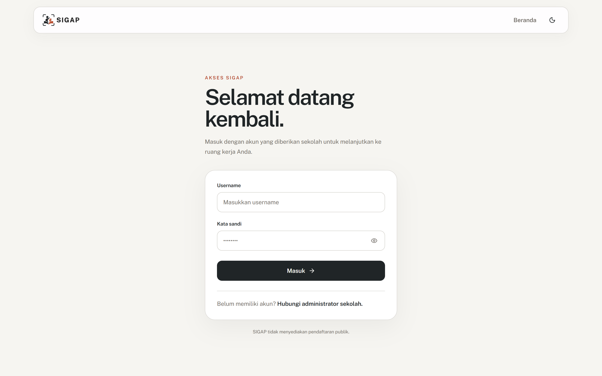

1. Buka alamat SIGAP di peramban.
2. Halaman awal adalah **Beranda**. Klik tombol masuk, atau buka langsung ke halaman **Akses SIGAP**.
3. Isi **Username** dan **Kata sandi**.
4. Klik **Masuk**.
5. Anda dibawa ke layar sesuai peran: administrator ke *Dashboard*, guru ke *Jadwal Mengajar*, kepala sekolah ke *Dashboard Pengawasan*, orang tua ke *Dashboard Anak*.

Lupa kata sandi? Hubungi administrator sekolah - hanya administrator yang dapat menyetel ulang kata sandi melalui menu **Pengguna**.

## 2.2 Mengenal layar kerja

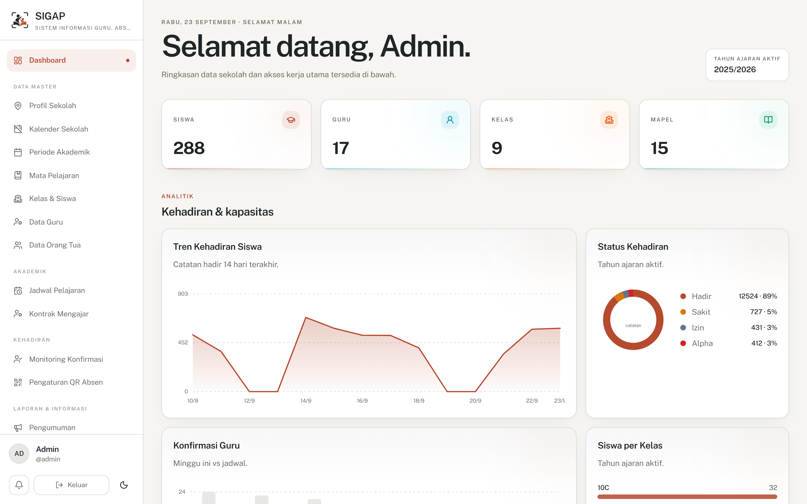

Setelah masuk, layar terbagi menjadi tiga area:

| Area | Isi |
|---|---|
| **Sidebar kiri** | Menu utama, dikelompokkan: Data Master, Akademik, Penilaian, Kehadiran, Laporan & Informasi, Manajemen, Akun. Menu yang aktif ditandai warna dan titik di kanannya |
| **Isi halaman** | Tabel, kartu ringkasan, grafik, dan formulir sesuai menu yang dipilih |
| **Kanan bawah sidebar** | Ikon **notifikasi** (lonceng), tombol **Keluar**, dan tombol **mode gelap/terang** |

Beberapa kebiasaan antarmuka yang berlaku di seluruh aplikasi:

- Tombol di kanan atas halaman (misal **Tambah Siswa**, **Impor daftar siswa**) membuka formulir di tengah layar, bukan halaman baru.
- Kolom pencarian di atas tabel menyaring data tanpa memuat ulang halaman.
- Kolom **Aksi** di ujung kanan tabel berisi tombol ubah (pensil) dan hapus (tempat sampah).
- Pesan hijau berarti berhasil, pesan merah berarti ada yang perlu diperbaiki.
- Posisi scroll sidebar dipertahankan saat Anda berpindah menu.

## 2.3 Profil dan kata sandi

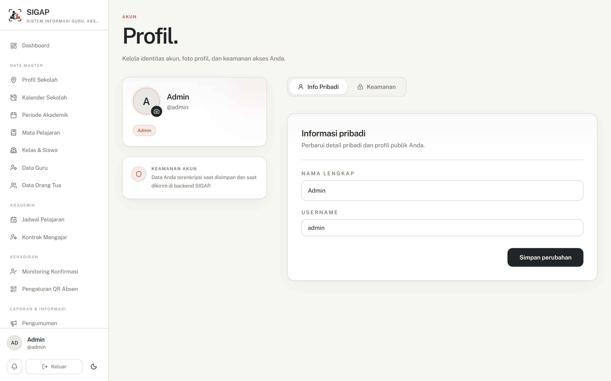

Menu **Akun > Profil Saya** berisi dua tab:

1. **Profil** - mengubah nama, username, telepon, dan foto profil (unggah gambar).
2. **Kata Sandi** - isi **Kata sandi lama**, lalu **Kata sandi baru** beserta konfirmasinya, lalu simpan.

Ganti kata sandi pertama kali setelah akun Anda dibuat administrator.

## 2.4 Keluar

Klik **Keluar** di bagian bawah sidebar. Jangan hanya menutup tab - keluar memastikan sesi Anda benar-benar berakhir, terutama di komputer sekolah yang dipakai bersama.

---

# Bagian 3 - Administrator

Administrator adalah orang pertama yang mengoperasikan SIGAP. Urutan pengerjaan di bawah ini adalah urutan yang disarankan, karena menu berikutnya bergantung pada data sebelumnya.

## 3.1 Profil sekolah dan batas lokasi (geofence)

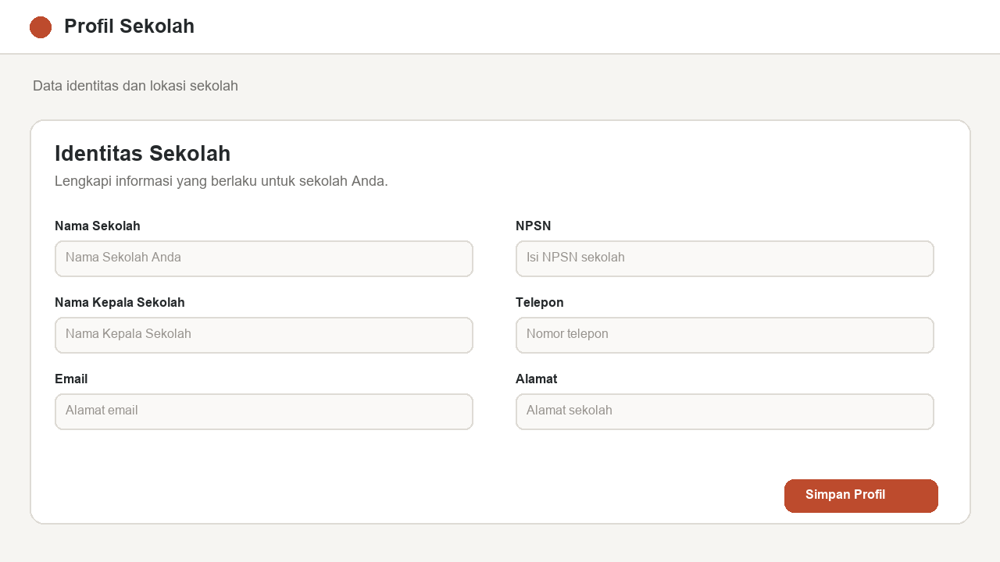

*Contoh ilustratif: ganti nama dan identitas dengan data sekolah Anda.*

Menu **Data Master > Profil Sekolah**. Isi identitas sekolah: nama, NPSN, nama kepala sekolah, telepon, email, dan alamat.

Tiga kolom berikut menentukan cara kerja absensi guru:

| Kolom | Fungsi |
|---|---|
| **Latitude** dan **Longitude** | Titik pusat sekolah. Diisi koordinat, contoh `-7.2575` dan `112.7525` |
| **Radius (meter)** | Jarak maksimum guru masih dianggap "di dalam sekolah", misalnya `150` |
| **Jam mulai** | Batas waktu kehadiran. Konfirmasi setelah jam ini tercatat **Terlambat** |

> Jika latitude, longitude, dan radius semuanya terisi, sistem mengaktifkan **geofence**: guru yang memindai QR di luar radius akan tetap tercatat, tapi ditandai berada di luar sekolah sehingga bisa ditindaklanjuti kepala sekolah. Kosongkan salah satunya jika sekolah belum ingin memakai pembatasan lokasi.

## 3.2 Kalender sekolah: hari libur dan hari Sabtu

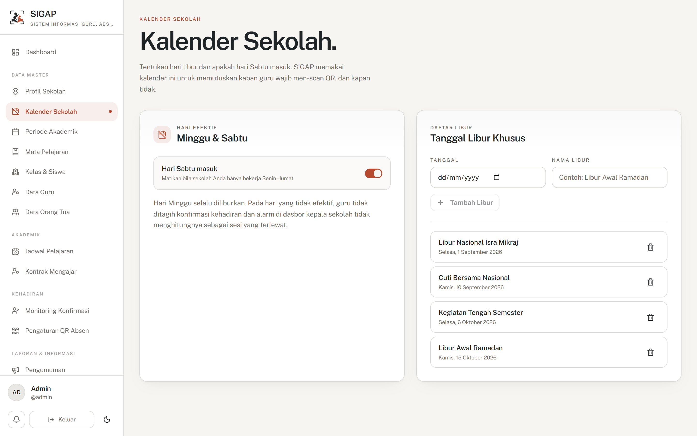

Menu **Data Master > Kalender Sekolah**. Halaman ini memberi tahu SIGAP kapan sekolah benar-benar efektif bekerja, sehingga tidak ada lagi guru yang ditagih absen pada hari libur.

1. **Hari Sabtu masuk** - sakelar di kartu *Hari Efektif*. Biarkan aktif bila sekolah Anda bekerja Senin-Sabtu; matikan bila hanya sampai Jumat. Hari Minggu selalu diliburkan dan tidak bisa diaktifkan.
2. **Tanggal Libur Khusus** - isi **Tanggal**, lalu **Nama Libur** (misal `Libur Awal Ramadan`), klik **Tambah Libur**. Tanggal libur bisa berada di tengah pekan dan boleh lebih dari satu. Hapus lewat ikon tempat sampah bila ternyata sekolah masuk.

Yang dipengaruhi kalender ini:

| Bagian | Efek pada hari non-efektif |
|---|---|
| Halaman Nilai guru | tidak menuntut scan QR - nilai tetap terbuka |
| Form Jurnal mengajar | sesi hari itu tidak ditawarkan, termasuk untuk jurnal susulan |
| Alarm *Guru Tanpa Konfirmasi* di dasbor kepala sekolah | hari itu tidak dihitung, jadi tidak muncul baris palsu |
| *Kehadiran Guru (30 Hari)* dan *Monitoring* | hari itu dikeluarkan dari perhitungan hari mengajar |

Isi kalender di awal tahun ajaran bersama kepala sekolah. Sekolah yang berbeda punya keputusan berbeda soal hari Sabtu - sistem mengikuti pengaturan Anda, bukan sebaliknya.

## 3.3 Periode akademik dan publikasi nilai

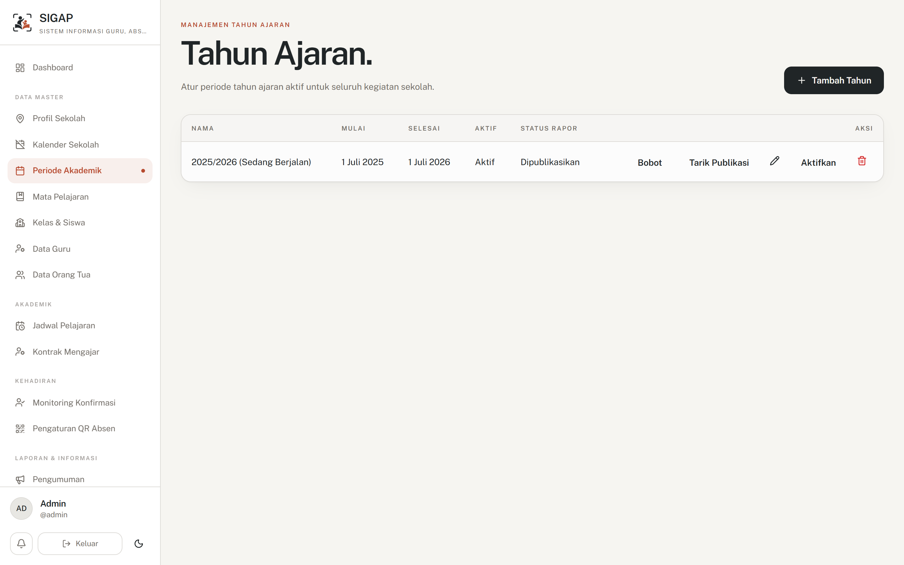

Menu **Data Master > Periode Akademik**.

1. Klik **Tambah** dan isi nama periode (misal `2025/2026`), tanggal mulai, dan tanggal selesai.
2. Tandai satu periode sebagai **Aktif** - semua kelas, jadwal, jurnal, dan nilai mengacu ke periode aktif ini.
3. Pada periode aktif, atur **Publikasi Nilai**:
   - **Publikasi aktif** > orang tua dan siswa dapat melihat nilai dan rapor.
   - **Publikasi mati** > nilai hanya dilihat guru dan kepala sekolah.

Gunakan tombol publikasi ini sebagai "keran" di akhir semester, setelah semua nilai guru selesai diinput.

## 3.4 Mata pelajaran dan KKM

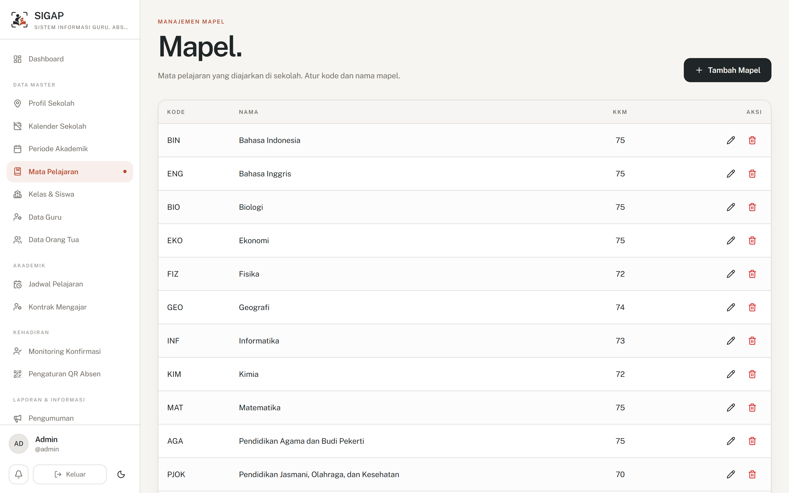

Menu **Data Master > Mata Pelajaran**. Tambahkan mapel beserta **kode** dan **KKM** (kriteria ketuntasan minimum). KKM dipakai sistem untuk menandai nilai tuntas/tidak tuntas dan menghitung predikat pada rapor.

## 3.5 Kelas dan siswa

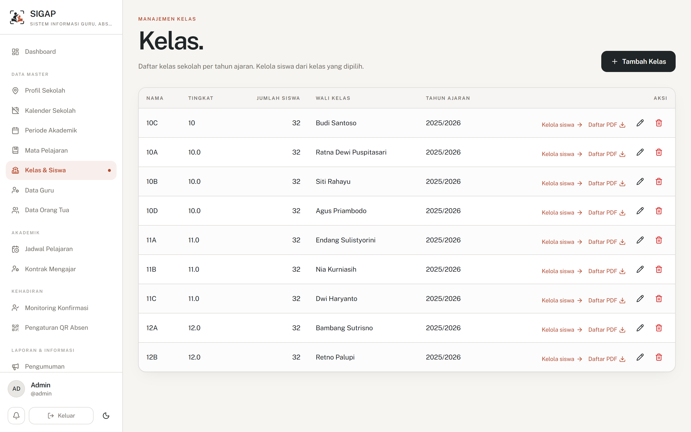

Menu **Data Master > Kelas & Siswa**.

1. **Buat kelas** lebih dulu: nama kelas (misal `10A`), tingkat, dan periode akademik.
2. Klik kelas untuk membuka **daftar siswa** kelas tersebut.
3. Tambah siswa satu per satu dengan tombol **Tambah Siswa**, atau massal lewat **Impor daftar siswa** (lihat 3.6).

Isian siswa: **NIS**, **nama**, **kelas**, **telepon**, **alamat**.

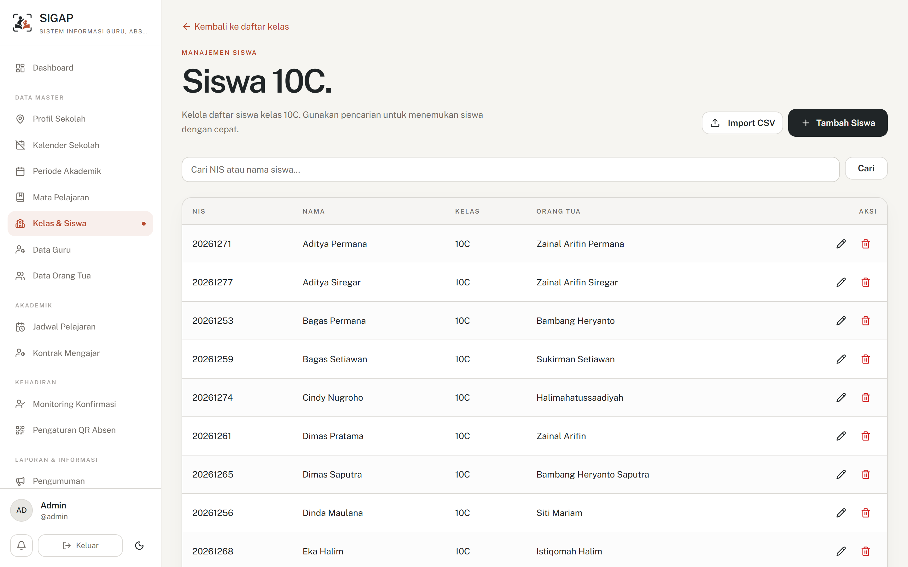

Di halaman **Kelas**, setiap baris kelas menyediakan pintasan untuk membuka daftar siswa dan mengunduh **Daftar PDF**. Pada halaman siswa kelas, tombol **Unduh data kelas (.xlsx)** menghasilkan berkas Excel berisi roster saat ini untuk dilengkapi atau diperbarui; lihat 3.6.

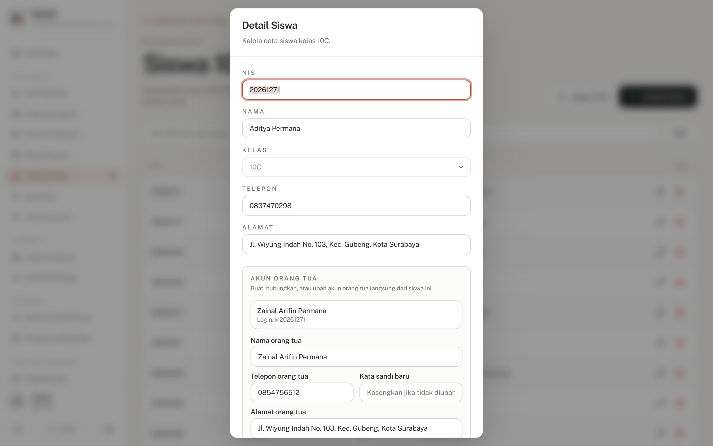

Di dalam formulir siswa ada blok **Akun Orang Tua**. Tiga pilihan:

- **Buat akun baru** - isi nama orang tua dan kata sandi. Username otomatis memakai NIS anak.
- **Pakai akun yang ada** - menautkan akun orang tua yang sudah punya anak lain, sehingga satu akun bisa melihat beberapa anak sekaligus.
- **Lepas akun** - memutus hubungan; jika akun itu tidak lagi menaungi anak mana pun, akunnya ikut terhapus.

## 3.6 Impor siswa dan unduh data kelas

Di halaman **Kelas & Siswa**, tombol impor bernama **Impor daftar siswa**. SIGAP menerima Excel `.xlsx` dan CSV `.csv`. Gunakan template umum untuk memasukkan siswa baru, atau unduh roster kelas yang sudah berisi data saat ini untuk melengkapi data siswa dan orang tua.

**Langkah:**

1. Buka halaman siswa dari **Kelas & Siswa**. Untuk memperbarui satu kelas, buka kelas yang dimaksud.
2. Pada halaman kelas, klik **Unduh data kelas (.xlsx)**. File `data-kelas-[nama-kelas].xlsx` memuat siswa dan data yang sudah tersimpan; jika kelas kosong, file hanya berisi baris judul kolom. Untuk template umum, buka impor dari halaman daftar siswa dan unduh Excel atau CSV.
3. Isi satu siswa per baris. Pada file data kelas, kolom **ID Siswa SIGAP (jangan diubah)** dipakai untuk mengenali siswa lama. Jangan mengedit atau menghapus ID tersebut. Baris siswa baru ditambahkan di bagian bawah dengan ID kosong; isi NIS dan nama.
4. Pilih file `.xlsx` atau `.csv` melalui formulir **Impor daftar siswa**. Jika membuka impor dari halaman kelas, seluruh baris masuk ke kelas itu dan kolom Kelas pada berkas diabaikan.
5. Jika membuat akun orang tua baru, isi **Nama Orang Tua** dan **Kata sandi awal akun orang tua** (minimal 8 karakter). Satu kata sandi yang dimasukkan dipakai untuk akun baru yang dibuat dari impor. Untuk akun orang tua yang sudah ada, perubahan nama/kontak tidak memerlukan kata sandi baru.
6. Klik **Impor siswa**. Hasil menampilkan jumlah siswa ditambahkan/diperbarui, akun orang tua dibuat/diperbarui, serta rincian baris yang gagal.

**Kolom pada kedua jenis berkas:**

| Header | Template umum `.xlsx` / `.csv` | Data kelas `.xlsx` |
|---|---|---|
| ID Siswa SIGAP | tidak ada | A - jangan diubah; kosong untuk siswa baru |
| NIS | A | B |
| Nama Siswa | B | C |
| Kelas | C | D - diabaikan saat impor dari halaman kelas |
| Telepon Siswa | D | E |
| Alamat Siswa | E | F |
| Nama Orang Tua | F | G |
| Telepon Orang Tua | G | H |
| Alamat Orang Tua | H | I |

NIS dan Nama Siswa wajib diisi untuk baris siswa baru. Pada baris siswa lama yang memiliki ID SIGAP, biarkan data identitas yang tidak ingin diubah tetap kosong. Kolom orang tua bersifat opsional.

**Yang perlu diketahui:**

- Pemisah antar kolom adalah **koma**. Teks yang mengandung koma harus diapit tanda kutip, contoh: `"Jl. Mawar No. 5, RT 01/RW 02"`. Berkas dengan pemisah titik-koma (`;`) juga diterima.
- Template umum tersedia dalam format Excel `.xlsx` dan CSV `.csv`; CSV tetap didukung untuk berkas lama. Template Excel menampilkan kolom terpisah dan header yang jelas.
- Pada file data kelas, baris dengan ID SIGAP memperbarui siswa tersebut. Kolom yang dibiarkan kosong pada siswa lama tidak menghapus data tersimpan. Data kontak orang tua yang kosong juga tidak menghapus kontak tersimpan.
- Siswa baru pada impor kelas harus memiliki NIS dan nama. NIS yang sudah dipakai siswa atau akun lain ditolak; hasil impor menjelaskan baris yang bermasalah.
- Untuk file umum, kolom wajib adalah NIS, nama, dan kelas. Sistem mengenali header yang tersedia, jadi urutan kolom boleh diubah selama nama header tetap dikenali.
- Nama orang tua membuat akun baru hanya jika belum ada akun yang tertaut dan kata sandi awal diisi. Jika sudah ada akun orang tua yang tertaut, nama/kontaknya diperbarui; kata sandi tidak berubah.
- Membuka berkas CSV di Excel dengan pengaturan regional Indonesia bisa membuat semua kolom menumpuk di satu sel. Untuk melihatnya per kolom, gunakan **Data > From Text/CSV** dan pilih pemisah yang cocok dengan file (koma atau titik-koma). Saat mengimpor, SIGAP membaca kedua pemisah tersebut.
- Unduh data kelas selalu mengikuti isi SIGAP saat file dibuat. NIS, nama, atau informasi orang tua yang belum tersedia akan kosong di berkas dan dapat dilengkapi.
- Import dari halaman sebuah kelas mengabaikan kolom Kelas: semua siswa baru masuk ke kelas yang sedang dibuka.

## 3.7 Data guru dan kontrak mengajar

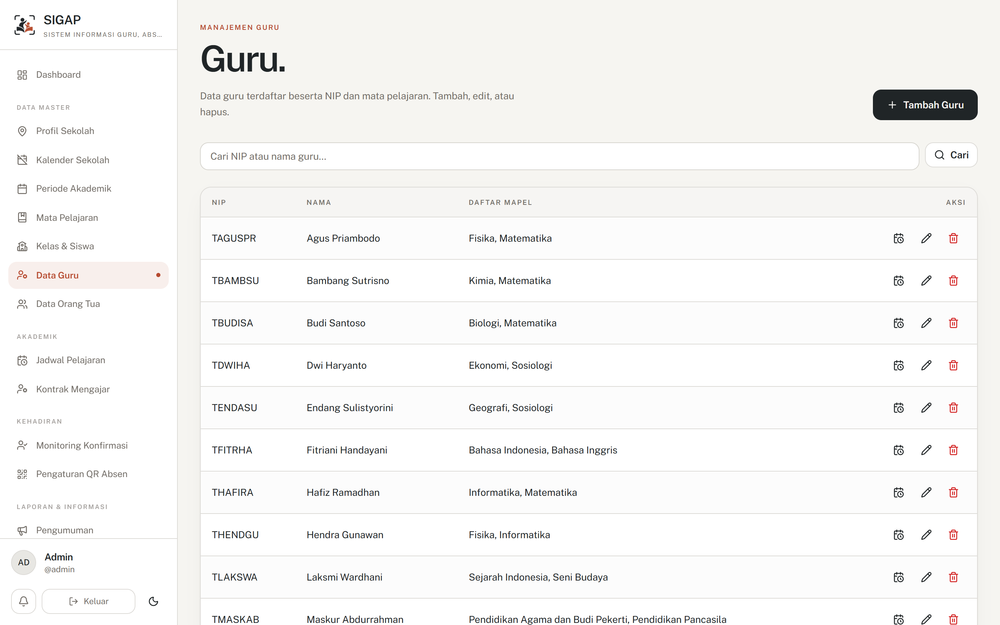

- **Data Master > Data Guru**: tautkan seorang guru ke akun pengguna, isi NIP, telepon, dan mata pelajaran yang diampu.
- **Akademik > Kontrak Mengajar**: menentukan guru mengajar kelas mana saja, dan siapa **wali kelas**-nya. Satu kelas punya satu wali kelas per periode akademik.

Kontrak mengajar inilah yang membuat seorang guru hanya melihat kelas tertentu di layarnya - dan yang menentukan kelas mana yang boleh ia dokumentasikan.

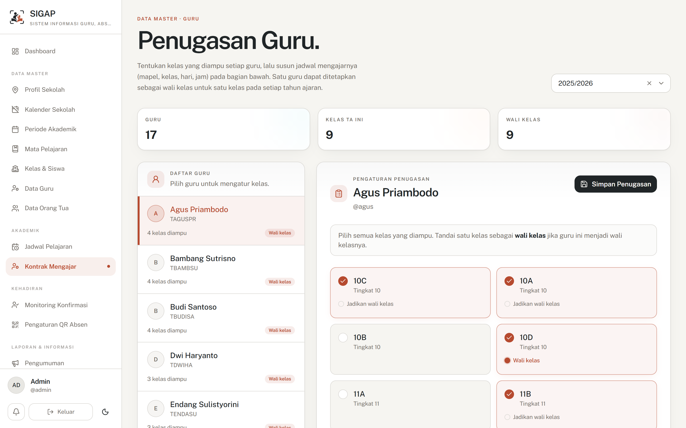

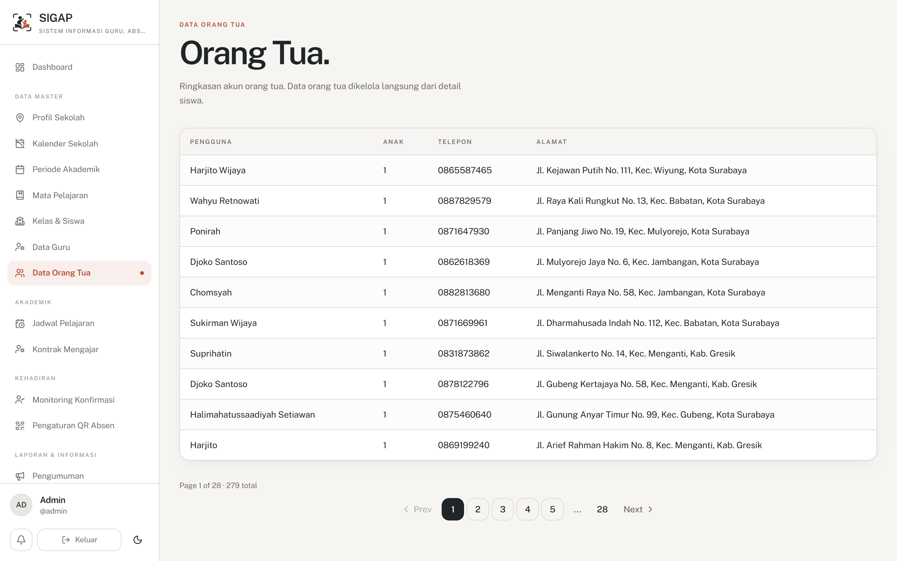

Menu **Data Master > Data Orang Tua** hanya membaca: daftar akun wali beserta jumlah anak yang terhubung. Pembuatan dan perubahan akun orang tua dilakukan dari halaman siswa (3.5) atau lewat impor daftar siswa (3.6), supaya relasi akun dan anak tidak terpisah.

## 3.8 Jadwal pelajaran

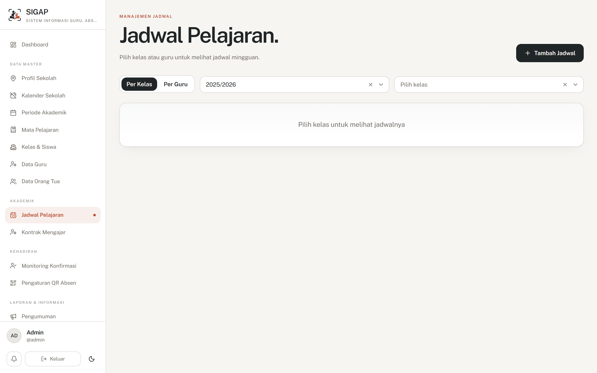

Menu **Akademik > Jadwal Pelajaran**. Pilih periode akademik, lalu saring per kelas atau guru untuk melihat jadwal yang berjalan.

Tombol **Tambah** membuka formulir: kelas, mata pelajaran, guru, hari, jam mulai, dan jam selesai. Jam pada jadwal menentukan daftar "hari ini" yang dilihat guru, sekaligus menjadi dasar perhitungan sesi terlewat bagi kepala sekolah.

## 3.9 Pengaturan QR absen dan layar QR

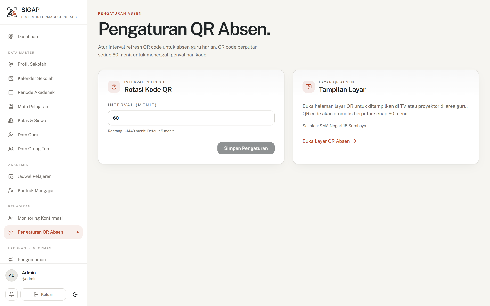

Menu **Kehadiran > Pengaturan QR Absen** mengatur **interval pergantian QR** - berapa detik satu kode QR berlaku sebelum berganti. Nilai kecil (misal 30-60 detik) membuat QR tidak bisa difoto lalu dipakai di rumah.

Setelah disimpan, buka **Layar QR Absen** untuk menampilkan QR berukuran besar di TV atau proyektor di ruang guru.

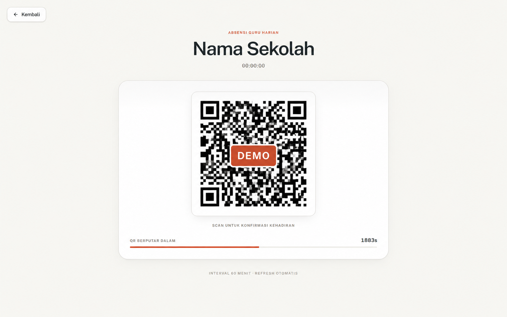

*Kode pada ilustrasi ini hanya contoh dan tidak dapat dipakai untuk konfirmasi.*

Kode pada layar ini dibuat dari data sekolah dan diperbarui otomatis sesuai interval. Guru memindainya dari akun masing-masing.

## 3.10 Pengguna, peran, dan hak akses

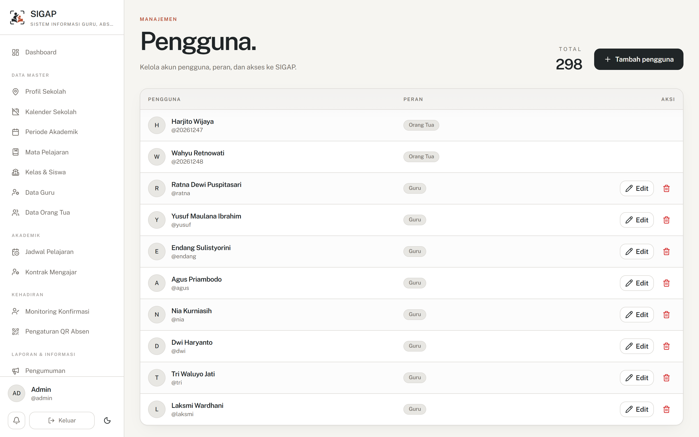

- **Manajemen > Pengguna**: menambah akun, mengatur nama, telepon, peran, dan status aktif. Akun yang dinonaktifkan tidak bisa masuk tetapi datanya tetap tersimpan.
- **Manajemen > Peran & Hak Akses**: setiap peran tersusun dari kumpulan hak akses (misalnya `journals.create`, `grades.edit`, `students.view`). Menambah hak ke sebuah peran langsung mengubah menu yang muncul di sidebar pengguna peran itu.

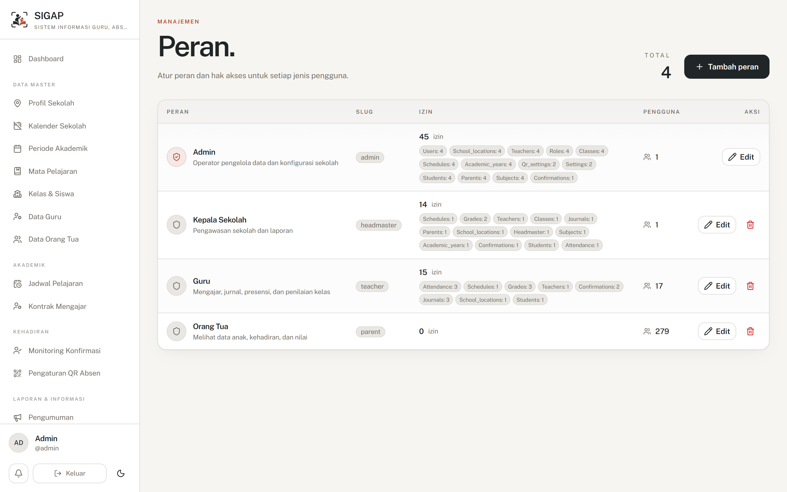

## 3.11 Pengumuman

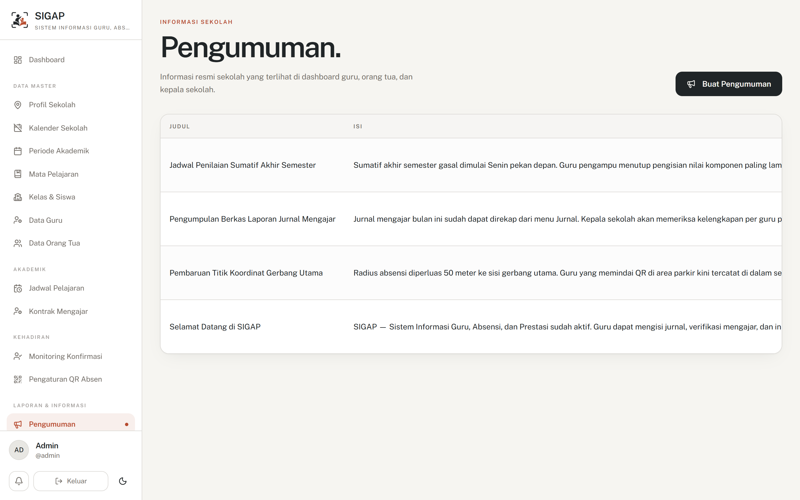

Menu **Laporan & Informasi > Pengumuman**. Judul dan isi pengumuman tersimpan dan muncul di dasbor pengguna yang menjadi sasarannya, termasuk orang tua.

## 3.12 Pengaturan e-Rapor

Menu **Penilaian > Pengaturan e-Rapor** menyimpan struktur file e-Rapor sekolah dan menentukan kolom mana yang mengambil nilai dari komponen SIGAP. Admin mengelola template, default sekolah, dan sakelar akses pemetaan guru. Guru pengampu dapat mengubah pemetaan lokal bila sakelar tersebut aktif.

**Simpan template untuk kelas, mapel, dan semester:**

1. Pilih **Kelas**, **Mata pelajaran**, dan **Semester I/II** yang sama dengan file dari e-Rapor.
2. Unggah file nilai `.xls` dari e-Rapor SMP 2025.2, atau file `.xlsx` yang benar-benar disimpan ulang melalui Excel. Batas ukuran 2 MB. File harus mempertahankan struktur e-Rapor, termasuk identitas sekolah, kelas/rombel, daftar siswa, dan kolom penilaian yang didukung. Header harus memiliki `mapel_id`, `id_anggota_rombel`, dan `status kunci`; kolom penilaian harus berurutan setelah identitas siswa dan mencakup satu atau lebih **Sumatif** serta kolom **Non Tes** dan **Tes**. File nilai kosong boleh dipakai untuk mendaftarkan format.
3. Klik **Periksa dan unggah**. NPSN pada file harus sama dengan NPSN pada Profil Sekolah SIGAP jika NPSN sekolah sudah diisi. Kelas, tingkat, mapel, dan semester pilihan juga harus sesuai dengan file.
4. SIGAP mencocokkan siswa memakai ID anggota rombel yang sudah dipetakan, atau nama unik di kelas. Jika file memuat siswa baru yang belum terdaftar, pratinjau akan meminta **NIS asli** setiap siswa. Isi NIS lalu klik **Buat siswa dan simpan**. Siswa baru tidak otomatis memiliki akun orang tua.
5. Roster SIGAP juga harus lengkap: jika ada siswa SIGAP yang tidak ada pada file, impor ditolak. Periksa roster terlebih dahulu pada **Kelas & Siswa**. Setelah berhasil, template tersimpan untuk kombinasi kelas, mapel, dan semester tersebut. Unggah kembali jika format/file sumber perlu diperbarui.

**Atur akses dan sumber tiap kolom penilaian:**

- Pada bagian **Akses pemetaan e-Rapor untuk guru**, admin menentukan apakah guru boleh mengubah pemetaan lokal. Akses aktif secara default. Jika dimatikan, guru tetap dapat mengisi dan mengekspor nilai tetapi tidak dapat mengubah sumber kolom.
- Setelah memilih kelas, mapel, dan semester yang templatenya sudah tersimpan, panel **Pemetaan sumber nilai** menampilkan ringkasan jumlah kolom otomatis dan kolom yang diisi langsung. Klik **Atur pemetaan** untuk membuka pengaturan rinci **Sumber setiap kolom e-Rapor**. Panel ini tertutup secara awal dan kembali tertutup saat pilihan kelas/mapel/semester berubah.
- Di pengaturan rinci **Sumber setiap kolom e-Rapor**, admin atau guru pengampu (jika diizinkan) dapat memilih jenis nilai SIGAP untuk sebuah kolom, misalnya memetakan **Sumatif 1** dan **Sumatif 2**. Nilai yang dipetakan cukup dimasukkan sekali di halaman **Nilai Siswa**; nilai yang sama akan ditampilkan pada kolom e-Rapor dan ikut diekspor.
- Pilihan **Isi langsung di halaman e-Rapor** berarti kolom itu tidak terhubung ke nilai rutin SIGAP. Guru yang berhak mengedit dapat mengisi nilainya pada tabel e-Rapor.
- Nilai komponen biasa seperti tugas/ulangan harian tetap dapat dipantau di halaman nilai SIGAP. Hanya kolom yang admin petakan yang mengambil nilai dari komponen tersebut.
- Guru hanya menyimpan pemetaan untuk kelas, mapel, dan semester yang sedang dibuka. Admin dapat mencentang **Terapkan juga sebagai default** sebelum menekan **Simpan pemetaan** untuk menerapkan aturan pada semua mapel atau mapel terpilih di tahun ajaran dan semester itu. Default dipakai template lain jika kolomnya belum punya pemetaan khusus. Default khusus mapel mengalahkan default semua mapel; pemetaan khusus template mengalahkan keduanya.
- Riwayat menyimpan perubahan pemetaan lokal maupun default, nama pelaku, dan waktunya. Riwayat perubahan sakelar akses guru tampil pada pengaturan akses.
- Pilih jenis nilai yang berbeda untuk membedakan penilaian Semester I dan II. Jika pemetaan diganti, periksa nilai pada sumber lama dan baru; data lama tetap tersimpan. Kolom tanpa sumber tetap diisi langsung pada halaman e-Rapor.

Setelah template dan roster cocok, tombol **Unduh .xls (format sekolah)** dan **Unduh .xlsx** tersedia. Keduanya mempertahankan struktur template sekolah yang diimpor dan mengisi nilai SIGAP sesuai pemetaan; pilih hasil unduhan yang diperlukan untuk proses unggah e-Rapor. Ekspor membutuhkan pemetaan seluruh siswa pada template yang masih cocok dengan roster SIGAP.

---

# Bagian 4 - Guru

## 4.1 Dashboard jadwal hari ini

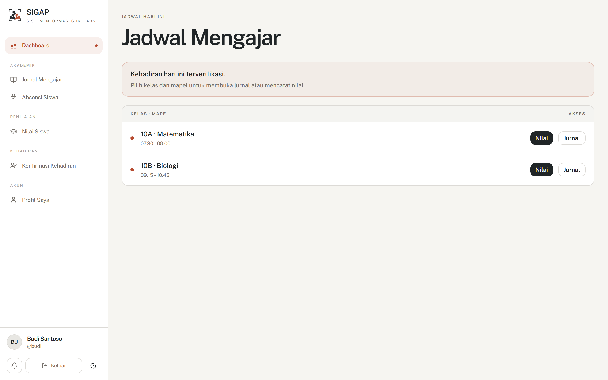

Guru masuk ke halaman **Jadwal Mengajar**. Isinya daftar mengampu hari itu: kelas, mata pelajaran, jam mulai-selesai.

Penting: konfirmasi kehadiran mengikat catatan mengajar pada hari itu. Halaman **Jadwal Mengajar** baru menampilkan daftar sesi setelah guru memindai QR, dan **jurnal serta nilai** menuntut konfirmasi yang sama **pada hari guru itu memang terjadwal mengajar**. Di hari tanpa jam mengajar, daftar nilai tetap terbuka. Aturan ini sengaja dibuat agar catatan kehadiran dan catatan mengajar selalu sepasang, tanpa mengunci guru di hari libur.

## 4.2 Konfirmasi kehadiran dengan QR

Menu **Kehadiran > Konfirmasi Kehadiran**.

1. Klik **Scan QR Absen** dan arahkan kamera ke layar QR di ruang guru.
2. Izinkan akses **kamera** dan **lokasi** saat peramban meminta.
3. Sistem menampilkan **Lokasi Anda** (latitude/bujur dan jarak ke sekolah). Bila posisi belum terbaca, tunggu atau klik **Perbarui lokasi**.
4. Klik **Verifikasi Kehadiran**.
5. Setelah berhasil, muncul status **Sudah terverifikasi** dan **Kehadiran hari ini sudah tercatat.**

| Kondisi | Yang tercatat |
|---|---|
| Di dalam radius sekolah, sebelum jam mulai | Hadir, tepat waktu |
| Di dalam radius, setelah jam mulai | Hadir, ditandai **Terlambat** |
| Di luar radius sekolah | Tetap tersimpan, tapi ditandai **di luar sekolah** dan masuk laporan kepala sekolah |

Satu guru hanya punya satu catatan konfirmasi per hari. Setelah terverifikasi, seluruh menu guru terbuka - klik **Lihat Jadwal Hari Ini** untuk kembali.

## 4.3 Jurnal mengajar dan presensi siswa

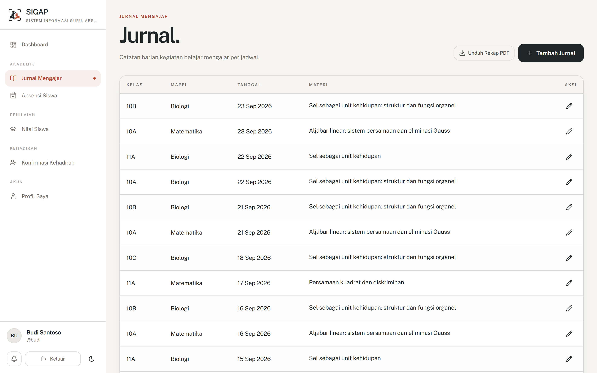

Menu **Akademik > Jurnal Mengajar**. Halaman ini berisi jurnal yang sudah Anda isi, tombol **Tambah Jurnal** di kanan atas, dan **Unduh Rekap PDF** untuk mencetak daftar jurnal (tanggal, guru, kelas, mapel, jam, materi) pada bulan berjalan.

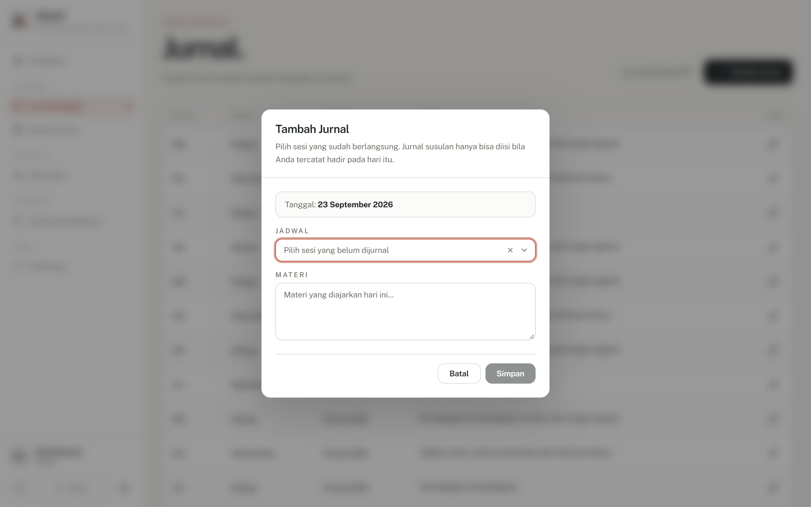

Isi jurnal untuk sesi yang **sudah berlangsung**. Pada hari yang sama, daftar isinya adalah sesi Anda hari ini. Sesi yang terlewat masih bisa ditutup sampai **tiga hari ke belakang** - ditandai keterangan *susulan* - dengan satu syarat: Anda tercatat men-scan QR pada hari sesi itu berlangsung. Tanggal dan bukti konfirmasi kehadiran terisi otomatis - Anda tidak perlu mengetiknya.

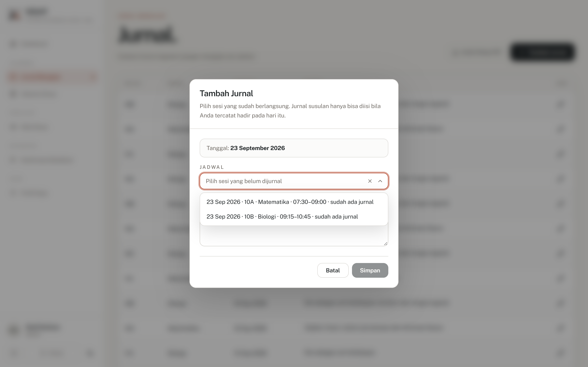

1. Klik kolom **Jadwal**, lalu pilih sesi yang ingin dicatat. Daftar yang muncul hanya sesi Anda yang sudah lewat jam selesainya dalam empat hari terakhir, lengkap dengan tanggal, nama kelas, mata pelajaran, dan jam. Sesi sebelum hari ini diberi keterangan *susulan*.
2. Jika jurnal untuk sesi itu sudah ada, sistem menampilkannya kembali dan materi akan diperbarui, bukan dibuat duplikat.
3. Isi **Materi** - ringkasan yang diajarkan hari itu.
4. Bagian **Presensi Siswa** otomatis memunculkan daftar siswa kelas tersebut. Setiap siswa punya empat tombol: **Hadir**, **Sakit**, **Izin**, **Alpa**. Semua siswa awalnya dianggap Hadir; ubah yang tidak masuk saja. Ringkasan jumlah tiap status terlihat di kanan atas daftar.

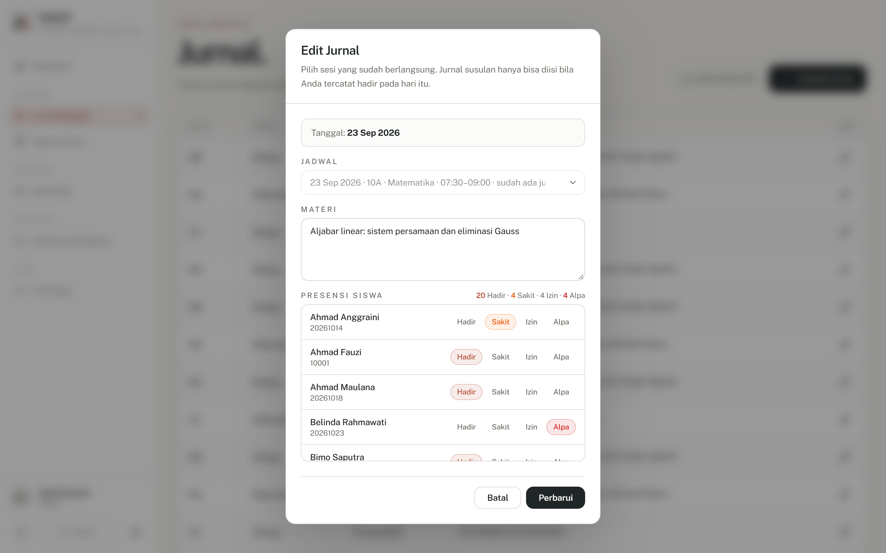

5. Klik **Simpan**. Materi dan presensi tersimpan sekaligus.

> Jika tombol **Tambah Jurnal** tidak dapat diklik atau daftar jadwal kosong, berarti semua sesi tiga hari terakhir sudah terisi jurnal. Bila sesi yang Anda maksud tidak muncul sama sekali, kemungkinan tanggalnya sudah lewat dari tiga hari, Anda tidak tercatat hadir pada hari itu, atau hari tersebut bukan hari efektif menurut kalender sekolah. Untuk kasus terakhir ini, minta administrator memeriksa **Kalender Sekolah**.

## 4.4 Nilai siswa

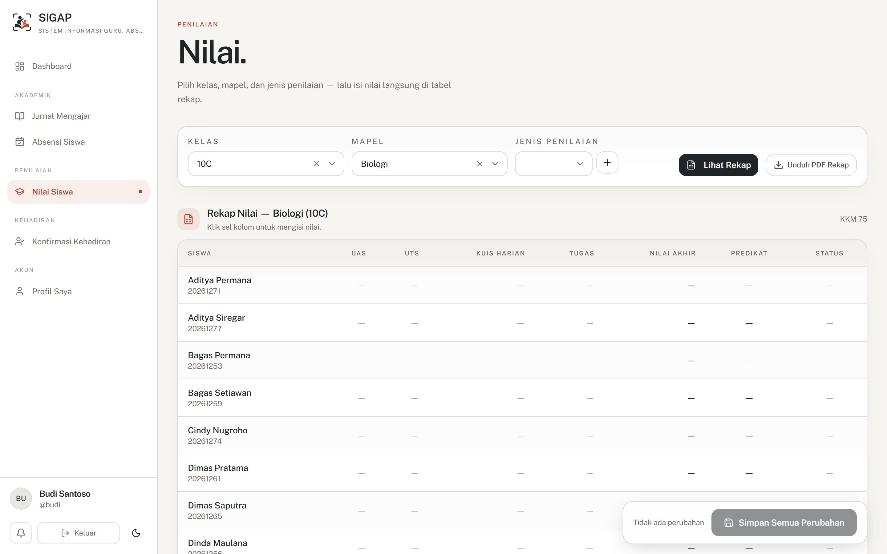

Menu **Penilaian > Nilai Siswa**.

1. Pilih **Kelas**, **Mapel**, dan **Jenis Penilaian** pada penyaring di atas.
2. Klik **Lihat Rekap**. Tabel menampilkan nilai siswa untuk seluruh komponen, **Nilai Akhir**, **Predikat**, dan status KKM.
3. Sel pada komponen yang dipilih di penyaring dapat diedit langsung. Setelah selesai, klik **Simpan Semua Perubahan**.
4. Tombol **+** menambah jenis penilaian. Ikon pensil mengganti namanya dan ikon tempat sampah menghapus jenis beserta nilainya. Bobot Nilai Akhir dikelola melalui tombol **Bobot** pada halaman **Periode Akademik**.
5. **Predikat** dan status tuntas dihitung otomatis memakai KKM mata pelajaran.

Guru hanya dapat menilai kelas dan mapel sesuai kontrak mengajarnya. Soal konfirmasi kehadiran: pada hari Anda **terjadwal mengajar**, nilai baru terbuka setelah memindai QR - sama seperti jurnal. Pada hari yang tidak ada jam mengajar untuk Anda (libur, akhir pekan, atau hari kosong), daftar nilai tetap bisa dibuka dan diisi seperti biasa.

Nilai di halaman ini adalah nilai SIGAP untuk pemantauan per komponen. Jika administrator menghubungkan komponen tersebut ke kolom e-Rapor (Bagian 3.12), guru mengisi sekali dan nilainya akan terbawa ke ekspor resmi. Komponen yang tidak dipetakan tetap menjadi nilai rutin SIGAP.

Setelah kelas dan mapel terpilih, tombol **Unduh PDF Rekap** di kanan atas mengunduh lembar rekap nilai kelas tersebut. Bagi guru yang bukan wali kelas, lembar itu hanya memuat mapel yang ia ampu sendiri.

## 4.5 Rekap absensi siswa

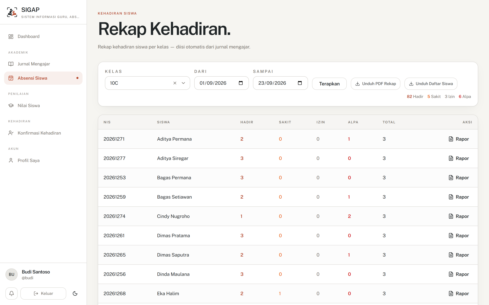

Menu **Akademik > Absensi Siswa** adalah baca ulang presensi yang sudah tercatat lewat jurnal: per kelas, per tanggal, per siswa. Pilih kelas dan rentang tanggal, maka seluruh siswa kelas itu tampil beserta jumlah Hadir, Sakit, Izin, Alpa, dan Total. Karena absensi lahir dari jurnal, halaman ini tidak punya formulir isian - cara menambah catatan absensi adalah dengan mengisi jurnal mengajar.

Dua tombol di sebelah **Terapkan** mengunduh hasil yang sedang tampil: **Unduh PDF Rekap** (rekapitulasi kehadiran, lengkap dengan baris jumlah dan persentase hadir) dan **Unduh Daftar Siswa** (identitas siswa beserta kontak orang tua/wali).

> **Penting dipahami:** angka yang Anda lihat sebagai guru pengampu hanya menghitung sesi yang **Anda ajar sendiri**. Karena itu totalnya lebih kecil daripada angka yang dilihat kepala sekolah untuk kelas yang sama - bukan karena datanya hilang. Wali kelas maupun guru lain tetap bisa membuka halaman ini, tapi lingkupnya sesi masing-masing. Bila sekolah butuh rekap satu kelas penuh (misalnya untuk rapat dewan guru), yang mengunduh adalah kepala sekolah atau administrator.

## 4.6 Rapor siswa

Rapor dibuka dari halaman yang sama: **Akademik > Absensi Siswa** > pilih kelas > klik **Rapor** di kolom Aksi pada baris siswa. Kolom Aksi ini hanya muncul untuk kelas tempat Anda tercatat sebagai **wali kelas**. Guru pengampu biasa tidak melihat tombolnya, dan administrator tidak punya akses ke halaman rapor.

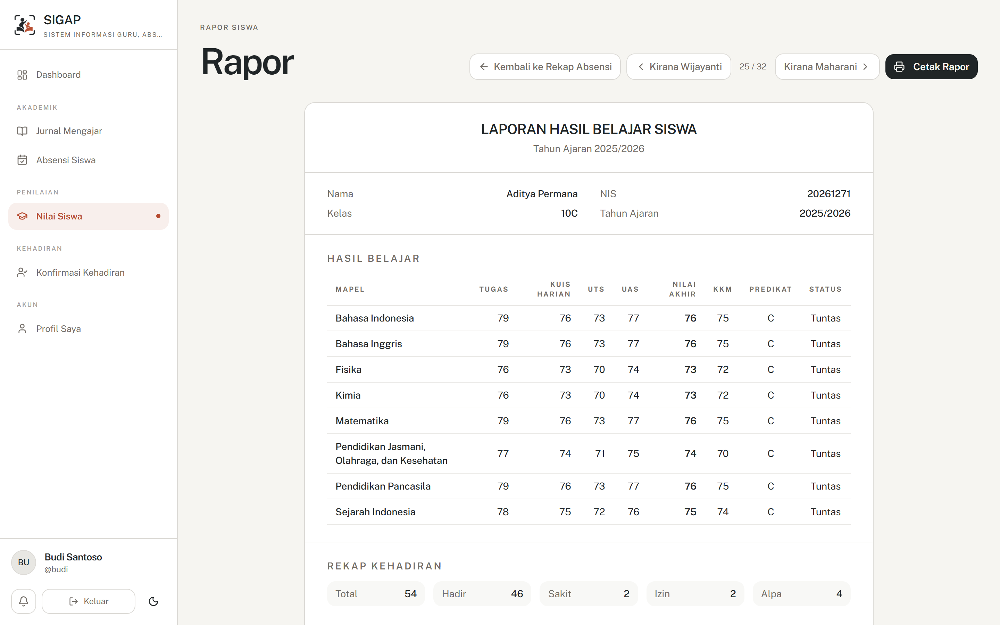

Lembar rapor berisi **Laporan Hasil Belajar Siswa**: identitas dan kelas, nilai per mata pelajaran (UAS, UTS, Kuis Harian, Tugas), Nilai Akhir, KKM, Predikat, status Tuntas, serta rekap kehadiran. Bagian bawah disediakan untuk tanda tangan orang tua/wali dan kepala sekolah. Klik **Cetak Rapor** di kanan atas (atau `Ctrl+P`) untuk mencetak atau menyimpannya sebagai PDF.

Di sekitar tombol cetak itu ada baris navigasi yang hanya muncul di layar (tidak ikut tercetak): **Kembali** ke halaman tempat rapor dibuka, serta **‹ siswa sebelumnya** dan **siswa berikutnya ›** untuk berpindah antar siswa dalam kelas yang sama, dengan penanda posisi seperti `7 / 32`. Orang tua berpindah di antara anak-anak pada akunnya sendiri. Dengan begitu memeriksa satu rombel cukup dilakukan tanpa kembali ke daftar setiap kali.

> Satu kelas hanya punya satu wali kelas per periode akademik. Jika tombol Rapor tidak muncul pada kelas yang Anda kira, minta administrator memeriksa **Akademik > Kontrak Mengajar** dan mencentang *Wali kelas* untuk kelas tersebut.

## 4.7 Mengunduh dokumen resmi (PDF)

SIGAP menghasilkan berkas PDF sendiri - tanpa aplikasi lain, tanpa plugin peramban. Berkasnya diunduh apa adanya, jadi penampilannya sama di komputer mana pun dan bisa langsung dilampirkan atau dicetak.

| Dokumen | Diunduh dari | Isinya |
|---|---|---|
| **Rekapitulasi Kehadiran Siswa** | Akademik > Absensi Siswa > *Unduh PDF Rekap* | per siswa: Hadir, Sakit, Izin, Alpa, jumlah sesi, persentase hadir, lalu baris jumlah seluruh kelas |
| **Daftar Siswa** | Akademik > Absensi Siswa > *Unduh Daftar Siswa*, atau Kelas > *Daftar PDF* | nama, NIS, nama orang tua/wali, telepon, alamat |
| **Lembar Rekapitulasi Nilai** | Penilaian > Nilai Siswa > *Unduh PDF Rekap*, atau dasbor kepala sekolah > *Detail nilai* > *Unduh PDF Rekap Nilai* | rata-rata nilai per siswa per mata pelajaran, plus rata-rata akhir tiap siswa |
| **Daftar Hadir Guru** | Kehadiran > Monitoring Konfirmasi > *Unduh PDF* | tanggal, nama guru, jam pindai, jarak ke sekolah, dalam/luar radius, tepat waktu/terlambat |
| **Rekapitulasi Jurnal Mengajar** | Akademik > Jurnal Mengajar > *Unduh Rekap PDF* | tanggal, guru, kelas, mapel, jam, dan materi tiap sesi |
| **Rapor siswa** | rapor siswa > *Cetak Rapor* | nilai per mapel, predikat, rekap kehadiran, kolom tanda tangan (cetak lewat dialog cetak peramban, pilih *Save as PDF*) |

Tiga hal yang perlu diketahui:

1. **Yang terunduh adalah yang sedang tampil.** Rentang tanggal dan kelas yang Anda pilih pada layar ikut dipakai dokumen, jadi atur penyaringnya lebih dulu, baru unduh. Tanpa penyaring, sistem memakai bulan berjalan.
2. **Tombol unduh hanya muncul untuk yang berhak**, dan server memeriksa ulang hak itu saat berkas diminta. Guru mendapat kelas yang ia ampu; guru yang bukan wali kelas hanya mendapat mapelnya sendiri pada lembar nilai. Kepala sekolah dan administrator mendapat lingkup penuh sesuai halaman yang biasa mereka buka.
3. **Setiap dokumen mencantumkan siapa dan kapan dicetak**, pada baris kecil di bagian bawah halaman pertama - berguna sebagai bukti dokumen itu keluar dari sistem, bukan hasil suntingan.

## 4.8 Mengisi dan mengekspor nilai e-Rapor

Dari halaman **Penilaian > Nilai Siswa**, pilih kelas dan mapel lalu klik **Impor / Ekspor e-Rapor**. Pilih semester yang sama dengan template. Guru perlu memiliki akses nilai untuk kelas dan mapel tersebut; pada hari terjadwal mengajar, konfirmasi QR mungkin diperlukan.

Jika template belum tersimpan, unggah file e-Rapor sekolah `.xls` atau `.xlsx` sesuai petunjuk administrator. Jika roster file belum sama dengan SIGAP, hubungi admin untuk meninjau dan menyesuaikan daftar siswa. Guru tidak dapat membuat siswa baru dari pratinjau impor.

Pada tabel e-Rapor, kolom yang telah dipetakan akan menampilkan nilai dari komponen SIGAP dan tidak perlu diisi lagi. Jika akses guru aktif, panel ringkas **Pemetaan sumber nilai** menampilkan statusnya. Klik **Atur pemetaan** untuk membuka **Sumber setiap kolom e-Rapor** dan mengubah pemetaan lokal kelas/mapel/semester yang sedang dibuka; perubahan itu tercatat di riwayat. Guru tidak dapat mengubah default sekolah atau sakelar akses. Kolom **Isi langsung di halaman e-Rapor** dapat diisi pada tabel tersebut. Klik **Simpan nilai** setelah perubahan langsung. Setelah template dan roster siap, pilih **Unduh .xls (format sekolah)** atau **Unduh .xlsx**. Berkas memuat kolom dan tata letak template yang terdaftar untuk kelas, mapel, dan semester yang dipilih.

Jika akses guru nonaktif, minta admin memperbarui pemetaan. Hubungi admin untuk mengubah default sekolah. Periksa nilai sebelum mengunduh.

> Berkas PDF tidak disimpan di server. Setelah diunduh, menjadi tanggung jawab pengguna yang mengunduhnya - jangan menaruhnya di komputer bersama ruang guru.

---

# Bagian 5 - Kepala Sekolah

Kepala sekolah masuk ke halaman **Pengawasan Sekolah** (kelompok menu *Dasbor Kepala Sekolah*).

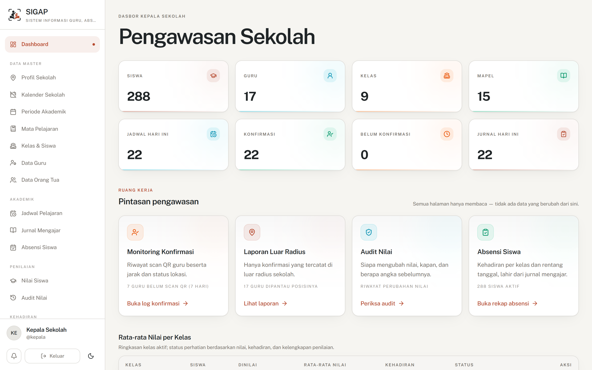

## 5.1 Delapan kartu ringkasan

| Kartu | Artinya |
|---|---|
| Siswa | Jumlah siswa terdaftar |
| Guru | Jumlah akun guru |
| Kelas | Jumlah kelas pada periode aktif |
| Mapel | Jumlah mata pelajaran |
| Jadwal Hari Ini | Sesi yang seharusnya berjalan hari ini |
| Konfirmasi | Sesi hari ini yang gurunya sudah memindai QR |
| Belum Konfirmasi | Sesi hari ini yang gurunya belum memindai QR - angka yang paling perlu diperhatikan setiap pagi |
| Jurnal Hari Ini | Jumlah jurnal yang sudah diisi hari ini |

Empat kartu paling kanan bersifat *hari ini*. Pada hari libur, akhir pekan, atau hari Sabtu yang sudah Anda matikan di Kalender Sekolah, keempatnya memang bernilai **0** - itu bukan gangguan, melainkan konsekuensi dari kalender yang benar. Empat kartu di kiri (Siswa, Guru, Kelas, Mapel) selalu terisi karena menghitung data sekolah, bukan kegiatan harian.

## 5.2 Pintasan pengawasan

Tepat di bawah kartu ringkasan ada empat kartu pintasan. Semuanya hanya membuka halaman; tidak ada data yang berubah dari sana.

| Pintasan | Membuka |
|---|---|
| Monitoring Konfirmasi | Log pemindaian QR guru beserta jarak dan status lokasi |
| Laporan Luar Radius | Konfirmasi yang tercatat di luar radius sekolah |
| Audit Nilai | Riwayat perubahan nilai |
| Absensi Siswa | Rekap kehadiran per kelas dan rentang tanggal |

Baris kecil di tiap kartu menyebut angka yang sedang berlaku, misalnya `4 guru belum scan QR (7 hari)`, supaya kepala sekolah tahu ke mana harus melihat lebih dulu.

## 5.3 Rata-rata Nilai per Kelas

Tabel ini merangkum tiap kelas aktif: **Kelas, Siswa, Dinilai, Rata-rata Nilai, Kehadiran, Status, Aksi**.

- Kolom **Dinilai** memakai format `32/32` - berapa siswa yang sudah punya nilai dibandingkan jumlah siswanya. Kelas dengan `0/32` berarti belum ada nilai masuk sama sekali.
- Kolom **Status** menandai kelas yang perlu ditindaklanjuti (misal *Perlu perhatian*) bila rata-rata nilainya di bawah 75, kehadiran siswanya di bawah 90%, atau masih ada siswa yang belum dinilai.
- Tautan **Detail nilai** membuka lembar nilai per siswa untuk kelas tersebut - hanya membaca, kepala sekolah tidak mengubah angka di sini. Di lembar itu ada **Unduh PDF Rekap Nilai** untuk memperoleh rata-rata nilai per siswa per mata pelajaran dalam satu berkas.

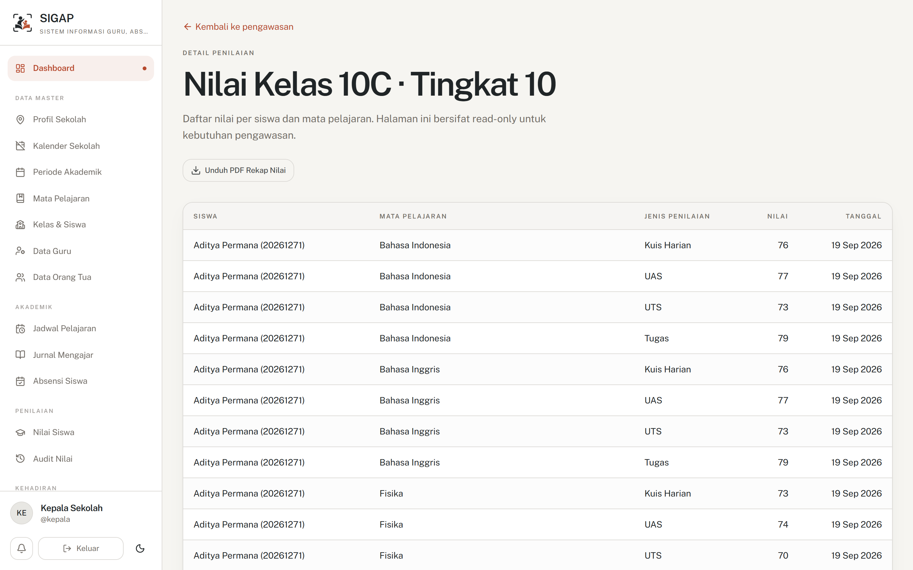

## 5.4 Kehadiran Guru (30 Hari)

Tabel kedua membandingkan konfirmasi QR dengan hari mengajar yang dijadwalkan: **Guru, Hari Hadir, Tingkat Kehadiran, Status, Aksi**. Barisnya berbunyi misalnya `Siti Rahayu · 20/21 · 95,24% · Normal`, dan guru dengan tingkat kehadiran di bawah 90% ditandai *Perlu perhatian*. Tautan **Riwayat** membuka daftar hari guru tersebut.

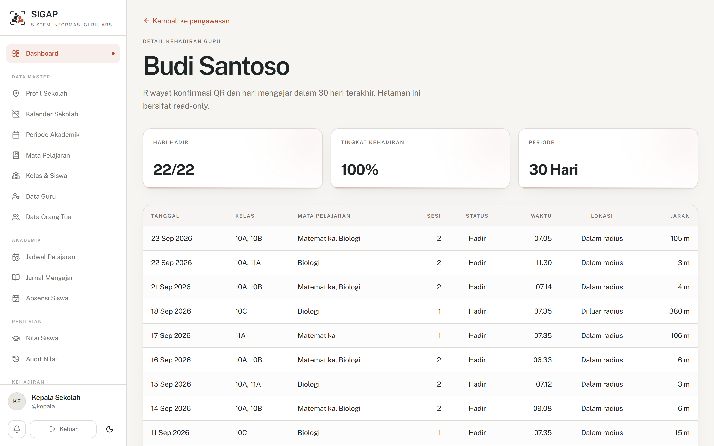

Lembar riwayat menampilkan **Tanggal, Kelas, Mata Pelajaran, Sesi, Status, Waktu, Lokasi, Jarak** - jadi terlihat berapa sesi yang diampu pada hari itu dan apakah konfirmasinya tercatat di dalam sekolah.

## 5.5 Guru Tanpa Konfirmasi (7 Hari)

Satu baris berarti satu guru pada satu hari: ia punya jadwal mengajar, tetapi tidak ada pemindaian QR pada hari itu. Kolomnya **Guru, Tanggal, Sesi Terlewat, Kelas, Mapel, Status**.

Aturannya mengikuti cara guru bekerja: satu pemindaian berlaku untuk satu hari penuh, bukan per jam pelajaran. Karena itu baris di tabel ini muncul meskipun guru tersebut hanya melewatkan scan pagi - jumlah sesinya ikut ditampilkan agar terlihat seberapa besar dampaknya hari itu.

## 5.6 Monitoring Konfirmasi

Menu **Kehadiran > Monitoring Konfirmasi** membuka *Log Kehadiran Guru*. Bagian atas menampilkan ringkasan hari ini, misalnya **15 dari 16 guru sudah konfirmasi hari ini · Batas tepat waktu 07:00**.

Di bawahnya ada penyaring **Dari Tanggal**, **Sampai Tanggal**, dan **Guru** (tombol *Reset* muncul saat penyaring aktif). Gunakan rentang tanggal untuk melihat histori, misalnya satu bulan terakhir.

Tombol **Unduh PDF** di sebelah penyaring menghasilkan **Daftar Hadir Guru** untuk persis rentang yang sedang tampil - berkas yang biasa dipakai untuk rekap bulanan atau keperluan tanda tangan. Baris pertamanya menyebut jumlah pindai dan batas jam tepat waktu yang berlaku, dan tiap baris memuat jarak serta status dalam/luar radius.

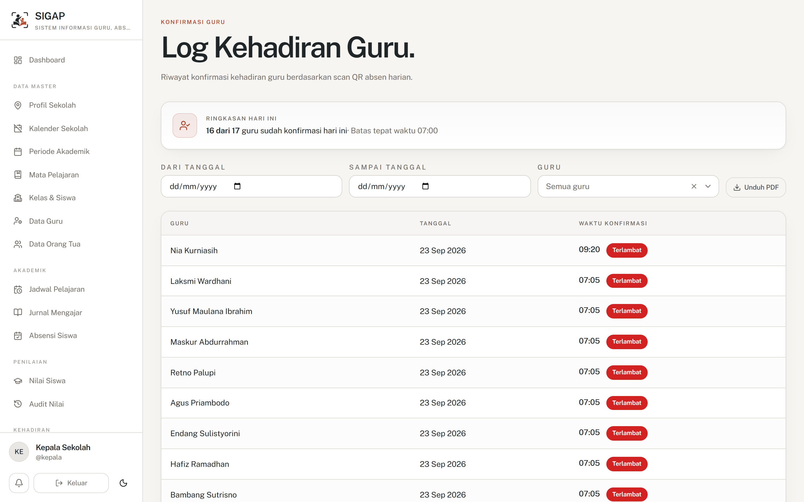

## 5.7 Laporan Kehadiran Guru

Menu **Laporan > Laporan Kehadiran Guru** khusus menampilkan konfirmasi yang tercatat **di luar radius sekolah** - kolomnya **Guru, Kelas, Mapel, Jarak, Konfirmasi, Status**. Laporan inilah yang dipakai menindaklanjuti dugaan absensi tidak di lokasi.

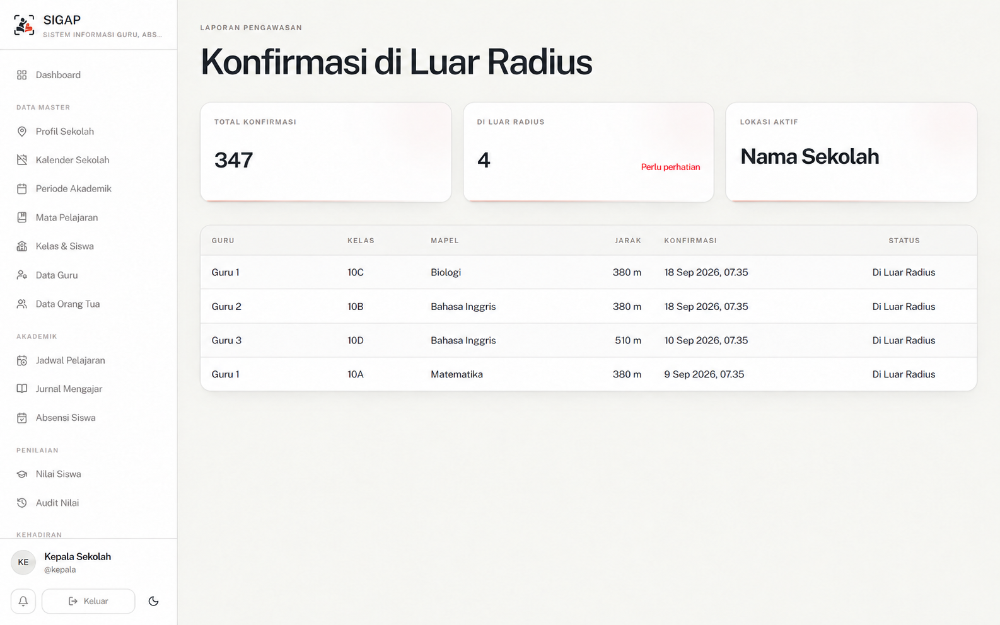

## 5.8 Audit Nilai

Menu **Penilaian > Audit Nilai** berisi riwayat perubahan nilai: **Waktu, Siswa, Mapel, Kelas, Jenis, Aksi, Nilai, Oleh**. Setiap perubahan tercatat otomatis - nilai lama dan nilai baru sama-sama ditampilkan - dan tidak dapat dihapus dari layar. Ini pegangan saat ada keberatan orang tua terhadap sebuah nilai.

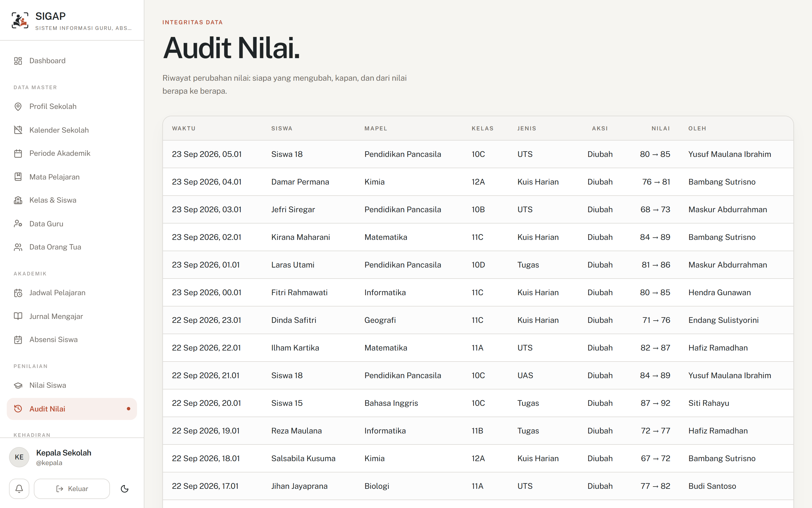

> Kepala sekolah tidak mengubah data master; perannya mengawasi dan menindaklanjuti. Untuk mengubah nilai, kepala sekolah meminta guru pengampu yang memperbaikinya agar jejak audit tetap jelas.

---

# Bagian 6 - Orang Tua/Wali

## 6.1 Masuk dan melihat daftar anak

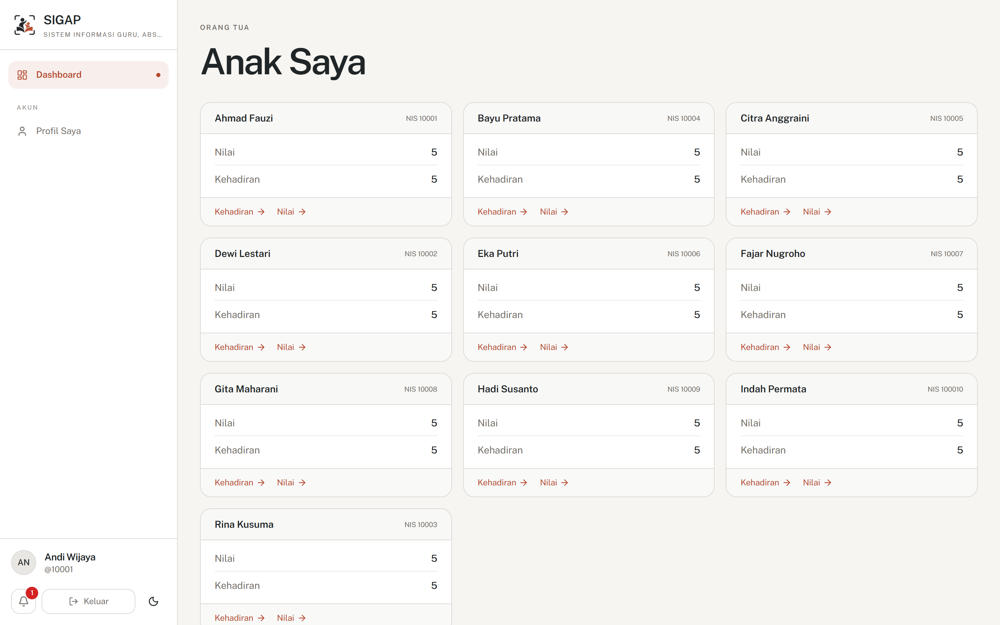

Orang tua masuk memakai **username = NIS anak** dan kata sandi yang diberikan sekolah (bisa dibuatkan lewat impor daftar siswa atau oleh administrator di halaman siswa).

Dasbor menampilkan seluruh anak yang tertaut ke akun tersebut, lengkap dengan kelas dan ringkasan kehadirannya. Jika akun menaungi beberapa anak, semua muncul di sini.

## 6.2 Nilai dan rapor anak

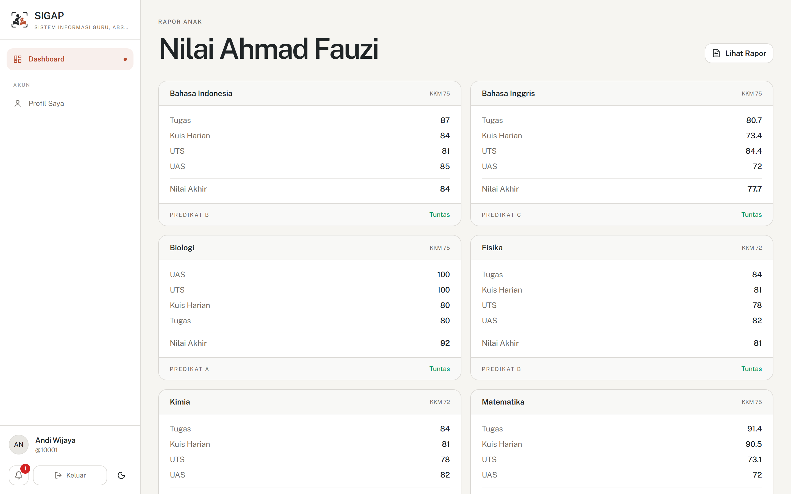

Pilih anak, lalu buka **Nilai**. Yang terlihat: nilai tiap komponen per mata pelajaran, nilai akhir, predikat, dan keterangan tuntas terhadap KKM.

Setelah nilai dipublikasikan, bagian **Nilai Resmi e-Rapor** juga dapat tampil terpisah bila template e-Rapor tersedia dan memiliki nilai. Bagian ini mengikuti kolom resmi e-Rapor yang disiapkan untuk kelas, mapel, dan semester tersebut; nilai tugas harian atau komponen lain tetap ada pada rekap nilai SIGAP.

> Nilai baru tampil setelah sekolah **mempublikasikan nilai** pada periode akademik (diatur administrator/kepala sekolah di menu Periode Akademik). Sebelum itu, halaman tetap terbuka tetapi daftar nilai kosong.

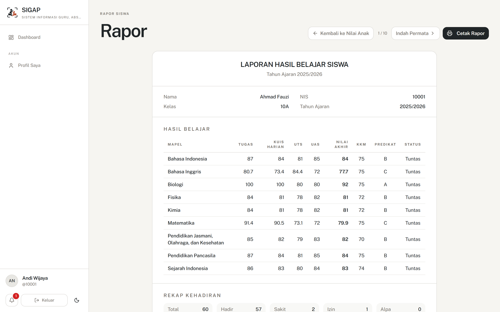

Klik **Lihat Rapor** di kanan atas halaman nilai untuk membuka lembar rekap satu anak - nilai akhir, predikat, dan rekap kehadiran dalam format siap cetak (tombol **Cetak Rapor** atau `Ctrl+P`).

## 6.3 Absensi anak

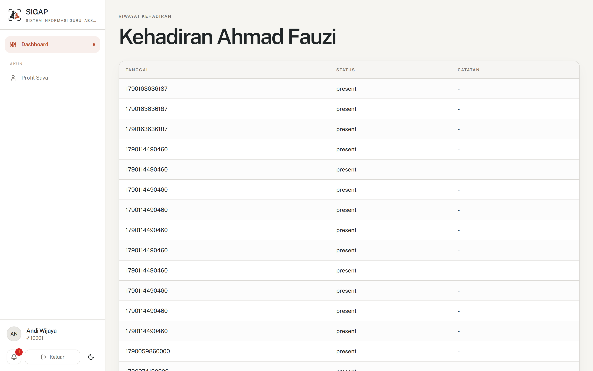

Rekap kehadiran per tanggal beserta total Hadir, Sakit, Izin, dan Alpa. Data ini berasal dari jurnal yang diisi guru pengampu pada hari tersebut.

## 6.4 Notifikasi dan pengumuman

Ikon lonceng di pojok sidebar menampilkan pemberitahuan pribadi (misalnya ada nilai baru). Pengumuman sekolah muncul di halaman utamanya. Orang tua juga dapat mengganti kata sandi sendiri di **Profil Saya**.

---

# Bagian 7 - Alur Harian Ringkas

## 7.1 Satu hari untuk guru

| Waktu | Aksi di SIGAP |
|---|---|
| Tiba di sekolah | **Kehadiran > Konfirmasi Kehadiran** > scan QR di ruang guru > verifikasi |
| Sebelum mengajar | **Akademik > Jurnal Mengajar > Tambah Jurnal** > pilih sesi, tulis materi, tandai siswa yang tidak hadir, simpan |
| Setelah ujian | **Penilaian > Nilai Siswa** > pilih kelas & mapel > input nilai > simpan |
| Sepanjang hari | Ulangi jurnal untuk setiap sesi yang diampu |

## 7.2 Menyiapkan awal semester (administrator)

1. Profil sekolah - identitas, koordinat, radius, jam mulai.
2. Kalender sekolah - tentukan hari Sabtu masuk atau tidak, lalu catat tanggal libur khusus bersama kepala sekolah.
3. Periode akademik baru > tandai **Aktif**.
4. Mata pelajaran beserta KKM.
5. Kelas untuk periode itu.
6. Impor daftar siswa. Untuk kelas yang sudah dibuat, unduh **data kelas (.xlsx)** agar roster dan identitas yang sudah tersedia ikut terisi; lengkapi data orang tua sesuai kebutuhan.
7. Data guru + kontrak mengajar + wali kelas.
8. Jadwal pelajaran per kelas.
9. Pengaturan QR absen > cek layar QR tampil dengan benar.
10. Buat akun pengguna dan tentukan perannya.
11. Untuk e-Rapor, unggah template tiap kombinasi kelas/mapel/semester dan petakan kolom penilaian ke jenis nilai SIGAP (Bagian 3.12).

## 7.3 Akhir semester (administrator & kepala sekolah)

1. Kepala sekolah memeriksa **Audit Nilai** dan **Sesi terlewat**.
2. Guru memastikan seluruh jurnal dan nilai lengkap.
3. Administrator melengkapi kalender sekolah bila ada libur yang belum tercatat.
4. Guru mengisi komponen nilai SIGAP; kolom e-Rapor yang sudah dipetakan akan mengikuti nilainya.
5. Periksa template, roster, nilai langsung, dan hasil **Unduh .xls/.xlsx** e-Rapor sebelum mengunggah berkas ke sistem e-Rapor sekolah.
6. Unduh berkas arsip lain: **Daftar Hadir Guru**, **Rekapitulasi Jurnal Mengajar**, dan **Lembar Rekapitulasi Nilai**.
7. Administrator mengaktifkan **Publikasi Nilai** pada periode aktif agar orang tua dapat melihat rekap SIGAP dan nilai resmi e-Rapor yang tersedia.
8. Tarik publikasi bila nilai perlu diperbaiki lagi.

---

# Bagian 8 - Tips dan Pemecahan Masalah

| Gejala | Penyebab umum | Yang dilakukan |
|---|---|---|
| Menu yang dicari tidak muncul | Hak akses peran Anda memang tidak mencakup menu itu | Cek Bagian 3.10 atau minta administrator |
| Tombol jurnal/nilai bertuliskan *Akses terkunci* | Belum konfirmasi kehadiran hari ini | Scan QR lebih dulu (Bagian 4.2) |
| Kamera tidak muncul saat scan | Izin kamera belum diberikan, atau halaman dibuka tanpa HTTPS di luar localhost | Buka lewat alamat `https://…`, atau izinkan kamera di pengaturan peramban |
| Muncul "Di luar radius sekolah" | Posisi GPS belum akurat atau guru benar-benar di luar sekolah | Tunggu posisi terbaca, klik **Perbarui lokasi**, pastikan GPS perangkat aktif |
| Daftar jadwal pada jurnal kosong | Tidak ada jadwal mengajar hari itu, atau kontrak/jadwal belum dibuat | Periksa jadwal pelajaran dan kontrak mengajar bersama administrator |
| Angka rekap absensi jauh lebih kecil daripada jumlah sesi kelas | Sebagai guru pengampu, yang dihitung hanya sesi Anda sendiri | Untuk rekap satu kelas penuh, unduh dari akun kepala sekolah (Bagian 4.5) |
| Tombol *Unduh PDF* tidak muncul di layar | Dokumen itu memang di luar lingkup peran Anda | Minta peran yang berhak: kepala sekolah untuk lingkup penuh, guru untuk mapelnya sendiri |
| Guru tetap diminta scan QR pada hari libur | Tanggal libur belum dicatat di kalender sekolah | Administrator mengisi **Data Master > Kalender Sekolah** (Bagian 3.2) |
| Alarm kepala sekolah menandai hari Sabtu | Sakelar *Hari Sabtu masuk* masih aktif padahal sekolah libur | Matikan sakelarnya di Kalender Sekolah |
| Impor siswa menolak baris | NIS sudah dipakai, kelas tidak dikenali, atau akun orang tua baru belum diberi kata sandi awal | Baca rincian baris pada hasil impor; perbaiki data lalu impor kembali |
| File e-Rapor tidak dikenal atau kolom nilai tidak ditemukan | File bukan workbook e-Rapor asli, struktur/header diubah, atau file hanya diganti ekstensi | Unduh ulang file dari e-Rapor SMP 2025.2. Jika perlu `.xlsx`, gunakan **File > Save As > Excel Workbook (.xlsx)** dan pertahankan header serta susunan kolom aslinya |
| Siswa lama ikut dianggap siswa baru saat impor kelas | Kolom **ID Siswa SIGAP** kosong, berubah, atau dihapus | Unduh ulang data kelas dan jangan ubah kolom ID siswa. Untuk siswa baru, biarkan ID kosong dan isi NIS serta nama |
| Saya mengosongkan kontak orang tua, tetapi data lama tetap ada | Kolom kosong pada baris siswa lama tidak menghapus data tersimpan | Isi nilai baru yang ingin disimpan; ubah atau lepas akun lewat formulir siswa jika perlu menghapus relasi akun |
| Semua kolom CSV menumpuk di satu sel | Pengaturan regional Excel memakai pemisah yang berbeda | Tidak masalah untuk sistem. Untuk melihat per kolom: **Data > From Text/CSV**, pilih pemisah yang sesuai dengan isi berkas (koma atau titik-koma) |
| Unggah e-Rapor menyatakan kelas/rombel atau NPSN berbeda | Pilihan di SIGAP tidak sama dengan identitas pada workbook | Cocokkan kelas, mapel, semester, dan NPSN Profil Sekolah. Gunakan file asli dari e-Rapor atau simpan sebagai `.xlsx` dari Excel tanpa mengubah identitas dan struktur |
| Unggah e-Rapor meminta NIS siswa baru | Ada siswa pada workbook yang belum cocok dengan roster SIGAP | Admin masukkan NIS asli pada pratinjau lalu buat siswa. NIS wajib dan harus unik; akun orang tua tetap dibuat terpisah |
| Roster SIGAP memuat siswa yang tidak ada pada file e-Rapor | Isi kelas di SIGAP dan file tidak sama | Periksa/selaraskan daftar siswa kelas sebelum mengunggah template |
| Ekspor e-Rapor belum tersedia | Template belum diunggah, mapping siswa belum lengkap, atau roster berubah | Admin unggah kembali template untuk kelas/mapel/semester yang dipilih dan pastikan semua siswa cocok |
| Nilai e-Rapor kosong meski nilai tugas sudah diisi | Kolom template belum dipetakan ke komponen nilai yang diisi | Klik **Atur pemetaan** pada panel **Pemetaan sumber nilai** dan periksa sumber kolom. Jika tidak memiliki akses, minta admin mengatur pemetaan. Kolom *Isi langsung* diisi pada tabel e-Rapor. |
| Orang tua tidak melihat nilai | Publikasi nilai periode aktif masih mati | Aktifkan di **Periode Akademik** |
| Nilai anak tidak lengkap | Guru belum menyimpan nilai komponen | Cek **Progres nilai** di dasbor kepala sekolah |
| Data sudah diubah tapi layar lama | Sesi peramban menggantung | Muat ulang halaman (Ctrl+R) |
| Lupa kata sandi | - | Administrator menyetel ulang di **Pengguna**, atau pengguna ganti sendiri di **Profil Saya** bila masih ingat sandi lama |
| QR di layar tidak berganti | Interval terlalu besar atau halaman layar QR tidak aktif | Perkecil interval di **Pengaturan QR Absen**, buka ulang layar QR |

**Tiga kebiasaan yang membuat data selalu rapi**

1. Guru mengisi jurnal **pada hari yang sama** - presensi siswa lahir dari jurnal.
2. Administrator tidak mengubah NIS siswa yang sudah punya riwayat nilai.
3. Publikasi nilai dipakai sebagai keran, bukan disematkan terbuka sepanjang semester.
---

# Lampiran A - Menu yang tampak per peran

Tabel di bawah ini adalah menu yang benar-benar tampil di sidebar tiap peran pada instalasi standar (urutan mengikuti kelompok menu di layar: Data Master, Akademik, Penilaian, Kehadiran, Laporan & Informasi, Manajemen, Akun).

| Menu | Admin | Guru | Kepala Sekolah | Orang Tua |
|---|:--:|:--:|:--:|:--:|
| Dashboard (halaman awal) | ya | Jadwal Mengajar | Pengawasan Sekolah | Dashboard Anak |
| Profil Sekolah | ya | - | ya | - |
| Kalender Sekolah | ya | - | ya | - |
| Periode Akademik | ya | - | ya | - |
| Mata Pelajaran | ya | - | ya | - |
| Kelas & Siswa | ya | - | ya | - |
| Data Guru | ya | - | ya | - |
| Data Orang Tua | ya | - | ya | - |
| Jadwal Pelajaran | ya | - | ya | - |
| Kontrak Mengajar | ya | - | - | - |
| Jurnal Mengajar | - | ya | ya | - |
| Absensi Siswa | - | ya | ya | - |
| Nilai Siswa | - | ya | ya | - |
| Pengaturan e-Rapor | ya | melalui **Impor / Ekspor e-Rapor** di Nilai Siswa | - | - |
| Audit Nilai | - | - | ya | - |
| Konfirmasi Kehadiran | - | ya | - | - |
| Monitoring Konfirmasi | ya | - | ya | - |
| Pengaturan QR Absen | ya | - | - | - |
| Pengawasan Sekolah | - | - | ya | - |
| Laporan Kehadiran Guru | - | - | ya | - |
| Pengumuman | ya | - | - | - |
| Pengguna | ya | - | - | - |
| Peran & Hak Akses | ya | - | - | - |
| Profil Saya | ya | ya | ya | ya |

Orang tua melihat pengumuman dan notifikasi melalui Dashboard Anak. Administrator tidak memiliki menu Jurnal Mengajar, Nilai Siswa, atau Rapor.

Daftar di atas mengikuti hak akses, sehingga dapat berubah jika administrator menyesuaikan peran.

---

# Lampiran B - Glosarium

| Istilah | Arti |
|---|---|
| **NIS** | Nomor induk siswa. Dipakai username akun orang tuanya |
| **ID Siswa SIGAP** | ID internal untuk mencocokkan dan memperbarui siswa saat impor file data kelas; bukan NIS dan bukan ID anggota rombel e-Rapor |
| **ID anggota rombel** | Identitas siswa/anggota kelas dari e-Rapor yang dipakai untuk mencocokkan siswa dengan baris pada template sekolah |
| **Periode akademik** | Tahun ajaran aktif; semua kelas, jadwal, jurnal, dan nilai mengacu ke sini |
| **Mapel** | Mata pelajaran |
| **KKM** | Kriteria ketuntasan minimum; ambang nilai tuntas per mata pelajaran |
| **Komponen nilai** | Jenis penilaian (misal Tugas, UTS, UAS) beserta bobotnya |
| **Nilai akhir** | Hasil perhitungan bobot seluruh komponen |
| **Predikat** | Label mutu nilai akhir |
| **Konfirmasi kehadiran** | Absensi guru harian lewat pindai QR, berisi waktu, jarak, dan posisi guru |
| **Geofence** | Pembatas area berbasis radius sekolah |
| **Hari efektif** | Hari yang dihitung sebagai hari bekerja: Senin-Jumat, Sabtu bila sakelarnya aktif, dikurangi tanggal libur khusus |
| **Jurnal mengajar** | Catatan kegiatan belajar per sesi; sekaligus sumber data absensi siswa |
| **Jurnal susulan** | Jurnal untuk sesi yang terlewat, masih boleh ditulis sampai tiga hari ke belakang bila guru itu tercatat hadir pada hari sesi tersebut |
| **Sesi terlewat** | Hari mengajar yang dijadwalkan tetapi gurunya tidak memindai QR |
| **Audit nilai** | Riwayat perubahan nilai: pelaku, waktu, nilai lama, nilai baru |
| **Publikasi nilai** | Saklar yang membuat nilai dan rapor terlihat oleh orang tua |
| **Pemetaan e-Rapor** | Hubungan antara kolom penilaian pada template sekolah dan jenis nilai SIGAP; kolom tanpa sumber diisi langsung pada halaman e-Rapor |
| **Wali kelas** | Guru yang bertanggung jawab atas satu kelas |
| **Unduh PDF** | Berkas dokumen yang dibuat sistem (rekap absensi, daftar siswa, lembar nilai, daftar hadir guru, rekap jurnal) |
| **NPSN** | Nomor Pokok Sekolah Nasional. Jika NPSN profil SIGAP diisi, nilainya harus sama dengan yang tercantum pada file e-Rapor |
| **Roster siswa** | Daftar siswa yang tercatat pada satu kelas dan menjadi acuan absensi, nilai, serta pencocokan impor |
| **Data kelas (.xlsx)** | File unduhan berisi data siswa tersimpan; admin dapat melengkapi data dan mengimpornya kembali ke kelas yang sama |
| **Template e-Rapor** | File sumber sekolah berisi struktur kolom, identitas, dan daftar siswa; disimpan per kelas, mapel, dan semester |
| **Semester** | Periode penilaian I atau II. Template dan pemetaan nilai dipisahkan agar nilai tidak tercampur |
| **Pemetaan default** | Aturan sumber nilai yang admin terapkan untuk semua mapel atau mapel tertentu pada tahun ajaran dan semester yang sama |
| **Pemetaan lokal** | Aturan sumber nilai khusus untuk template kelas, mapel, dan semester yang sedang dibuka; mengalahkan default |
| **Nilai langsung e-Rapor** | Nilai yang guru masukkan pada tabel e-Rapor saat kolomnya tidak mengambil nilai dari komponen SIGAP |

---

*Manual book ini disusun mengikuti tampilan SIGAP versi berjalan. Jika antarmuka sekolah Anda sudah disesuaikan, nama menu bisa sedikit berbeda; alur kerjanya tetap sama.*
